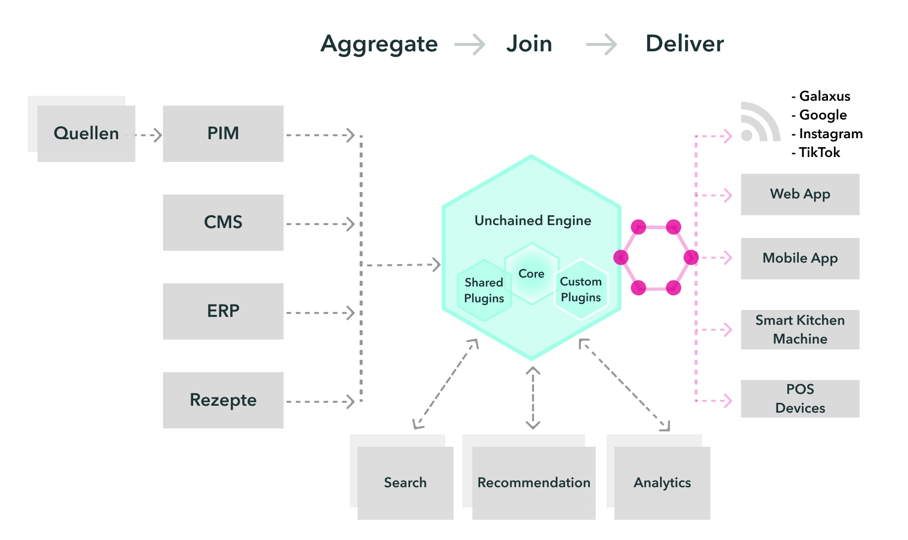
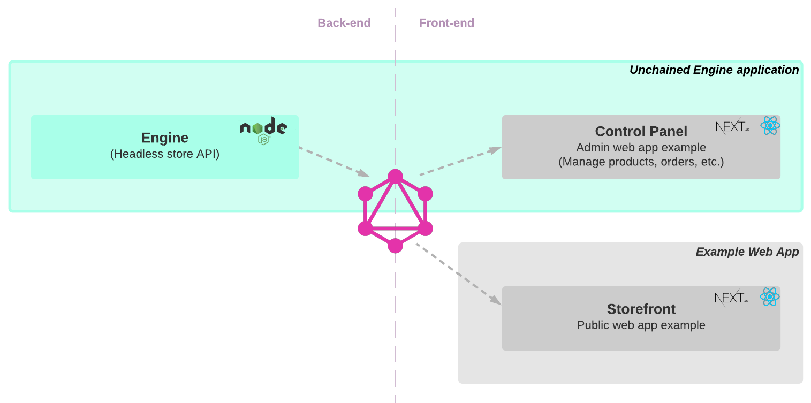

**Unchained Engine is an open-source API-first e-commerce framework that lets you build your own custom shopping experiences**

#### Unchained Engine provides:

- **Codeability**, so you can tweak the system with endless possibilities not restricted by "customization" or a settings-approach
- **GraphQL API**, allowing you to build fast, performant and modern storefronts
- **Stateless architecture**, allowing you to scale horizontally and vertically
- **Production readiness**, due to the fact that the host company uses the Unchained Engine for medium- to big enterprise web shops (Dogfooding)

### Solution Overview

The following diagram shows all applications and services provided by Unchained as open-source software for you to easily setup your first eCommerce store in a few minutes.

As you can see the Unchained Engine ecosystem consists of

- the **Engine** itself as server-side only GraphQL API included in a [Node](https://www.nodejs.com/) app to serve all functionality to manage the store \*
- the **Storefront** boilerplate web app which provides a customizable UI for the public store itself as [Next.js](https://nextjs.org/) project

The next chapter helps you setup an E-Commerce solution self-hosted.
