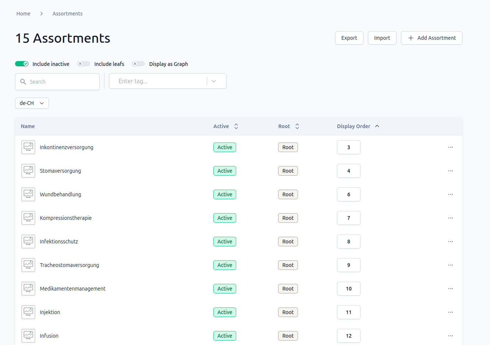
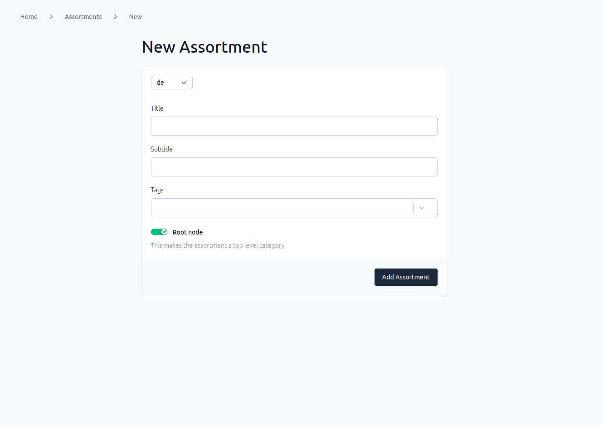
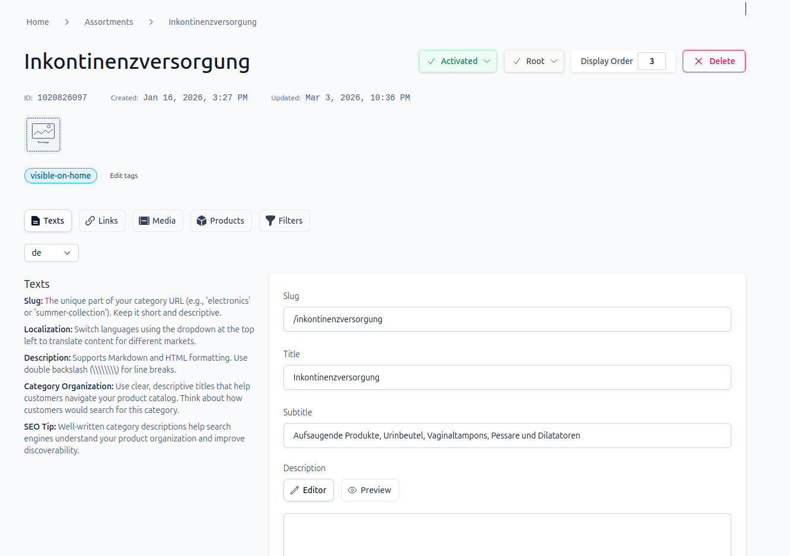
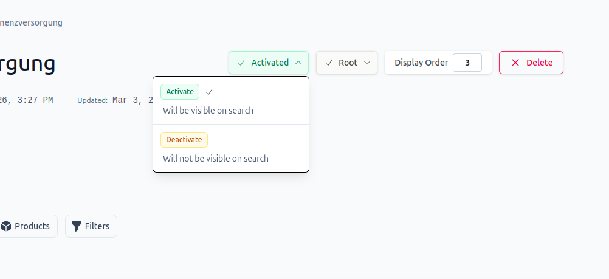
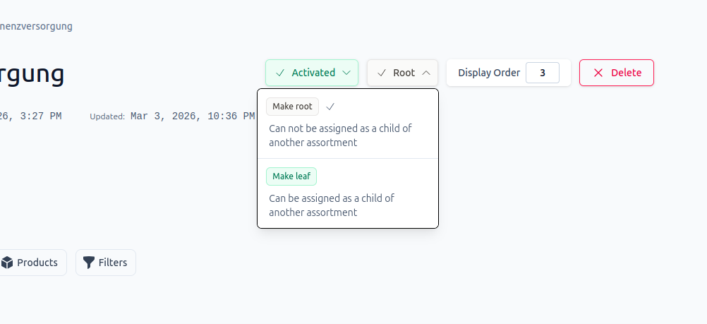
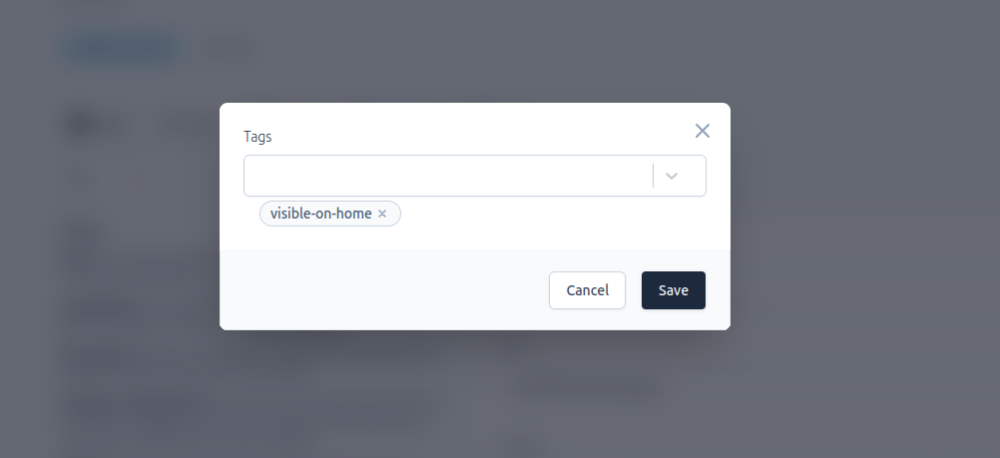
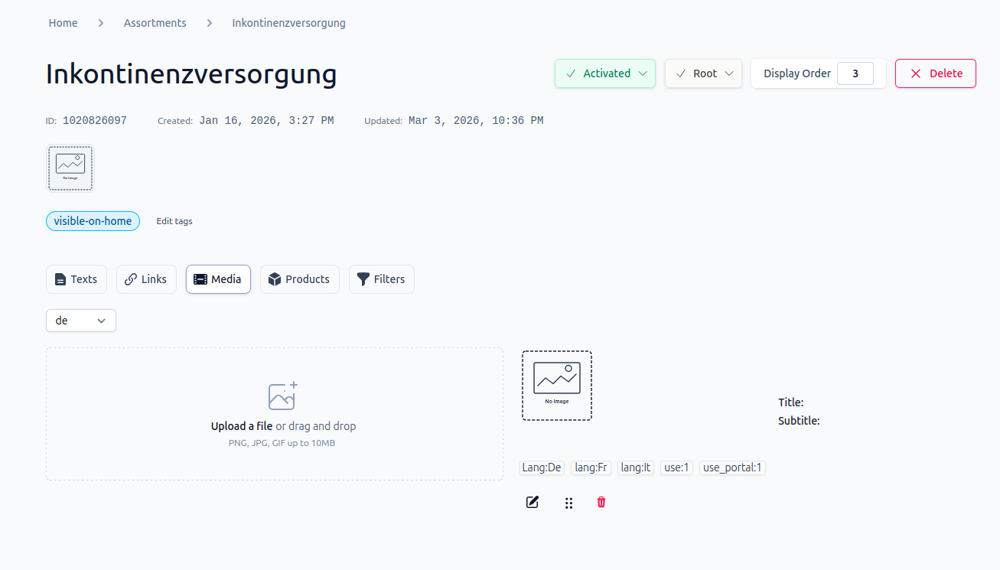
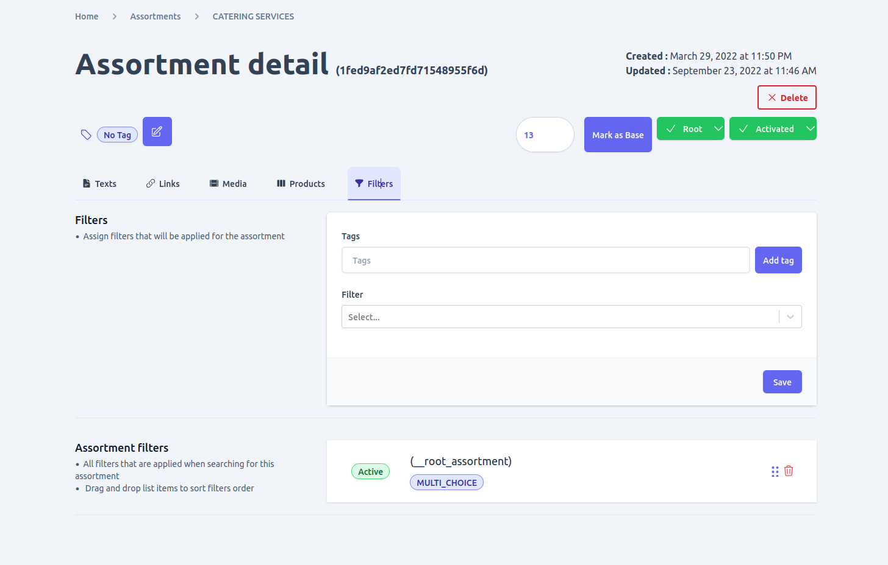
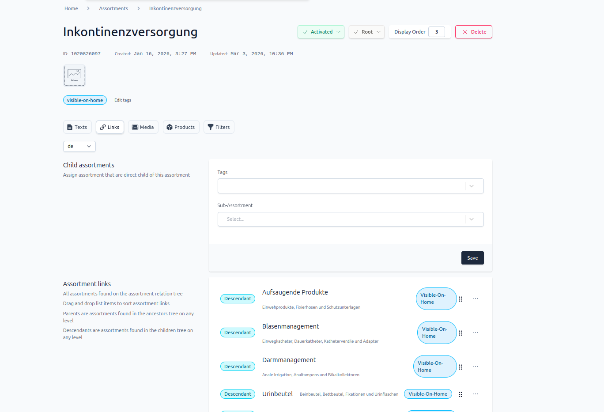

This section covers the management of product assortments within the Unchained e-commerce platform. An assortment represents a grouping of similar products that share a common theme, category, or purpose. Within Unchained, assortments can be organized hierarchically, with parent-child relationships that allow for deeper categorization of products.

Using the admin UI you can perform task related with category management including:
- Viewing and search and/or filtering them with different parameters
- Add, edit and delete categories
- Assign filters
- Assign products
- Assign media
- Link assortments to create a hierarchy between them
- Activate or deactivate assortment and many more

## View and filter assortments

If you navigate to the assortments page, you will see a list of categories that are available in the shop. By default, only active root assortments will be visible, but you can change this by using the toggle button to display inactive assortments as well. Furthermore, there is an option to view assortments as a graph, which provides a better understanding of their hierarchy.

In addition to these features, you can search, filter, and sort assortments using different parameters, such as tags, name, and status. This will help you quickly locate the assortment you are looking for and make managing your inventory more efficient.



## Add, edit and delete assortment
1. ### Adding new Assortment
If you want to create a new assortment, you can do so by clicking the "Add" button on the list view of assortments. This will take you to the assortment creation form page, where you can provide all the required information, including the name of the assortment, a brief description, and any other relevant details that are necessary. This form is easy to use and will guide you through the process of creating a new assortment quickly and efficiently.

2. ### Edit assortment
To modify an existing assortment, simply select the assortment from the list view, and you will be taken to its detail view page. From there, you can make changes to the assortment's information, including adding localized counterparts for each. If you want to add a localized text for an assortment, you will need to [add the language](./language/#add-language) first by going to the add the [language page](./language). This step is important to ensure that your assortment is accurately translated and localized for your customers in different regions. Once you have added the language, you can proceed to add the localized text for your assortment, making it more accessible and understandable for your global audience.

3. ### Delete assortment
If you have the necessary privileges, you can delete an assortment by using the delete button found on the assortment detail page. However, it is essential to be extra cautious when performing this operation, as it is not reversible. Deleting an assortment that is linked to other parts of the shop can have unintended consequences and lead to problems. Therefore, it is important to ensure that there are no dependencies on the assortment before proceeding with the deletion. If you are unsure about whether it is safe to delete an assortment, it is always a good idea to consult with a supervisor or someone with more experience before taking any action.



## Activating or deactivating assortment
When you access an assortment's detail page, you will see a button that displays the current status of the assortment. This button can be used to toggle the assortment's status between active and inactive. Simply click on the button to change the status. This feature is useful when you need to temporarily remove an assortment from the shop or reactivate an inactive assortment.




## Root or leaf
If you need to change the placement of an assortment from root to leaf or vice versa, you can use the button that displays the current placement value to toggle to the other value. This feature allows you to modify the hierarchy of your assortments and organize them in a way that best suits your business needs. Simply click on the button to change the placement value, and the assortment will be moved accordingly. This is a convenient way to reorganize your assortments and ensure that they are properly classified and easy to navigate.



## Make base
Base assortments are top-level assortments that cannot be assigned as child assortments of another assortment. If an assortment was not initially added as a base assortment, you can make it base by navigating to the assortment detail page. From there, you can select the "Make Base" option, which will promote the assortment to a base assortment. This is useful when you need to restructure your assortments or if you have new assortments that need to be classified as base. Keep in mind that once an assortment has been made base, it cannot be assigned as a child of another assortment. Therefore, it is important to carefully consider your assortment structure and hierarchy before making any changes.

## Edit assortment tags
You can easily manage the tags assigned to an assortment using the tag section found at the top of the assortment detail page. From there, you can add or delete tags as needed to ensure that your assortment is properly classified and easy to find. This feature is useful when you need to quickly update the tags associated with an assortment or when you want to make sure that your assortments are properly organized and categorized. Simply click on the tag section to access the tag management options, and you can easily add or delete tags as needed.



## Manage assortment Medias
To manage media files associated with an assortment, navigate to the "Media" tab on the assortment detail page. From there, you can upload, edit, and delete media files as needed. An assortment can have multiple media files assigned to it, which can include images, videos, or other types of media. Additionally, you can add localized text for each media file to ensure that it is properly translated and accessible for your customers in different regions. This feature is useful when you need to showcase your assortment and provide customers with visual information about your products. Simply click on the "Media" tab to access the media management options, and you can easily upload, edit, or delete media files as needed.



## Manage assortment Filters
To manage filters associated with an assortment, navigate to the "Filter" tab on the assortment detail page. From there, you can add or remove links to filters that are relevant to your assortment. This feature is useful when you want to make it easier for customers to find products within a specific category or with certain attributes. Simply click on the "Filter" tab to access the filter management options, and you can easily add or remove links to filters as needed. Keep in mind that filters need to be created before they can be linked to an assortment. If you haven't created any filters yet, you can do so by following the instructions provided in the [Filter](./filter) documentation.



## Manage assortment Links
To manage links to other assortments associated with an assortment, navigate to the "Links" tab on the assortment detail page. From there, you can add or remove links to other assortments as needed. This feature is useful when you want to create a hierarchy of related products or categories, and make it easy for customers to navigate through your assortment.

Keep in mind that a non-root assortment can be assigned as a child to multiple assortments, as long as it is not a base assortment type. However, you should avoid creating cyclic relationships, where two or more assortments are part of the same link parent hierarchy. This type of relationship is not currently supported by Unchained, and can lead to unexpected issues.

Note that base assortments can only have children, but cannot be assigned as a child to another assortment. This is because base assortments are top-level categories that cannot be part of a hierarchy themselves.

In summary, the "Links" tab allows you to create and manage relationships between different assortments, which can help you create a more organized and intuitive shopping experience for your customers.

```
//Not allowed X
a -> b -> c -> a

//Allowed
a -> b -> c
a -> c
```


## Manage assortment Products
To add products to an assortment, navigate to the "Products" tab on the assortment detail page. From there, you can assign multiple products to the assortment, which can help customers easily find the products they're interested in.

It's important to note that a product can belong to multiple categories, so there is no restriction on assigning a product to multiple assortments. This can help you create a more flexible and intuitive product catalog, where customers can find products based on their needs and interests, rather than being limited by a strict category structure.

By assigning products to assortments, you can also help customers discover related or complementary products, which can increase sales and customer satisfaction. Keep in mind that products need to be created before they can be assigned to an assortment. If you haven't created any products yet, you can do so by following the instructions provided in the [Products](./products) documentation.
Cc©
