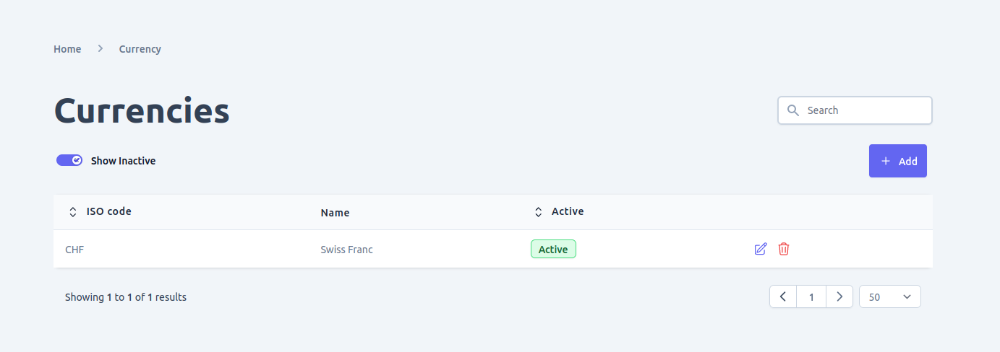
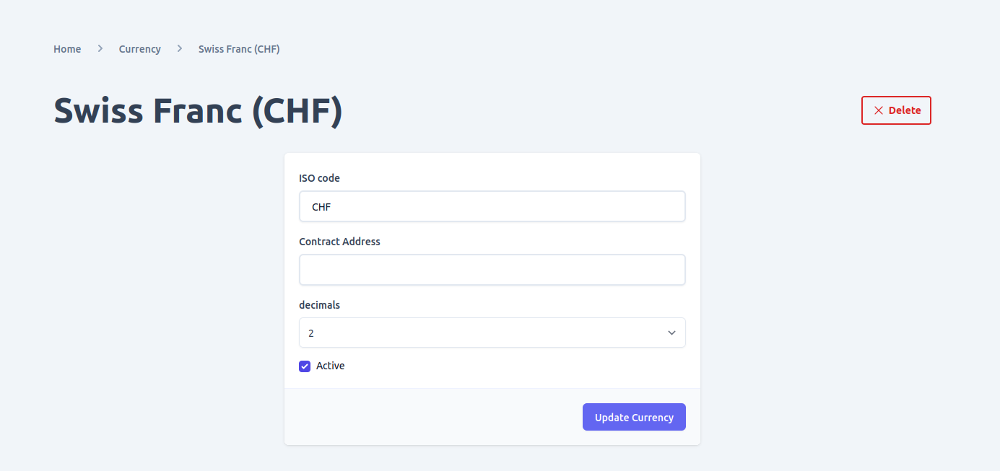

The e-commerce platform and Admin UI provide a user-friendly interface to enable multiple currency support, including blockchain tokens. Once you add a currency and activate it, it can be used throughout the entire system, from product pricing to order processing.

If you add a cryptocurrency, you have the option to configure a contract address, which can be used to distinguish tokens on a blockchain. This information can be read by a cryptocurrency payment plugin, such as [Cryptopay](../platform-configuration/plugins/cryptopay), to determine which currency is being used for a particular transaction.

In the Admin UI, you can perform the following currency-related actions:
- View all the currencies and search/filter them by their name or status.
- Add new currencies or tokens to the system.
- Update existing currencies, including changing their name, symbol, contract address (for cryptocurrencies), and status.
- Delete currencies from the system. However, this action is irreversible, and you should ensure that deleting a currency will not cause any data integrity issues.
- Activate or deactivate currencies as needed, which will enable or disable them in the system.

In summary, the Admin UI provides a convenient way to manage currencies and tokens, making it easy for e-commerce store owners to support a variety of payment methods and streamline their order processing workflows.

## View supported currencies

When you navigate to the currencies page using the link in the navigation menu, you will be able to see a list of all the currencies that have been added to the system. You can filter these currencies by their status or search for a specific currency using the search bar. This makes it easy to locate and manage the currencies that you need for your e-commerce store.

## Add new currency
To add a new currency to your e-commerce store, you can navigate to the currencies page and click on the "Add" button. This will bring up a form where you can enter the necessary details for the currency you want to add.

For regular currencies, you will need to enter the ISO code for the currency, which is a three-letter code that represents the currency on the global market. After submitting the form, you will be redirected to the detail page for the newly added currency.

However, if you want to add an ERC token as a currency, you will need to provide the token's contract address and precision using the inputs provided in the form. The contract address is a unique identifier for the token on the blockchain, while the precision determines how many decimal places are used to represent the token's value. After submitting the form, you will be redirected to the detail page for the new ERC token currency.

By providing a simple and intuitive form for adding new currencies, the Admin UI makes it easy to manage multiple currencies and tokens for your e-commerce store. 

## Update currency

To view or update the details of a currency on the currencies list, you can click on the edit icon next to the currency you want to modify. This will take you to the currency detail page, where you can view and update the currency's information.

On the detail page, you will see the current values for the currency's contract address, status, and ISO code. If you need to update any of these values, you can do so by making changes in the provided input fields. However, as a precaution, it is not recommended to change the ISO code or contract address unless absolutely necessary, as doing so may cause data integrity issues throughout the system.

Before making any changes to the currency information, be sure to carefully consider the potential impact on other parts of the system, and consult with any relevant stakeholders or experts to ensure that the change will not cause any unintended consequences or issues with data integrity.

## Delete currency

To delete a currency in your e-commerce store, you can perform the deletion from two places within the Admin UI:
1. Currencies List View: You can navigate to the currencies list view and locate the currency you want to delete. Then, click on the delete icon next to the currency to initiate the deletion process.
2. Currency Detail View: Alternatively, you can open the detail page of the currency you want to delete and click on the delete button at the bottom of the page to start the deletion process.

However, before deleting a currency, you should exercise caution and ensure that the deletion will not cause any data integrity issues in your system. This is because the delete operation is irreversible, and deleting a currency that is currently in use by products or order pricing plugins can lead to data inconsistencies and errors in your e-commerce store.

To avoid data integrity issues, you should first check if the currency you want to delete is being used by any product or order pricing plugin in your system. If it is being used, you should update the product or pricing plugin to use a different currency before proceeding with the deletion.

Once you have confirmed that deleting the currency will not cause any data integrity issues, you can initiate the deletion process from either the currencies list view or the currency detail view in Admin UI.