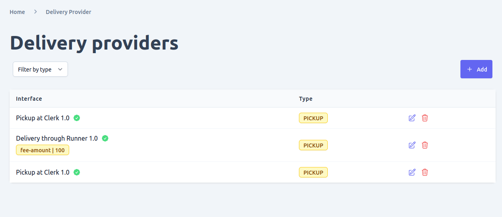
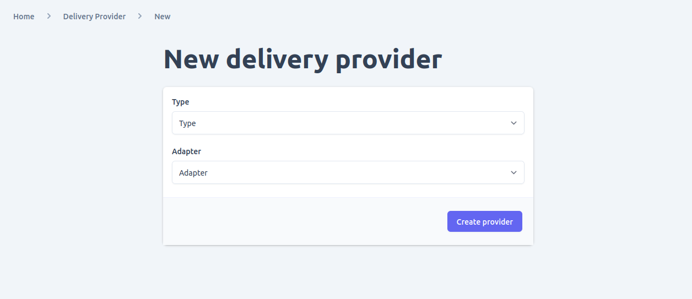
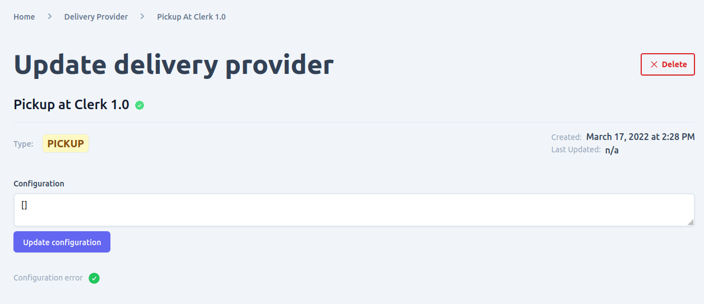

To manage the delivery providers supported in your e-commerce shop, you can navigate to the delivery provider page in the system settings section of the admin UI. This page allows you to manage all the configured delivery plugins in Unchained.

Using the delivery provider page, you can perform the following actions:
- **View and filter delivery providers**: The page displays all the delivery providers that are currently configured in your e-commerce shop. You can also filter the delivery providers by various criteria, such as provider name or status.
- **Add new delivery provider**: You can add new delivery providers to your e-commerce shop by selecting the provider you want to use and configuring the necessary settings.
- **Update existing delivery provider**: You can update the settings for an existing delivery provider, such as changing the delivery method or updating the credentials required for the provider to function correctly.
- **Delete delivery provider**: If a delivery provider is no longer needed, you can delete it from your e-commerce shop.

By using the delivery provider page in the admin UI, you can easily manage the delivery providers supported in your e-commerce shop. This allows you to offer your customers a wide range of delivery options and ensures that deliveries are processed smoothly and efficiently.

Please note that before you can add a new delivery provider to your e-commerce shop using the admin UI, it must be configured and loaded into the Unchained engine instance that your shop is using. This means that you will need to have the necessary plugin files and configurations in place before you can start managing the delivery provider through the admin UI.

Furthermore, it is important to understand that the activation and deactivation of delivery providers is typically controlled by the plugin logic itself. This means that activating or deactivating a delivery provider in the admin UI does not necessarily guarantee that it will be functional in your e-commerce shop. You will need to make sure that the plugin code and configurations are properly set up and maintained to ensure the smooth functioning of your delivery providers.

## View and Filter delivery providers
To view and filter delivery providers in your e-commerce shop, you can navigate to the delivery provider page in the system settings section of the admin UI. This page allows you to manage all the configured delivery plugins in Unchained.

On the delivery provider page, you can perform the following actions:
- **View and filter delivery providers**: The page displays all the delivery providers that are currently configured in your e-commerce shop. You can also filter the delivery providers by various criteria, such as provider name or status.

To filter delivery providers by type, simply select the desired type from the drop-down filter menu. This will show only the delivery providers that match the selected type.

By using the delivery provider page in the admin UI, you can easily view and filter the delivery providers in your e-commerce shop. This allows you to manage your shipping options and ensure that your customers have access to a wide range of delivery options.

Please note that before you can view or filter delivery providers using the admin UI, they must be configured and loaded into the Unchained engine instance that your shop is using. This means that you will need to have the necessary plugin files and configurations in place before you can start managing the delivery providers through the admin UI.

## Add new delivery providers
To add a new delivery provider to your e-commerce shop, navigate to the delivery provider page in the system settings section of the admin UI. From there, click the "add" button found in the delivery providers list.

On the new delivery provider form, you will be prompted to enter the necessary information for the new provider. This includes the provider type and adapter, where the adapter refers to the DeliveryProvider adapter plugin that is configured and loaded in the Unchained engine instance that your shop is using.

After submitting the form, you will be redirected to the newly created delivery provider detail page. From there, you can further configure the settings for the new provider or manage its functionality in other ways.

## Update delivery providers
To make changes to a specific delivery provider, go to the list of delivery providers in the admin UI and click on the edit icon next to the provider you want to modify. This will take you to the detail page for that provider, where you can make changes to its configuration.

In the detail page, you will see various fields related to the delivery provider, such as its name, type, and adapter. You can modify these fields as needed, and then save your changes by clicking the "Save" button.

If there are any configuration errors with the provider, you will see a red "X" check mark next to the affected field(s), along with any relevant error messages. These errors must be resolved before you can save the changes and successfully update the delivery provider.

Keep in mind that making changes to a delivery provider's configuration can have significant effects on your e-commerce shop's delivery functionality. Make sure to thoroughly test any changes before deploying them to a live production environment.

## Delete delivery providers

To delete a delivery provider in Unchained, you have two options:
- From the delivery provider list view: Navigate to the delivery provider page in the system settings section of the admin UI. Locate the delivery provider you want to delete from the list and click on the delete button next to it.
- From the delivery provider detail page: Open the detail page of the delivery provider you want to delete, and click on the delete button located at the bottom of the page.

Before deleting a delivery provider, it's important to consider any potential implications that may arise from the deletion. Deleting a delivery provider may result in the loss of historical data associated with that provider, such as past orders or shipping information. Therefore, it's crucial to make sure that the deletion won't cause any data integrity issues.

Additionally, once a delivery provider is deleted, the operation is not reversible. This means that it's essential to exercise caution when deleting a delivery provider to avoid any unintended consequences.