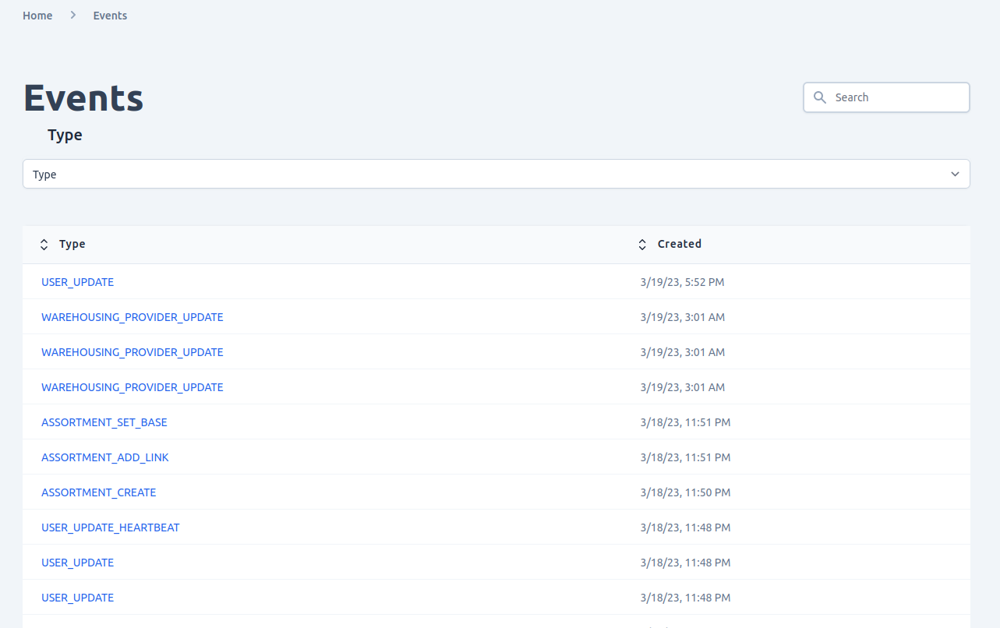
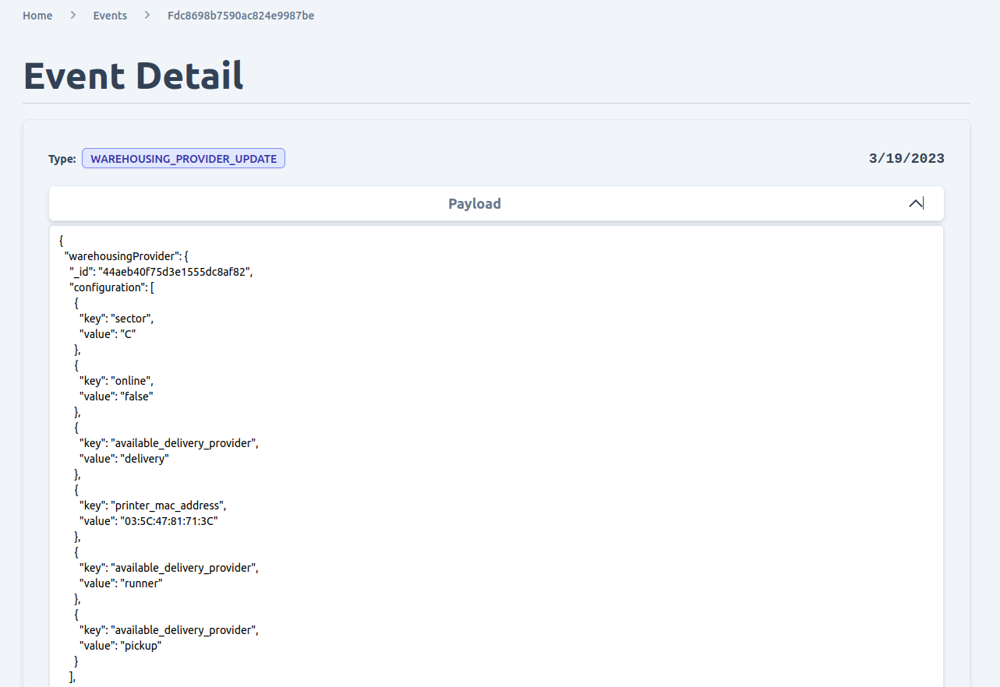

# Events
To access the event browser in the Admin UI, navigate to the "Events" tab in the main navigation menu. From there, you can view a list of all events that have been emitted by the system, sorted by date and time. You can also use the search bar to filter events by keyword.

Each event in the list displays a summary of the event's payload, including the event type, timestamp, and any relevant data associated with the event. You can click on an event to view more detailed information about it, including the full payload of the event and any related events that may have been emitted as a result.

The event browser is a powerful tool for tracking and auditing changes made to your system, and can be used to diagnose issues, identify trends, and troubleshoot problems. By providing a comprehensive view of all events emitted by the system, the Admin UI makes it easy to stay informed and in control of your online store.

## View emitted event
In the Admin UI, you can easily browse and view all of the events by navigating to the **Activities** tab and selecting `Events`. From there, you can filter events by type or search for a specific event using the search bar.

Each event in the list includes details such as the event type, creation time, and a summary of the payload. You can also click on an event to view more detailed information about it, including the full payload and any related events.

## Detail event view
If you click on an event from the list you are able to view details events payload

