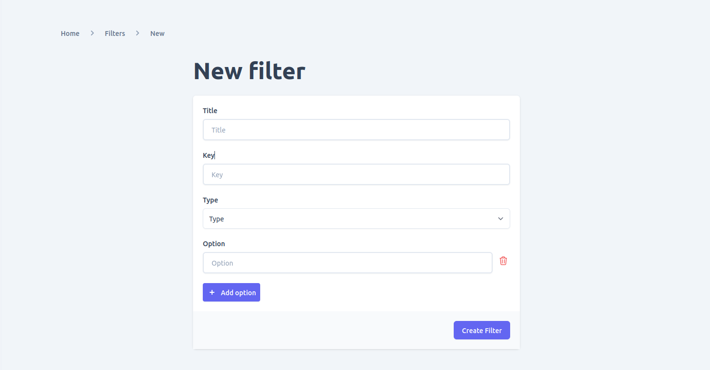
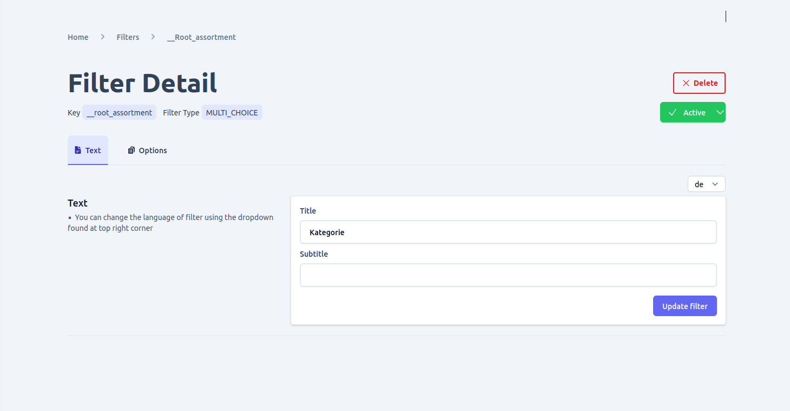
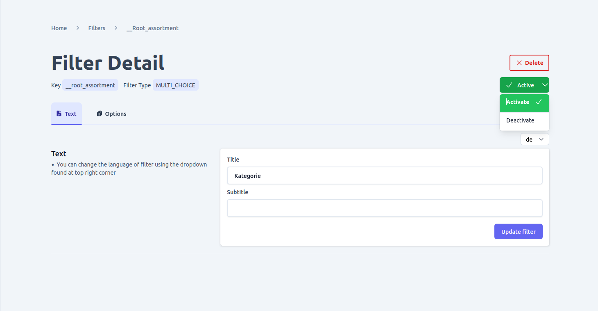
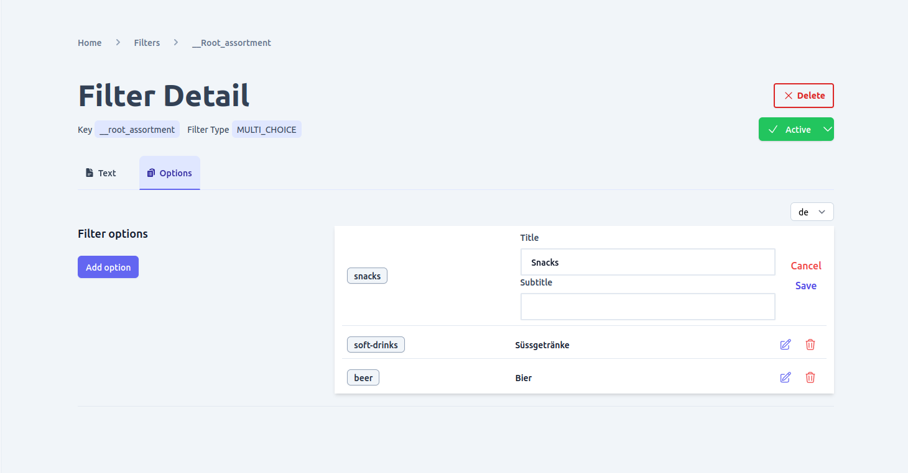
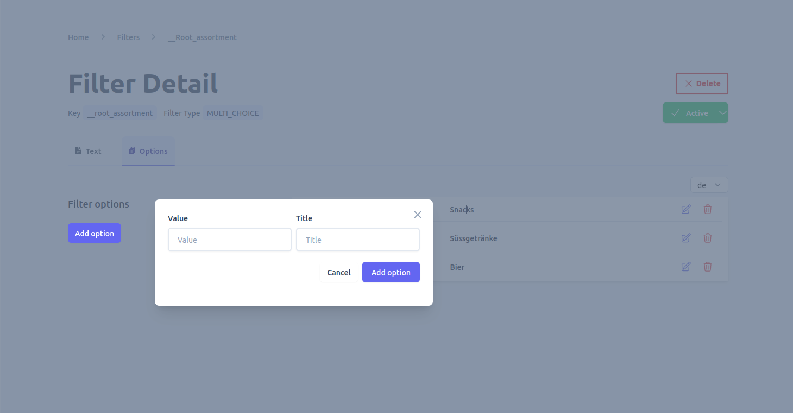

# Filter

Filters are an essential feature in an e-commerce shop that allows customers to easily access products and categories. Unchained provides built-in support for defining filters for categories and products. The admin UI offers a user-friendly interface for managing filters, allowing you to create a customized browsing experience for your customers.

With the filter management interface, you can perform the following actions:
- **View existing filters**: The interface allows you to view all the filters that have been defined for your e-commerce shop.
- **Add new filters**: You can add new filters to categories and products, making it easier for customers to find specific items.
- **Add filter options**: The filter management interface allows you to add filter options for each filter, allowing customers to narrow down their search results.
- **Update existing filters**: You can update the existing filters to modify their settings or add more filter options.
- **Update filter options**: You can update filter options to add or remove them as required.
- **Delete filters**: You can delete filters that are no longer required for your e-commerce shop.
- **Delete filter options**: You can delete filter options that are no longer relevant or useful.
- **Activate/deactivate filters**: You can activate or deactivate filters as needed, depending on their relevance and usefulness to your customers.

By using the filter management interface in Unchained, you can create a streamlined and intuitive browsing experience for your customers. This makes it easier for them to find the products they are looking for, leading to increased customer satisfaction and sales.

To make a filter available for a specific category in your e-commerce shop, you need to link it to the category by accessing the [assortment detail](./assortment) page. Until this linking process is completed, the filter will not be usable for that particular category.

To link a [ilter to a category](./assortment/#manage-assortment-filters), follow these steps:
- Go to the assortment detail page for the category you want to link the filter to.
- In the "Filters" section of the page, click on the "Add filter" button.
- Select the filter you want to link from the dropdown list of available filters.

Once you have linked the filter to the category, it will be available for customers to use when browsing products in that category. You can repeat this process for each category where you want the filter to be available.
## View filters
To manage the filters in your e-commerce shop, you can navigate to the "Filters" page in the admin UI. This page provides an overview of all the filters that are currently available in your shop.

Using the "Filters" page, you can perform the following actions:
- View existing filters: The page displays all the filters that have been defined in your e-commerce shop, along with their name, status, and language.
- Search and filter filters: You can search and/or filter the filters by various criteria, such as filter name or status, to find the ones you need more easily.
- Change the language of filters: If your e-commerce shop supports multiple languages, you can change the language of the filters to make them more accessible to customers who speak different languages.

By using the "Filters" page in the admin UI, you can easily manage and update the filters in your e-commerce shop. This allows you to provide a more customized and streamlined browsing experience for your customers, making it easier for them to find the products they are looking for.
By navigating to the "Filters" page in your shop's admin UI, you can view all the filters that currently exist in your shop. You can search and/or filter the filters by various criteria, such as filter name or status, and change the language of the filter.

## Add filter
To add a new filter in your e-commerce shop, go to the filters list page and click on the "add" button. This will present a form where you can input the following details:
- **Title**: The name or title of the filter.
- **Key**: A unique identifier for the filter.
- **Type**: The type of filter you want to create, which can be one of the following:
    - `SWITCH`: A boolean/toggle type filter.
    - `SINGLE_CHOICE`: A filter with options that behave like radio buttons, where only one option can be selected at a time.
    - `MULTIPLE_CHOICE`: A filter with options that can be applied together to filter content.
    - `RANGE`: A filter that allows users to select a range of values, such as a date range filter.
- **Options**: The filter options that will be applied to filter content. Depending on the type of filter, there can be one or multiple options.

## View and edit filter

To view or edit a specific filter, simply click on it from the list on the filters page. From there, you can also add localized titles and subtitles to the filter if your shop is localized. However, to add localized text for a specific language, you must first [add the language](./language/#add-language) by going to the [language page](./language).

## Activate/deactivate filter
To manage the status of a filter, go to the filter detail page and locate the button at the top right corner that displays the current status. This button can be used to toggle the status of a filter between active and inactive, depending on its current status.

Ensuring the proper status of your filters is important for managing your e-commerce shop effectively. Active filters will be available for customers to use when searching for products, while inactive filters will not be visible to customers.

## View and edit filter options
The option tab can be accessed from the filter detail page, and it allows you to make changes to the title and subtitle of a filter option. If your e-commerce shop is set up for multiple languages, you can also add localized text for specific languages to your filter options. Keep in mind that you must first [add the desired language](./language/#add-language) by going to the [language](./language) page before adding localized text.

## Add filter option
To add more options to a filter that has already been created, you can go to the options tab on the filter detail page.

## Delete filter

To delete a filter, there are two options available. The first option is to delete the filter from the list view on the filters page. The second option is to delete the filter from the detail page of the specific filter. However, before deleting a filter, ensure that deleting it won't cause any integrity issues, as the operation is not reversible.
