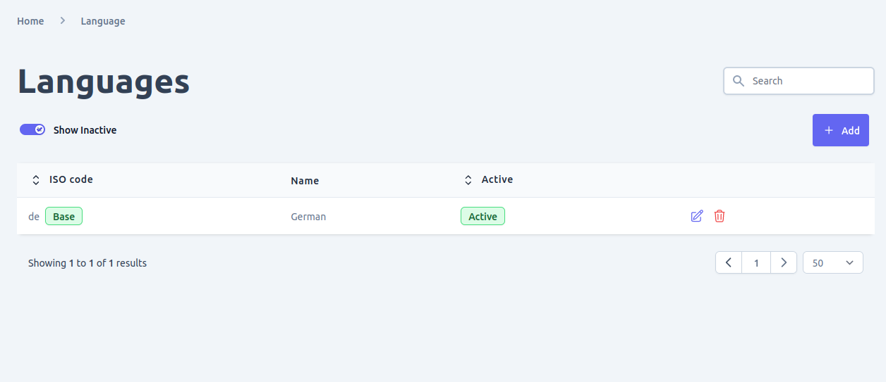
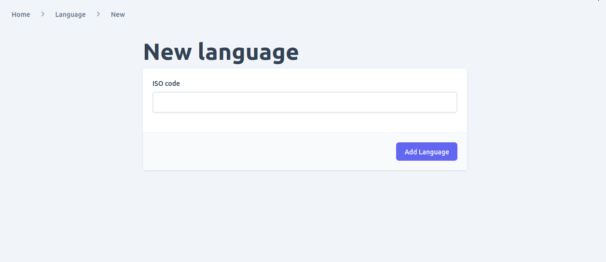
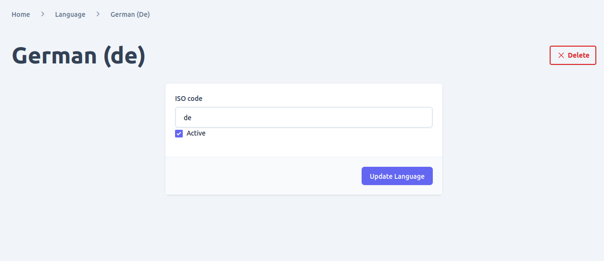

Adding multiple language/locale support to your e-commerce store is made easy with the Admin UI's user-friendly interface. Once you add and activate a language, you can use it throughout your system, from product and assortment descriptions to localized filter texts.

In the Admin UI, you have the following options for managing languages:
- View all currently added languages and search/filter them as needed.
- Add new languages with their corresponding ISO codes.
- Update existing languages with new information or change their status.
- Delete languages from your store. Please note that this operation is not reversible, so be sure to verify that it will not cause any data integrity issues before deleting a language.
- Activate or deactivate languages depending on your current needs

## View supported Language

To view all the currently added languages and filter or search them, navigate to the "Languages" page using the link in the navigation bar.

Once on the "Languages" page, you can perform the following actions using the Admin UI:
- Add a new language: click on the "Add" button and use the form provided to add a new language to your e-commerce store.
- Update an existing language: click on the "Edit" icon for the language you want to update and use the form provided to modify the language's information.
- Delete a language: click on the "Delete" icon for the language you want to delete. Be sure to confirm the action as it is irreversible.

## Add Language
To add a new language in your e-commerce store, follow these steps:
1. Go to the Admin UI and navigate to the Languages page using the link in the navigation menu.
2. Click on the "Add" button to add a new language.
3. You will be redirected to a form where you can add the language ISO code.
4. After submitting the form, you will be redirected to the newly added language detail page.

## Update Language

When you navigate to the languages list, you will see a list of all the languages currently added in your e-commerce store. To edit the details of a language, click on the edit icon. This will take you to the language detail page where you can view and update the language information, including the language's status and iso code.

Note that changing the iso code of a language is not recommended as it may have been used in other parts of the system, and changing it may cause data integrity issues. Therefore, it is important to ensure that any changes made do not compromise the integrity of the data.

## Delete Language

To delete a language, you can do so from two locations: the list view of the languages page or the detail page of a specific language. Before deleting a language, it is important to ensure that this action will not cause any integrity issues as it cannot be undone. Be sure to consider any potential implications before deleting a language.