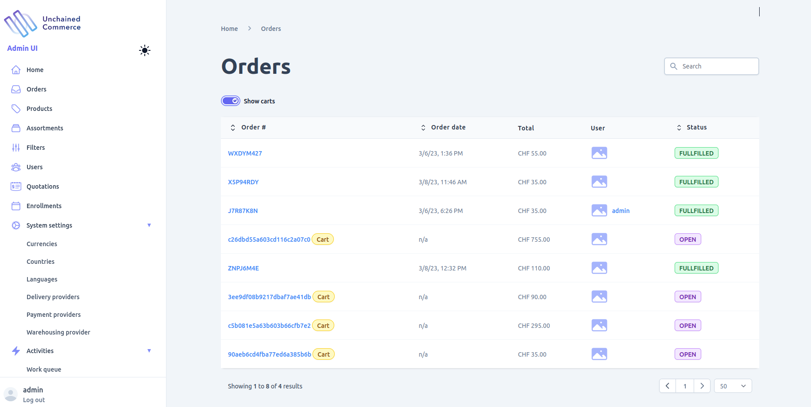
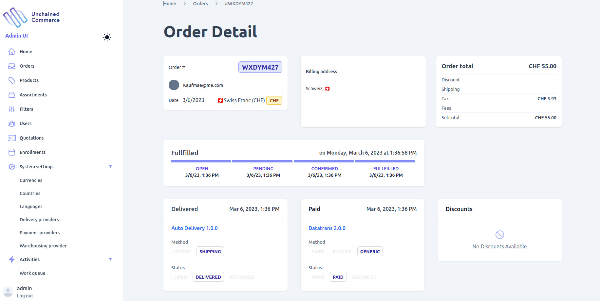

Orders are a crucial part of any E-commerce site, and Unchained Admin UI offers comprehensive functionalities for viewing and managing orders in your shop easily. The following functionalities are provided in Admin UI for managing orders:

- View all orders with search and filter support
- Track the status of a given order
- Confirm pending orders
- Manually mark an order as paid (Automation is supported by Unchained)
- Manually mark an order as delivered (Automation is supported by Unchained)
- Manually reject an order (Automation is supported by Unchained)
- Delete pending orders
- View all the details stored for a specific order, including the customer's information, order items, payment information, shipping information, and order history.

By using the order management functionalities provided in Admin UI, you can efficiently manage your orders and ensure that your customers receive their products on time.

## View and filter orders
To view all orders in your shop, including carts, you can navigate to the "Orders" page in the admin UI. From there, you can use the search and filter capabilities to find specific orders. If you want to include carts in the list of orders, simply toggle the "Show Carts" button. You can also search for a specific order using its "orderNumber". Once you find the order you are looking for, you can view all the details associated with it, such as the customer's information, payment details, and order status.

## Order details

The order detail page in the admin UI provides a comprehensive view of all the information related to an order. Depending on the current status of the order, certain actions can be performed.

If the order has an **OPEN** status, you can delete it using the "Delete" button. For orders with a **PENDING** status, you can either mark them as confirmed using the "Confirm" button or reject them using the "Reject" button.

Once an order has been confirmed or rejected, these actions cannot be undone. Additionally, if the order has a PAID status, you can change its payment status to **PAID** using the "Mark as Paid" button. Similarly, if the order has a **DELIVERED** status, you can change its delivery status to **DELIVERED** using the "Mark as Delivered" button.

It's important to note that these actions are available only based on the current status of the order, and attempting to perform an action that's not applicable to the order's status will not be possible. Furthermore, once an action has been performed on an order, it cannot be reversed.

