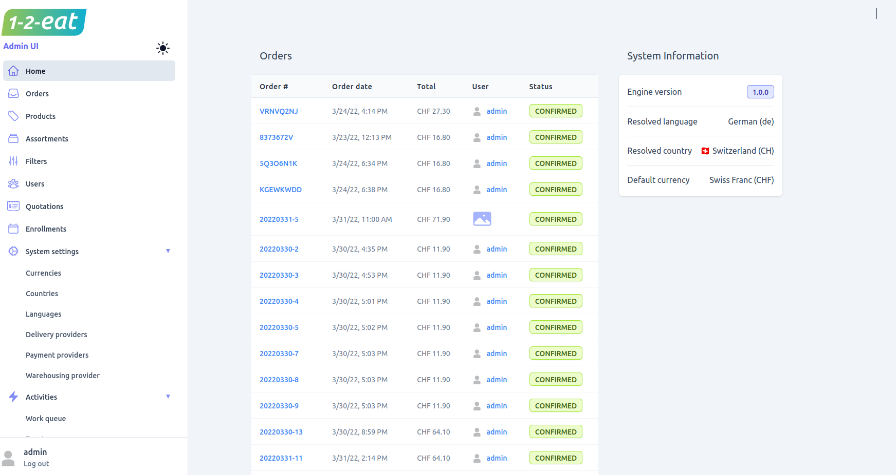

The Unchained Commerce Admin UI is a powerful tool that provides merchants with an easy-to-use interface to manage their online store. With the Admin UI, merchants can perform a variety of tasks that are essential to running an e-commerce business.

One of the key features of the Admin UI is the ability to manage products. Merchants can use the UI to add new products, edit existing products, and delete products that are no longer available. The Admin UI also provides a way to organize products into categories, which can help customers find what they're looking for more easily.

In addition to managing products, the Admin UI also provides merchants with the ability to manage orders. Merchants can view all orders in one place, track the status of individual orders, and perform various actions on orders, such as confirming, rejecting, marking as paid, and marking as delivered. Merchants can also view detailed information about each order, such as the customer's name and address, the products ordered, and the order total.

The Admin UI also includes features for managing customers. Merchants can view all customers in one place, view detailed information about each customer, and perform actions such as editing customer information and adding new customers.

The Admin UI is designed to be intuitive and user-friendly, with a clean and simple interface that makes it easy for merchants to find the information they need and perform the tasks they need to do. The UI is also highly customizable, with a range of settings and options that allow merchants to tailor it to their specific needs.

Overall, the Unchained Commerce Admin UI is an essential tool for any merchant looking to run a successful e-commerce business. With its wide range of features and intuitive interface, it provides merchants with everything they need to manage their store efficiently and provide a great shopping experience for their customers.

