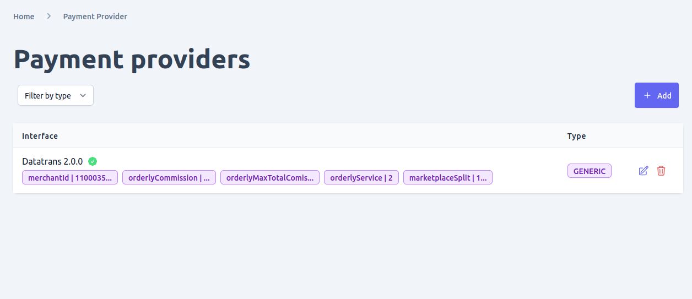
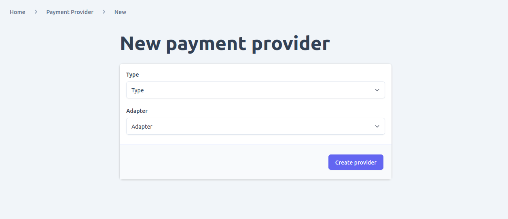
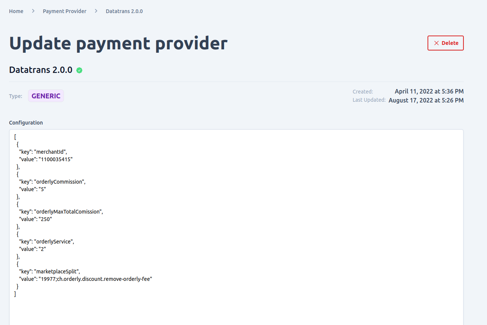

To manage the payment providers supported in your e-commerce shop, you can navigate to the payment provider page in the system settings section of the admin UI. This page allows you to manage all the configured payment plugins in Unchained.

Using the payment provider page, you can perform the following actions:
- **View and filter payment providers**: The page displays all the payment providers that are currently configured in your e-commerce shop. You can also filter the payment providers by various criteria, such as provider name or status.
- **Add new payment provider**: You can add new payment providers to your e-commerce shop by selecting the provider you want to use and configuring the necessary settings.
- **Update existing payment provider**: You can update the settings for an existing payment provider, such as changing the payment method or updating the credentials required for the provider to function correctly.
- **Delete payment provider**: If a payment provider is no longer needed, you can delete it from your e-commerce shop.

By using the payment provider page in the admin UI, you can easily manage the payment providers supported in your e-commerce shop. This allows you to offer your customers a wide range of payment options and ensures that payments are processed smoothly and securely.

Please note that before you can add a new payment provider to your e-commerce shop using the admin UI, it must be configured and loaded into the Unchained engine instance that your shop is using. This means that you will need to have the necessary plugin files and configurations in place before you can start managing the payment provider through the admin UI.

Furthermore, it is important to understand that the activation and deactivation of payment providers is typically controlled by the plugin logic itself. This means that activating or deactivating a payment provider in the admin UI does not necessarily guarantee that it will be functional in your e-commerce shop. You will need to make sure that the plugin code and configurations are properly set up and maintained to ensure the smooth functioning of your payment providers.

## View and Filter payment providers
In the payment provider page of your e-commerce shop's admin UI, you can view and filter the payment providers that have been added to your shop based on their type. This can be useful when you have a large number of payment providers and want to quickly find providers of a particular type.

To view and filter payment providers by type, follow these steps:
- Navigate to the payment provider page in the admin UI.
- Look for the "Type" column in the list of payment providers. This column displays the type of each payment provider, such as "Credit Card", "PayPal", "Bank Transfer", etc.
- Click on the "Type" column header to sort the payment providers by type.
- Use the search bar or filter options available on the page to filter the payment providers by type. For example, you could filter the list to only display payment providers of the "Credit Card" type.

By viewing and filtering payment providers by type, you can easily find and manage the payment providers that are relevant to your e-commerce shop's needs. This can help you offer a wider range of payment options to your customers, improving their shopping experience and increasing the chances of successful transactions.

## Add new payment providers
o add a new payment provider plugin to your e-commerce shop, follow these steps:
- Navigate to the payment provider page in the admin UI.
- Click on the "Add" button found in the payment providers list.
- On the new payment provider form, enter the required information such as the type and adapter for your payment provider. The adapter refers to the paymentProvider adapter plugin that has been configured and loaded in the Unchained engine.
- Once you have entered all the necessary information, submit the form.
- You will be redirected to the newly created payment provider detail page.

On the payment provider detail page, you can view and manage the settings for the newly added payment provider. You can update the provider's settings, such as the payment method and credentials required for it to function correctly. You can also activate or deactivate the provider, depending on your needs.

Adding new payment provider plugins can help you expand the payment options available to your customers, improving their shopping experience and increasing the chances of successful transactions. By using the admin UI to manage your payment providers, you can easily add, update, and activate/deactivate payment providers as needed.

## Update payment providers
If you need to update the settings of a specific payment provider in your e-commerce shop, you can do so by clicking on the edit icon (usually represented by a pencil or similar icon) next to that payment provider in the payment provider list view. This will take you to the payment provider detail page, where you can edit various settings for the payment provider.

One of the main settings you can edit for a payment provider is the configuration. The configuration settings will depend on the specific payment provider you are working with, but may include things like API keys, merchant IDs, and other credentials needed to connect to the payment provider's services.

If there is an error with the configuration settings for a payment provider, you will see a red "X" check mark next to the configuration field(s) with the error, along with helpful error text explaining what needs to be corrected. This can help you quickly identify and fix any configuration errors, ensuring that the payment provider functions correctly and smoothly in your e-commerce shop.

By using the edit function in the payment provider list view, you can easily manage the settings for each payment provider in your shop, making it easy to keep your payment options up-to-date and functioning properly.

## Delete payment providers

To delete a payment provider from your e-commerce shop, there are two places where you can do so:
- Payment Provider List View: You can delete a payment provider by clicking on the delete icon (usually represented by a trash can or similar icon) next to that payment provider in the payment provider list view.
- Payment Provider Detail Page: Alternatively, you can also delete a payment provider by opening the detail page for that provider and clicking on the "Delete" button.

Before you delete a payment provider, however, it's important to ensure that your change won't cause any integrity issues with your shop's data. Deleting a payment provider is an irreversible operation, so it's essential to be certain that it won't cause any problems with your shop's payment processing capabilities.

If you're unsure whether it's safe to delete a payment provider, it's always a good idea to consult with a technical expert or support team member who can provide guidance and advice based on your specific setup and needs.