Products are the integral part of any e-commerce shop and Unchained engine provides multiple product types to suit your needs. On the unchained Admin Ui you can mange all your shop products with an intuitive interface and perform tasks suc as:
- Add new product
- Edit product information and Add localized variation of a product information or delete exiting product
- Add media's to a product
- Price a product
- Add token information of a token product type (more detail on this can be found below)
- Create a bundle product
- Add product variation
- Add subscription plan configuration to a product
- Activate deactivate
- View and/or search and/filter product

## Overview
Before we talk about all the product configuration capabilities available in unchained lets first have an overview of the different type of products supported in unchained.

Unchained Engine is a powerful e-commerce platform that enables merchants to create and manage their online stores with ease. It provides a range of features and functionalities that help merchants to sell their products online, such as inventory management, order processing, payment processing, and more. Here are the various types of products that Unchained Engine supports:

1. **SimpleProduct**: A simple product is a standard product with a fixed price and no variations or customization options. This type of product is suitable for merchants who sell standard, one-size-fits-all products that don't require any additional options or configurations. Examples of simple products include a single book or a basic t-shirt.

**Use case**: A clothing store might sell a basic t-shirt as a simple product. The product would have a fixed price and no variations or customization options. Customers would simply choose their size and color, add the item to their cart, and check out.

2. **TokenizedProduct**:A tokenized product is a digital product that is stored on a blockchain network and can be traded as a token. This type of product is useful for merchants who want to sell digital assets [NFT](https://ethereum.org/en/nft/) such as digital art or music in a secure and decentralized way.

**Use case**: An online marketplace for digital art might sell tokenized products that represent ownership of a specific piece of art. Customers would purchase the token and receive ownership of the artwork on the blockchain network. The artwork could then be traded or sold by the customer on the blockchain network.

**Use case**: An online marketplace for digital art might sell tokenized products that represent ownership of a specific piece of art. Customers would purchase the token and receive ownership of the artwork on the blockchain network. The artwork could then be traded or sold by the customer on the blockchain network.

3. **PlanProduct**: A plan product is a subscription-based product that customers pay for on a recurring basis. This type of product is useful for merchants who offer ongoing services or products that require regular replenishment. Examples of plan products include a monthly subscription to a meal delivery service or a quarterly subscription to a magazine.

**Use case**: A meal delivery service might offer a plan product that provides customers with a certain number of meals each week. Customers would sign up for the plan and receive their meals on a recurring basis. The merchant would automatically bill the customer for the plan each month until they cancel.

4. **BundleProduct**: A bundle product is a collection of simple products that are sold as a package. This type of product is useful for merchants who want to sell related products together or provide customers with a discount for purchasing multiple products at once. Examples of bundle products include a set of kitchen utensils or a collection of books.

**Use case**: A bookstore might sell a bundle product that includes multiple books in a specific genre or by a specific author. The bundle would have a discounted price compared to buying each book separately. Customers would add the bundle to their cart and receive all the books in the bundle when they check out.

5. **ConfigurableProduct**: A configurable product is a product that has multiple options or configurations. This type of product is useful for merchants who sell products with variations or customization options, such as clothing with different sizes and colors or laptops with different specifications.

**Use case**: A clothing store might sell a configurable product that allows customers to choose the size, color, and style of a shirt. The price of the shirt would vary based on the selected options. Customers would choose their options, see the updated price, and add the item to their cart.

## View and filter and/or search products
Product list view page provides a comprehensive list of all the products available on your e-commerce site. You can efficiently manage your product catalog by using various filter options like tags and status, or searching for a specific product. By utilizing these filters, you can narrow down your search and streamline your product management process.
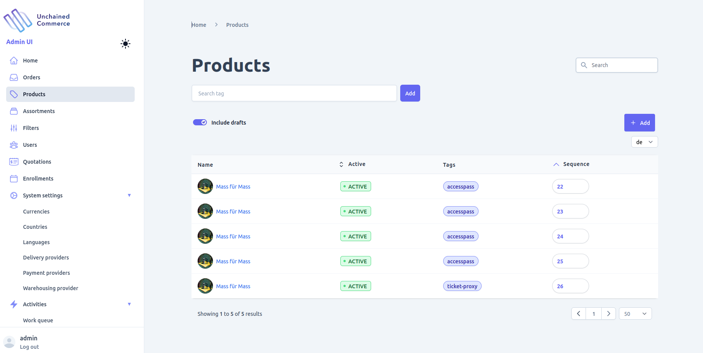

## Add product
To add a new product to your e-commerce store, navigate to the product list view and click on the "Add" button. This will open a form where you can provide the necessary details for the new product. The form will include fields for the product title and type, where the type should be selected from the list of supported product types for your store.

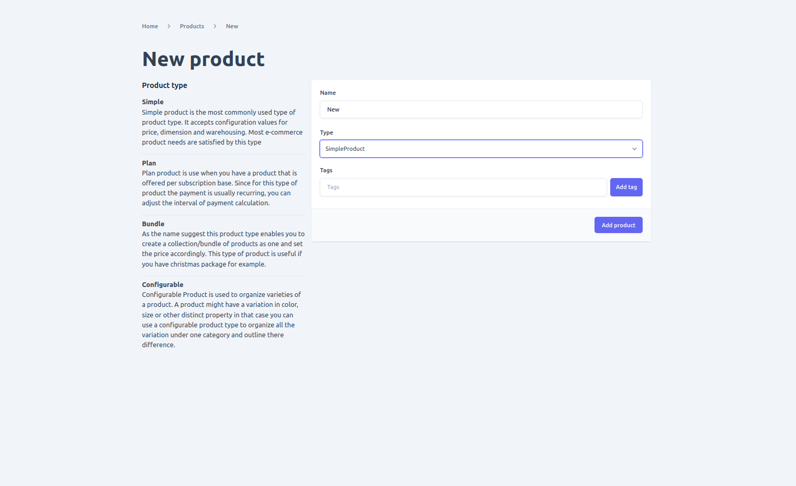

## Edit Product
Once you have opened the detail view of a product, you can update various information about the product depending on its type. Here are some of the common actions that you can perform:

- **Edit product information**: You can update the product title, description, and other general information about the product.
- **Add localized variations of product information**: If you are selling products in multiple regions or languages, you can add localized variations of the product information to make it easier for customers to understand the product.
- **Add media to a product**: You can add images and videos to showcase the product and help customers visualize it better.
- **Price a product**: You can set the price of the product, and configure discounts and promotions if required.
- **Add token information of a token product type**: If you are selling tokenized products, you can add token-specific information such as the token address, token ID, and other relevant details.
- **Create a bundle product**: If you are selling a bundle of products, you can add or remove products from the bundle, and adjust the pricing accordingly.
- **Add product variations**: If you are selling configurable products, you can add variations such as size, color, and style, and set different prices for each variation.
- **Add subscription plan configuration to a product**: If you are selling plan products, you can configure the subscription plan details such as billing cycle, start and end dates, and payment method.
- **Activate or deactivate a product**: You can activate or deactivate a product depending on its availability.
### Global update options
Below are updatable options found on every product type
1. **texts**: The "texts" tab on the product detail view allows you to update all the textual information of a product such as its title, subtitle, and description. You can also add localized text for all the supported languages in your shop by selecting the language at the top right of the form. This ensures that customers from different regions can view the product information in their preferred language.

It is important to note that before adding a localized text, you need to ensure that the language is added to your shop's supported languages. You can add a new language by using the [Add language](./language/#add-language) form available in the [Language](./language) section. Once the language is added, you can then add the localized text for the specific language in the Texts tab of the product detail view.

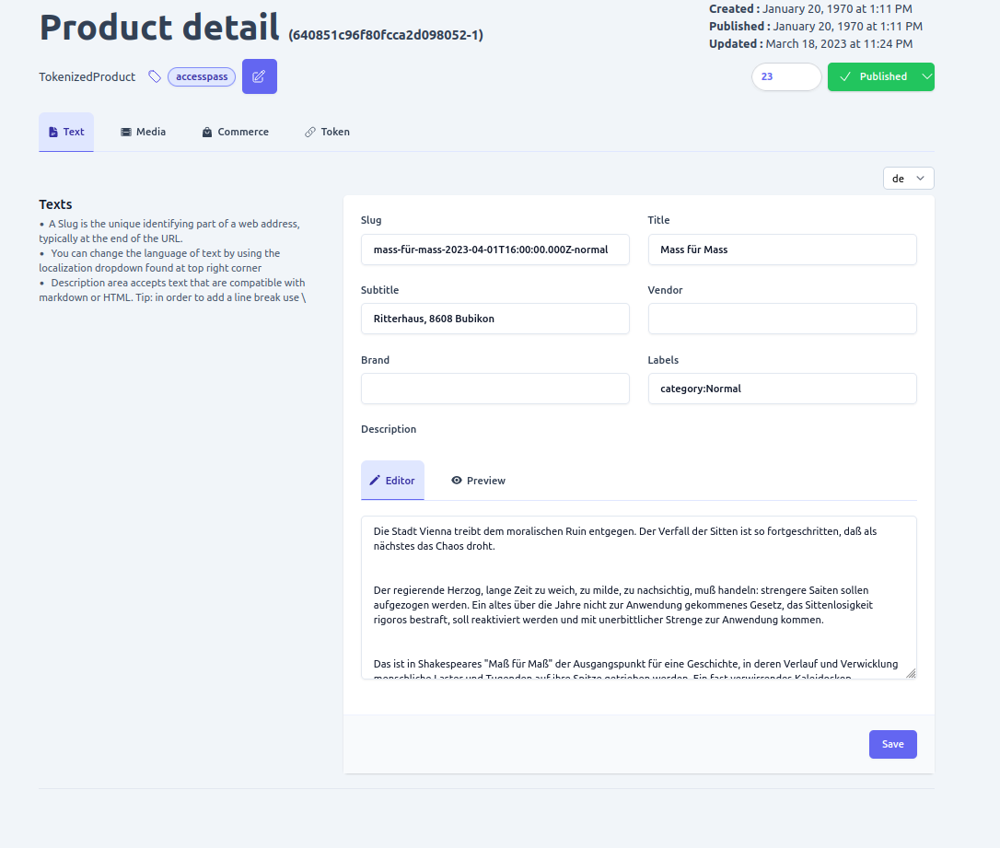

2. **Media**: The "media" tab on the product detail page allows you to manage the media files associated with a product. You can add, update, or delete media files to provide additional information about the product or to make the user interface more appealing. You can also add localized text in all the supported languages of your shop by selecting the language you want at the top right of the form. Please note that in order to add localized text, you must first [add language](./language/#add-language) using the new language form.

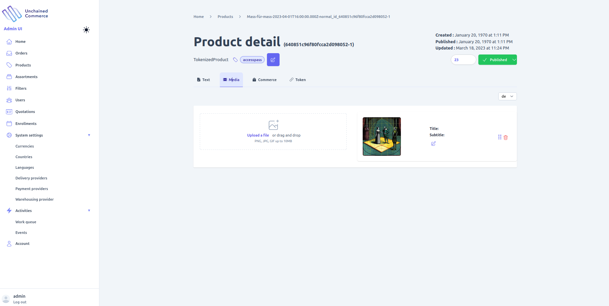

3. **Tags**: Tags are useful for providing additional information about a product that distinguishes it from others. You can add or remove tags for a product by clicking on the "Tags" button found at the top of the product detail page.

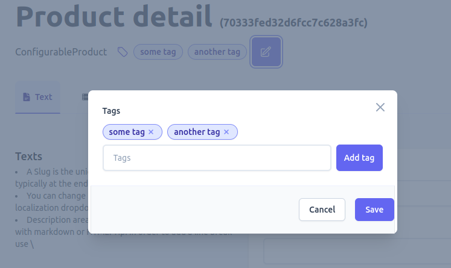

4. **Sequence**: You can reorder the products on the product list page by adjusting their sequence. Products with a lower sequence number will appear first in the list. To change the sequence, toggling "Sort" value found at the top of the page.

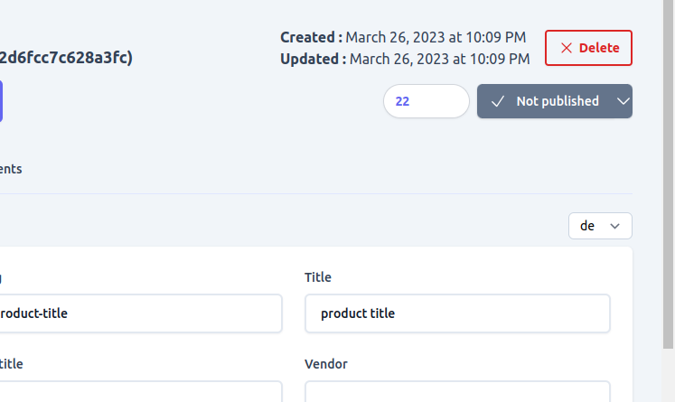

5. **Status**: The default behavior of products in the shop is to be active and displayed to customers. However, if you need to temporarily hide a product from customers while keeping it in the shop, you can change its status to draft. To do so, you simply toggle the button displaying the current status of the product and select "draft" as the new status. All operations on a product, such as updating or deleting, can be performed regardless of its status, but only active products are returned by default.

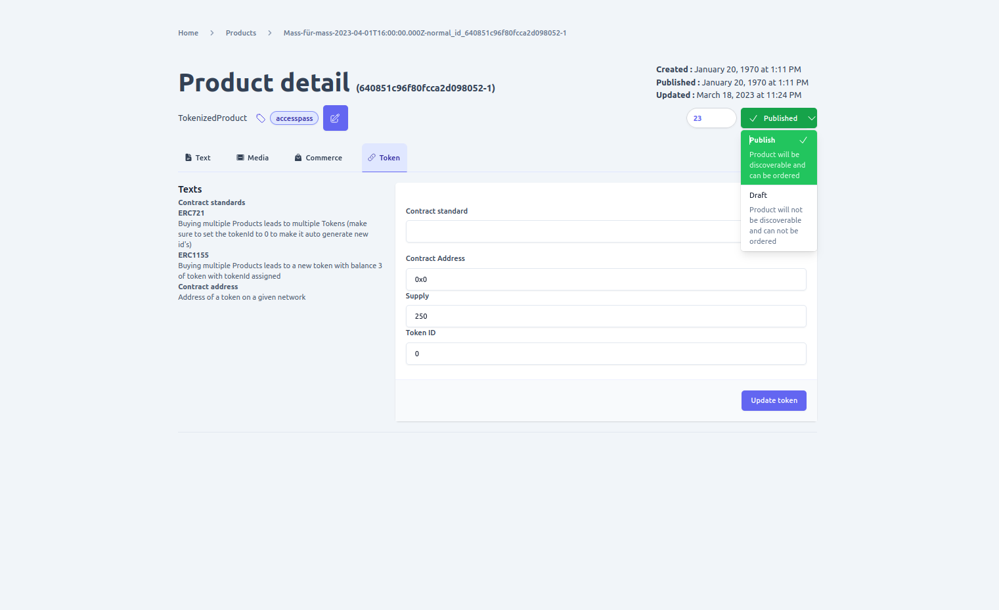

6. **Delete**: You can remove a product by clicking on the delete button available on a product detail page. A product is deletable only when it is in draft status. If a product is active then it cannot be deleted. In this case, you can change the product status to draft if you don't want to display it to customers but still want to keep it in your shop.as **DRAFT** state, so if you want to delete a product that is active change its status to do so.

**Note: When deleting a product, it is important to ensure that the deletion does not cause any integrity issues or affect the shop's operations, such as active orders. It is essential to be cautious as this operation is not reversible.**

### Scoped update options
Based on the product type there are additional configuration options available for a product. Below are all the available options for each product type

1. **Price or Commerce**

**Applicable to products with type**
- Simple
- Tokenized
- Bundle
- Plan /subscription

Since its a shop every product has a price and you can add one or multiple prices to a given product using the commerce tab available on the product detail page. 
on the product commerce form you will be required to provide the following information
- **Max Quantity**:- refers to the maximum number of product that should be in an order for the price to be used for a product. if left empty or 0 then it will be used as the default price for a product unless there is another price entry with max quantity set. On that case that price will be used the number of products in a order satisfy it.
- **Price**:- Actual price  of the product. Note decimal pricing is not supported to you should enter price for a product by multiplying it with 100. for example if a product price is $35 then entry on the price field should be 3500 and if the price is $3.5 it should be entered as 350.
- **Vat suspect**:- determines if tax should be added on the product price when calculating total price of a product. the applied tax can be different based on the ProductPricing plugin in configured on the engine.
- **Net price**:- Determines wether the price is final or tax, discount, delivery and other additional costs should be added to it when calculating total price
- **Country**:- if you have different price for a product based on the customers order location you can select the country where a given price is applicable using this field.
In order to add a select a country for a price you need to add the country in question using the  [new country form](./country/#add-country) first.
- **Currency**:- Currency of the price. you can have multiple currency prices configured for a product and based on the order currency the corresponding price will be applied.
In order to add a select a currency for a price you need to add the currency using the  [new currency form](./currency/#add-new-currency) first.

**Requirements of pricing**
- There must be one price entry with max quantity set to 0 that can be used as the default price.
- It is not possible to add multiple product price with the same max quantity, country and currency and it will create a conflict.

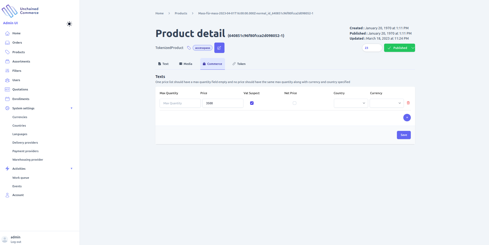

### Specialized configuration options

Below are configuration options available only for a specific product type.

1. **Supply**

Available on **SimpleProduct**

For a Simple product, you may need to provide additional information that outlines the dimensions of the product. This information can be added by navigating to the "Supply" tab found on the product detail page.

On the product Supply form, you will be required to provide the following information:
- **Weight**: Weight of the product.
- **Length**: Length of the product.
- **Width**: Width of the product.
- **Height**: Height of the product.

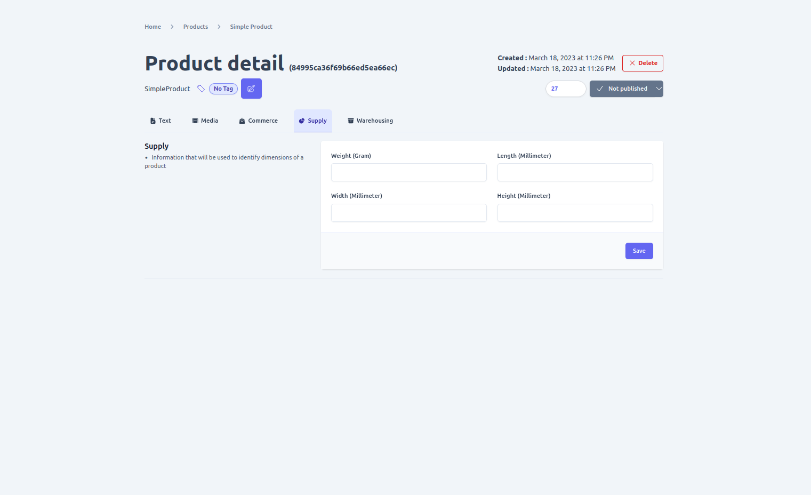

2. **Warehousing**

Available on **SimpleProduct**

Physical or Simple products are typically stored in a warehouse and you may need to provide additional information about the product's storage. You can add this information by navigating to the "warehousing" tab on a product detail page. Here you can add the following storage-related information:
- **SKU code**: A unique identifier assigned to a product for tracking purposes.
- **Base unit of measure**: The unit of measure used for tracking the quantity of a product in the warehouse. For example, if a product is sold by weight, the base unit of measure could be grams or kilograms.

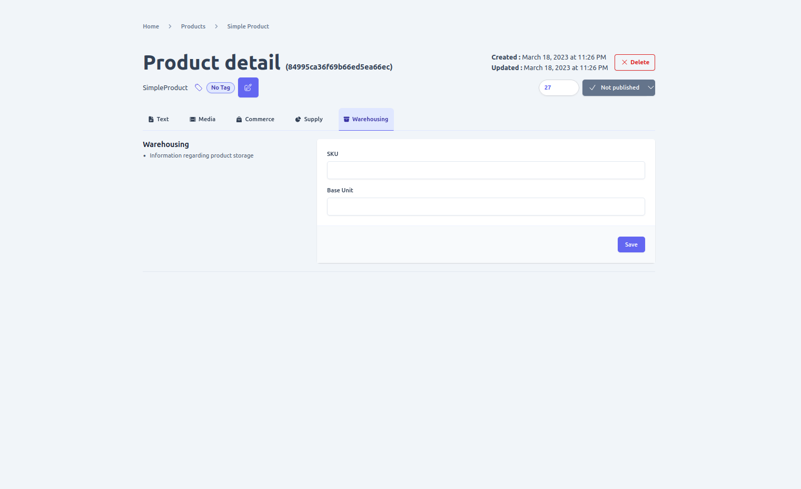

3. **Bundles**

Available on **BundleProduct**

Bundle products are a collection of products that are sold together as a single item. You can manage the bundle products by navigating to the ""Bundles" tab on the product detail page.

On the Bundle configuration page, you can specify the products that make up the bundle by selecting them from a list of available products. You can also set a custom name and description for the bundle.

Additionally, you can set a custom price for the bundle, which will override the prices of the individual products. You can also choose whether the bundle price is fixed or calculated based on the sum of the prices of the individual products.

If a product that is part of a bundle is removed or becomes inactive, the bundle will be automatically updated to reflect the change.

On the "Bundles" tab of a Bundle product, you can add or remove one or multiple products to be included in the bundle along with the quantity assigned to each product using the provided form.

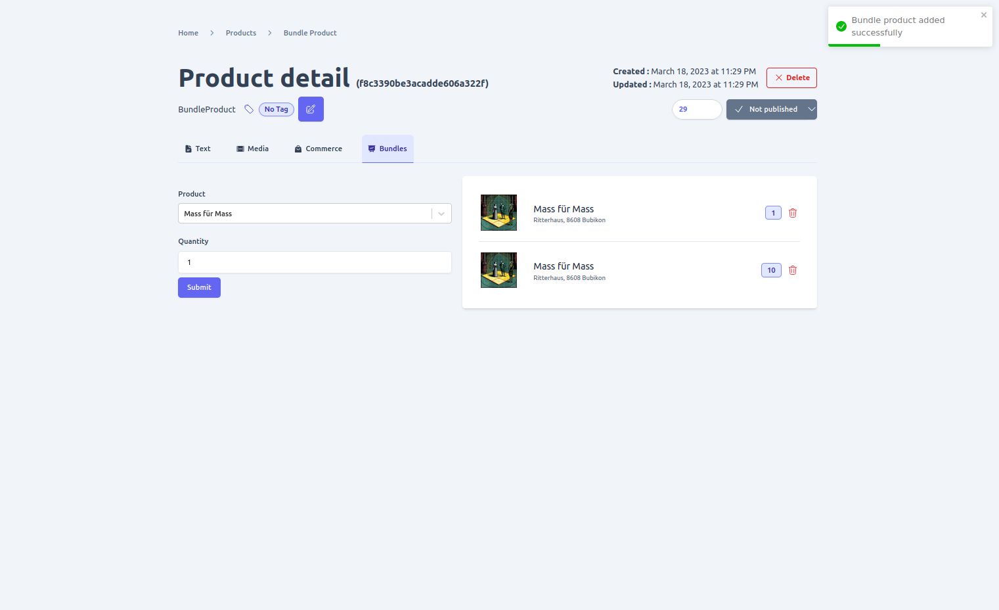

4. **Variation**

Available on **ConfigurableProduct**

A configurable product is a grouping of similar products with different characteristics, and you can add all the different variations of a product you want to sell in your shop using the "Variations" tab found on the product detail page.

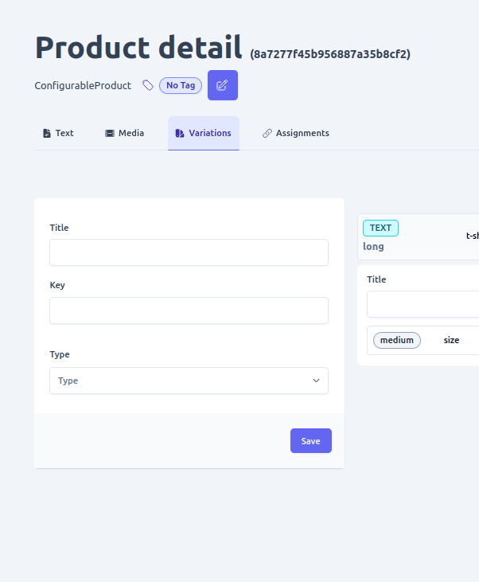

- **Adding variation option**

Variation is the highest level of product differentiation, such as brand or type, for a configurable product. For instance, if you're selling laptops on your shop and there are various brands available, the brand name, such as HP, can be the top-level variation. 

However, to add specific differentiation factors to a configurable product, you'll need to create variation options using the form available under the variations tab on the product detail page.

For example, suppose you have different HP laptop models with varying RAM sizes. In that case, you'll create a variation option for each RAM size, allowing customers to select the exact model they want to purchase.

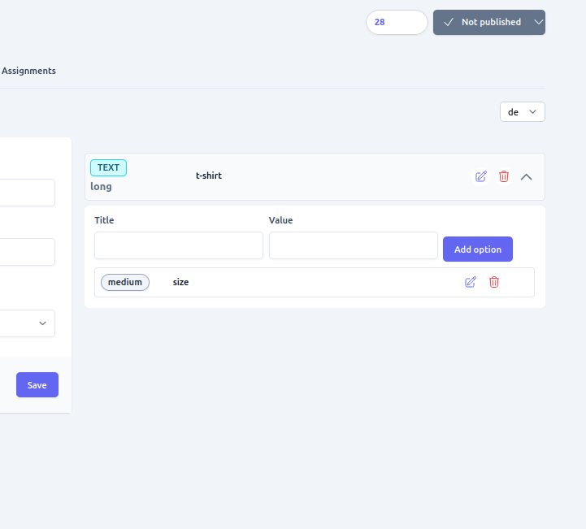

5. **Assignments**

Available on **ConfigurableProduct**

After creating variation and variation options of a configurable product, the next step is to assign the actual product that satisfies the variation configuration. To manage the assignments of a product for each variation option, you can use the "assignments" tab found on the product detail page.

In the assignments tab, you will see a list of all the variation options you have created for the configurable product. You can then assign the specific product that matches that variation option. For example, if you have a variation option for RAM size and you have products with different RAM sizes, you can assign the product with 4GB RAM to the "4GB" variation option.

To assign a product to a variation option, simply select the variation option from the list and then select the product that matches that variation option. Once you have assigned all the products to their respective variation options, the configurable product will be ready for sale on your shop.

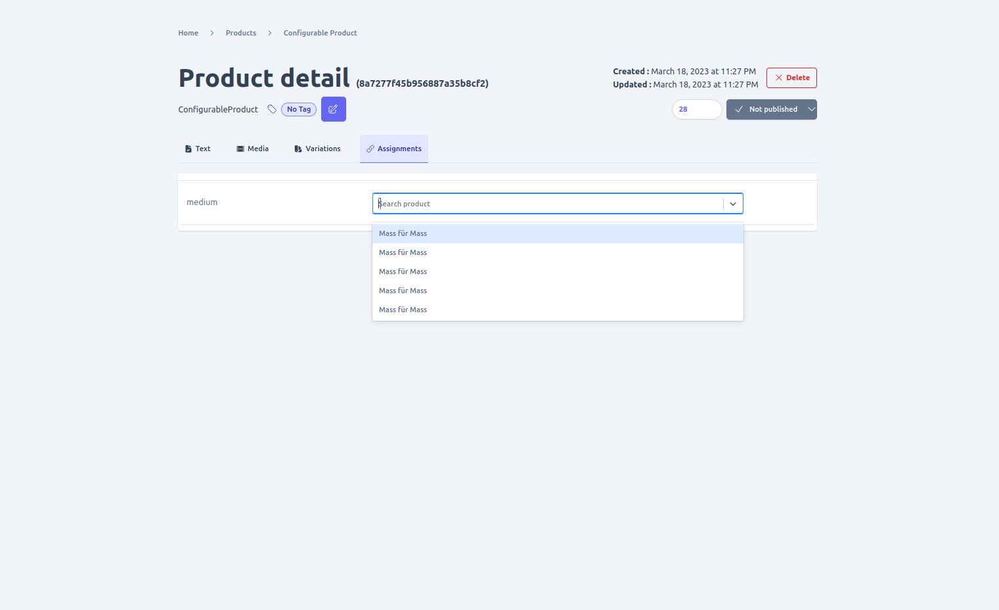

6. **Token**

Available on **TokenizedProduct**

To provide additional information that defines a Tokenized product, which is a digital asset, there are specific details that need to be added. These include:
- **Contract Standard**: This refers to the token standard that was used to create the digital asset.
- **Contract Address**: This is the address of the token on the blockchain where it can be found.
- **Supply**: This indicates the total number of tokens in circulation.
- **Token Serial Number**: This is the unique identifier of the token.

**Note that some fields might be optional depending on the contract standard used for the token implementation.**

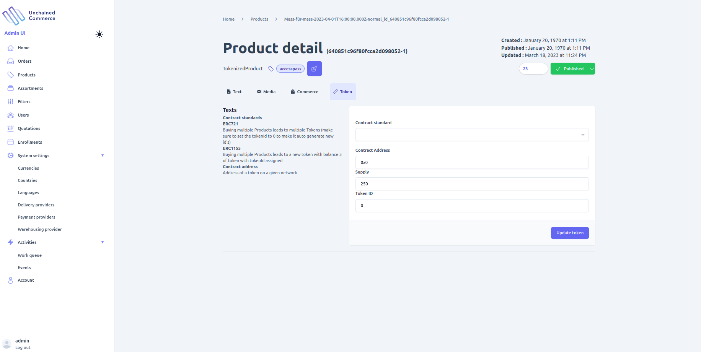