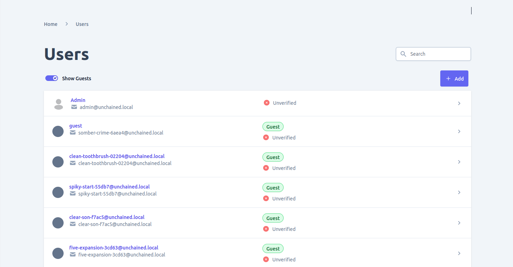
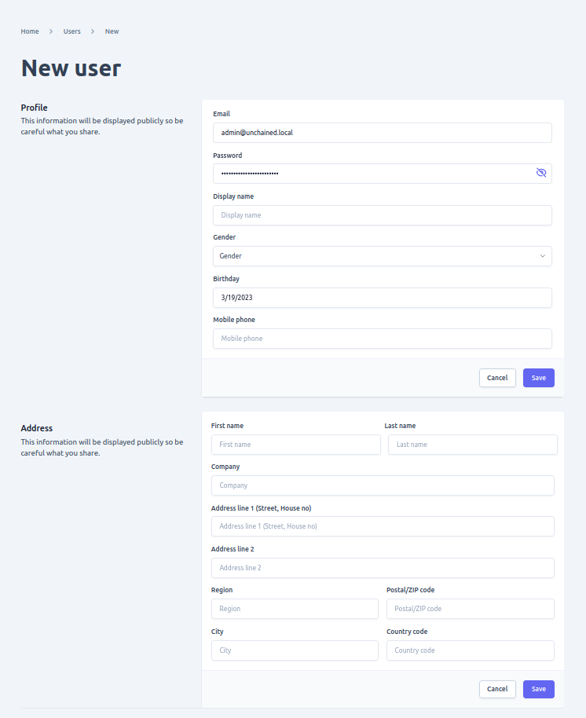
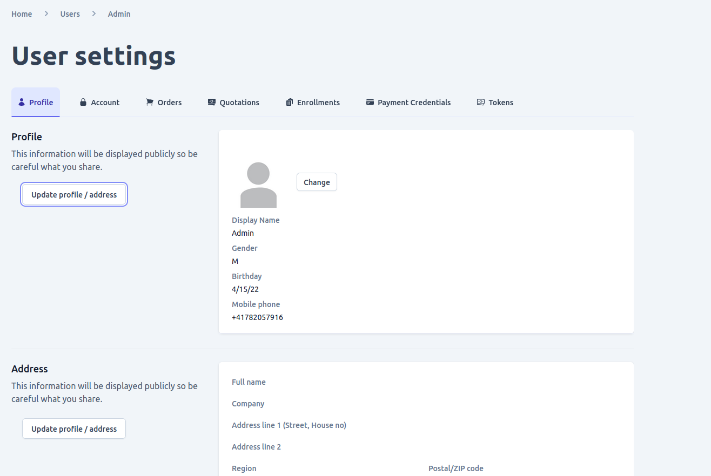
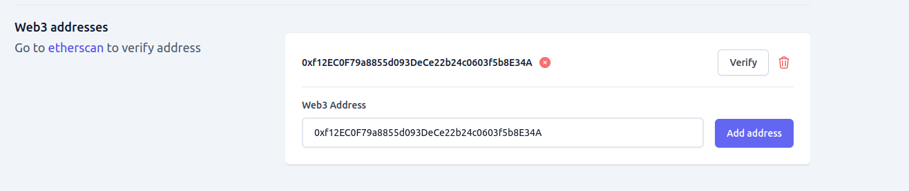
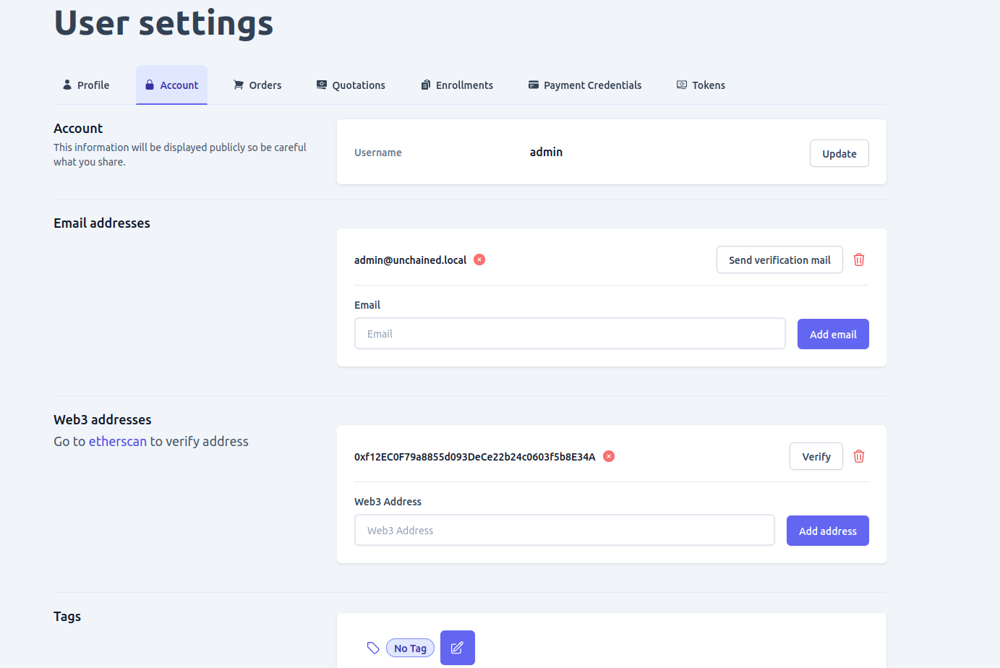

Admin UI provides a comprehensive interface for managing customer information on an e-commerce site, allowing you to view and/or manage user data based on your access rights. By default, every logged-in user can manage their own account, but to view and manage other users' data, a special role such as an admin or custom-configured role is required.

There are two types of users in Admin UI: guests and registered users. A guest user is created when the `loginAsGuest` API is used to log in. This is useful when you want to enable unregistered customers in your shop to still be able to add items to their cart and/or bookmark products without registering. However, when a user decides to checkout and order, they will need to register to complete the process.

If you have the appropriate privileges to view and/or manage other users' information, including guest users, you can do so by navigating to the "Users" page, where you can:
- View all users in the shop with filter and search capabilities
- Add a new user
- View detailed user information such as profile info, orders, quotations, subscriptions, and payment credentials
- Edit user profile information
- Delete a user
- View all orders made by a user
- View all quotations made by a user
- View all subscriptions made by a user
- View all payment credentials of a user

## View all Users
When you navigate to the Users page, you will be presented with an intuitive user interface that allows you to perform several actions such as:
- Filter and search through the list of users in the shop based on different criteria such as name, email, date of registration, etc. This makes it easier to find specific users quickly.

## Add new user
To add a new user to your shop, navigate to the Users page and click on the "Add" button located on the list view. You must have the necessary access rights to perform this action. The Add button will take you to a form where you can fill in the necessary details for the new user. Once the user has been added successfully, you will be redirected to the newly created user's detail page. On this page, you can view and edit additional information such as the user's profile picture, additional email addresses, and more.

##  View and/or edit user detail
To provide a more comprehensive documentation, here are the details that you can view on the user detail page when you open a user from the list:
- Profile Information: You can view the user's name, email address, phone number, and other details that were provided during registration.
- Orders: You can view all the orders that were placed by the user, including the order date, status, total amount, and payment information.
- Quotations: You can view all the quotations that were sent to the user, including the quotation date, status, and total amount.
- Subscriptions: You can view all the subscriptions that were created by the user, including the subscription date, status, and payment information.
- Payment Credentials: You can view all the payment credentials that were added by the user, including the payment method and the last four digits of the card number.

Additionally, if you have the access right to edit user information, you can also make changes to the user's profile, add or remove payment credentials, and manage the user's subscriptions.

1. ### Profile information of a user
On the Profile tab, you can view personal information such as the user's name, address, birthday, and other related details. If you have the necessary permissions, you can also edit this information by clicking on the edit button provided.

2. ### Account information of a user
The Account tab on the user detail page displays information such as email addresses, web3 addresses, and tags associated with the user's account. If you have the appropriate access rights, you can edit these details. The following information is displayed on this tab:
    - **Email addresses**: This is an editable list of email addresses linked to the user's account.
    - **Web3 addresses**: This is a list of blockchain addresses associated with the user's account. This list is also editable.
    - **Tags**: This is an editable list of tags associated with the user's account.
    
    - **Roles**:- The user's assigned roles in the shop.
    - **Password change**:- used to change the user's current password. By default, a user with an "Admin" role has the ability to change any user's password using the "Set Password" form, which is only visible to accounts with the appropriate permissions.
    
    - **Web Authn**:- The "WebAuthn" tab in the user detail page displays information about the devices used for [Web authn](https://webauthn.guide/) authentication method. [Web authn](https://webauthn.guide/) is a modern authentication method that allows users to authenticate themselves with their devices, such as smartphones or security keys. The tab provides information about the devices used for [Web authn](https://webauthn.guide/) authentication, such as their names, types, and statuses.
    

3. ### Additional information of a user
In addition to the above setting related information you can also view and search data of a user such as Order, Quotations, Subscriptions and Payment credentials using the tab.