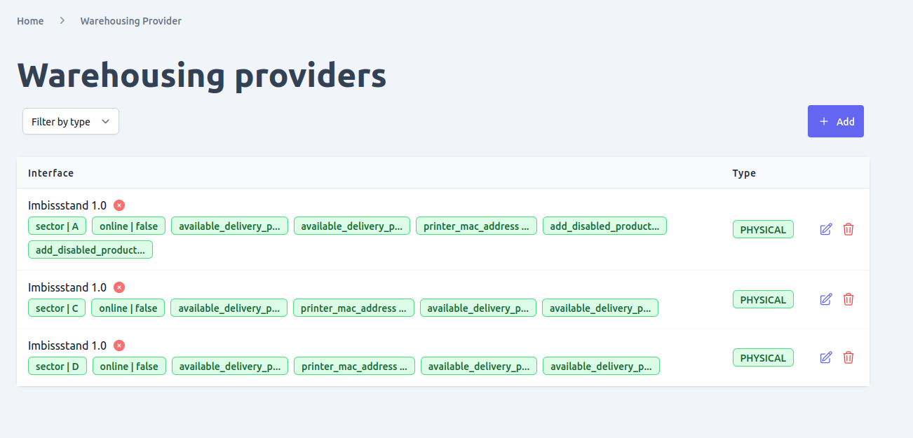
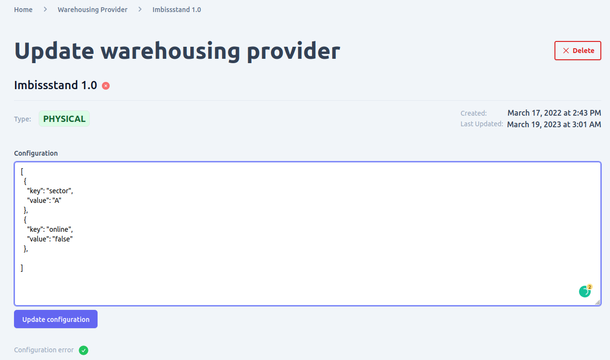

You can manage the warehousing providers in your shop by navigating to the "Warehousing Providers" page in the admin UI. This page is typically found under the "System Settings" section of the UI, and allows you to view and filter the existing warehousing providers that are configured for your shop.

The admin UI provides all the functionality you need to manage the configured warehousing plugins in your shop. This includes:
- **View and Filter**: You can view and filter the existing warehousing providers in your shop by various criteria, such as provider name or status.
- **Add New Warehousing Provider**: To add a new warehousing provider, simply click the "Add" button found on the warehousing provider list view. You'll be presented with a form where you can enter the provider type and adapter for your new provider. The adapter refers to the warehousing provider adapter plugin that is configured and loaded in your engine instance.
- **Update Existing Warehousing Provider**: You can update an existing warehousing provider by clicking the "Edit" icon next to that provider in the warehousing provider list view. This will open up a form where you can update the provider's configuration details.
- **Delete Warehousing Provider**: You can delete a warehousing provider from your shop by clicking the "Delete" button on either the provider list view or the provider detail page. However, be sure to check for any potential data integrity issues before deleting a provider, as the operation is not reversible.

It's important to note that in order to add or manage a warehousing provider in the admin UI, the provider must first be configured and loaded into your shop's unchained engine instance. Additionally, activating or deactivating warehousing providers is typically controlled by the plugin logic, rather than through the admin UI.

Note that in order to add or manage a warehousing provider in the admin UI, the provider must first be configured and loaded into your shop's unchained engine instance. This can typically be done through the installation and configuration of a warehousing provider adapter plugin.

Additionally, it's important to note that activating or deactivating warehousing providers is typically controlled by the plugin logic, rather than through the admin UI. This means that simply adding a warehousing provider through the admin UI does not necessarily mean it will be active and ready to use. Be sure to check the provider's documentation for information on how to activate and configure it for use in your shop.

## View and Filter warehousing providers
To view and filter the warehousing providers that have been added to your shop, you can navigate to the "Warehousing Providers" page in the admin UI. From there, you can use various filtering and search options to find the providers you're looking for, including filtering by provider type.

## Add new warehousing providers
When you navigate to the "Warehousing Providers" page in the admin UI, you can add a new provider by clicking the "Add" button on the list view. This will take you to a form where you can enter the necessary information for the new provider, including the type and adapter for your warehousing provider. The adapter refers to the warehousingProvider adapter plugin that is already configured and loaded in your engine instance.

After submitting the form, you will be redirected to the detail page for the newly created warehousing provider. From there, you can view and manage its settings as needed.

## Update warehousing providers
To edit an existing warehousing provider in Unchained, follow these steps:
- Navigate to the "Warehousing Providers" page in your shop's admin UI. This page can be accessed via the "System Settings" menu.
- Find the warehousing provider you wish to edit in the list view. You can filter the providers by various criteria to make it easier to find the one you're looking for.
- Click the edit icon for the provider you wish to edit. This will take you to the detail view for that provider.
- From here, you can update various aspects of the warehousing provider, including the configuration. Simply make the necessary changes and click the "Save" button to apply them.
- If there are any configuration errors present, you will see a red "x" icon next to the relevant section. Hovering over this icon will display any helpful error text that may be available.

It's important to note that any changes you make to a warehousing provider may impact the overall functionality of your shop, so be sure to test thoroughly before deploying any updates to a live environment.

## Delete warehousing providers

o delete a warehousing provider in Unchained, you can follow these steps:
- Navigate to the Warehousing Providers page by going to System Settings > Warehousing Providers.
- Locate the warehousing provider that you want to delete in the list view. You can use the filter and search functionalities to find it quickly.
- Click the "Delete" button located in the same row as the warehousing provider you want to delete.
- A confirmation dialog will appear asking you to confirm the deletion. Review the information carefully to ensure that you are deleting the correct warehousing provider. If you are sure, click the "Confirm" button.
- If the warehousing provider can be deleted, it will be removed from the system and you will see a success message. If there are any dependencies or relationships that prevent the deletion, you will see an error message indicating what needs to be resolved before the warehousing provider can be deleted.

Note that deleting a warehousing provider should be done with caution as it may cause integrity issues if there are any dependencies or relationships that rely on it. Therefore, it's recommended to review the dependencies before proceeding with the deletion.