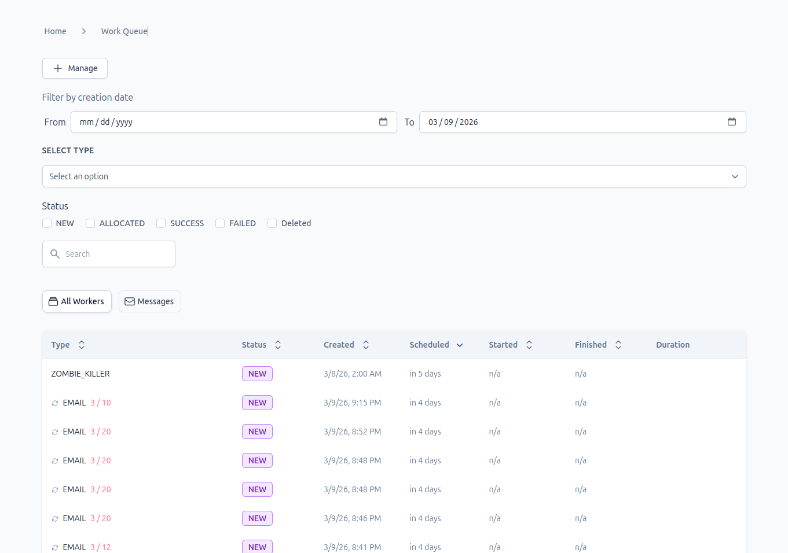
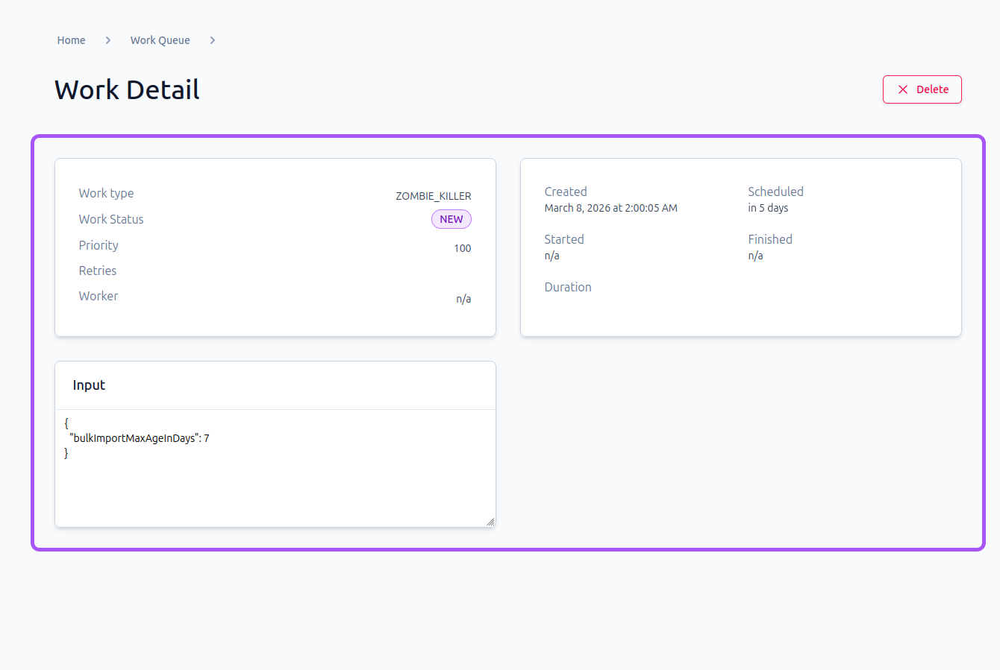
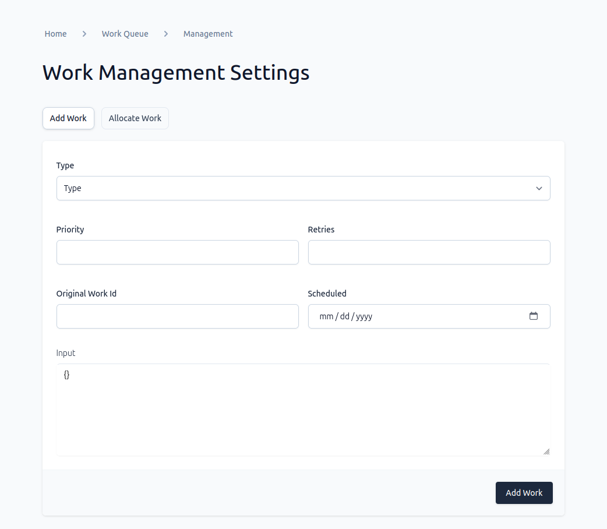
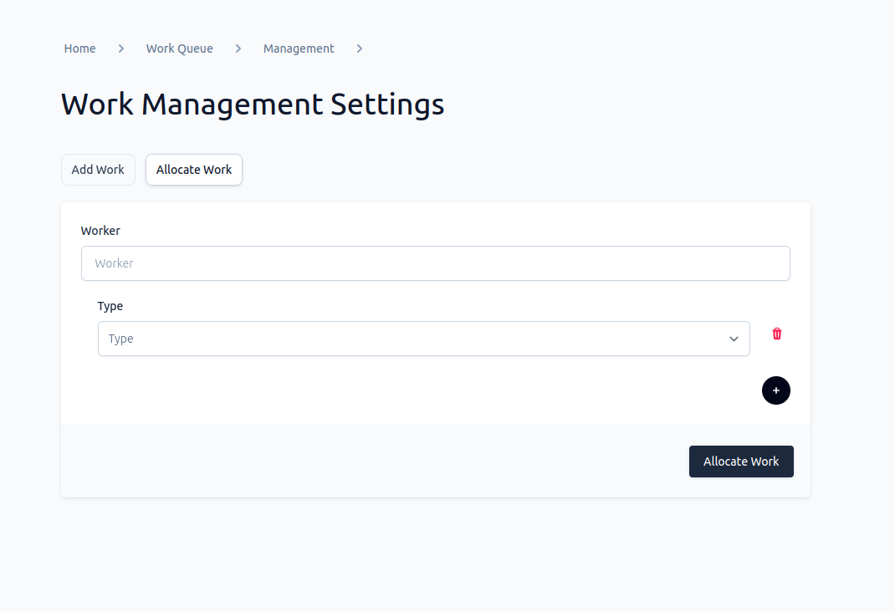
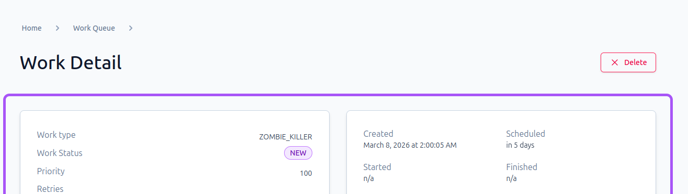

# Work Queue

Open **Activities → Work Queue** to inspect queued and completed jobs. Worker adapters implement the job types; each work item records one execution and its input, result, timing, and status.

## View work queue

Filter the list by type, status, date, or search text. Open an item to inspect its input, output, errors, and duration. The available actions depend on your permissions and the item's status.

The statuses are `NEW`, `ALLOCATED`, `SUCCESS`, `FAILED`, and `DELETED`.

## Work detail

The detail page shows when an item was scheduled, started, and finished, which worker claimed it, and the result or error. A failed item can be retried through the retry form.

## Add work

Open the **Manage** menu on the work list and choose **Add Work**. The worker adapter must be registered and active before its type is available.

- **Type**: The registered work type to execute.
- **Priority**: Higher numeric values are allocated first. The default is 0.
- **Retries**: Retry allowance for failed work. The default is 20.
- **Original Work ID**: Associates the new item with an earlier work item.
- **Scheduled**: Earliest execution time. Leave empty to make it eligible immediately.
- **Input**: JSON data expected by the selected adapter.

Submitting creates a `NEW` item. The built-in work loop processes internal work when it becomes eligible; external work requires an external worker.

## Allocate work

The **Allocate Work** form claims one eligible `NEW` item. Choose the work types and a worker identifier. Allocation considers the scheduled time, priority, existing worker assignment, and each adapter's parallel-allocation limit. It returns one item or no item when none is eligible.

Allocation records the worker identifier and changes the status to `ALLOCATED`. It does not execute the task. An external worker must perform the work and report completion through `finishWork`.

The built-in work loop performs allocation, execution, and completion together for internal jobs. It will not pick up an item that has already been claimed manually, so use manual allocation only when a worker is ready to execute it.

## Delete work

Work items with status `NEW` or `ALLOCATED` can be deleted from their detail page. Deletion marks the item as `DELETED`; its record remains until the work queue's retention policy removes it. Deleting an allocated item does not interrupt code already running in a worker.

