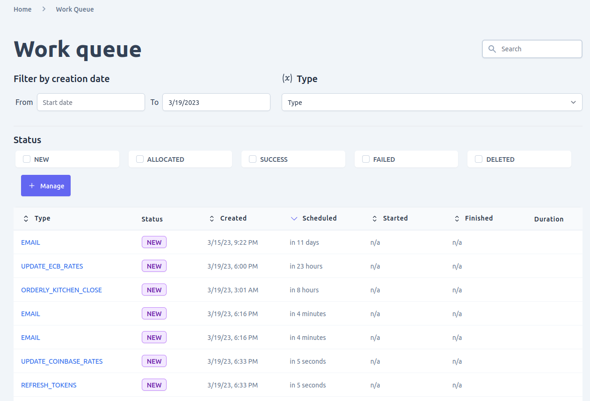
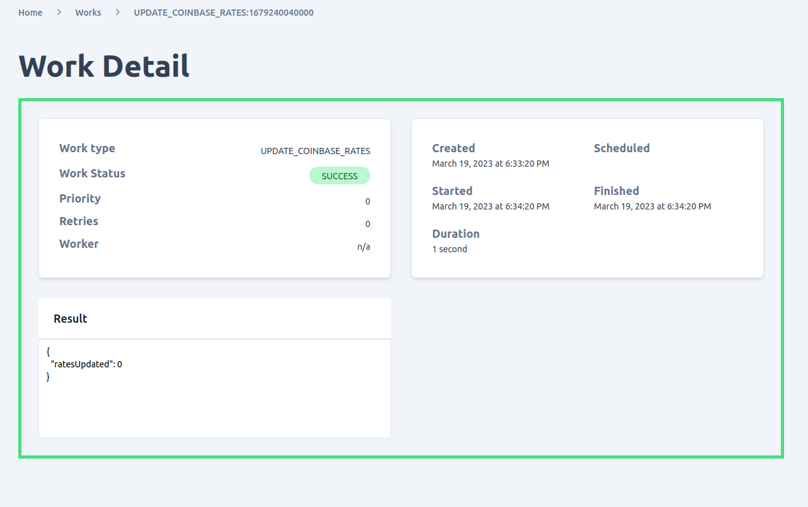
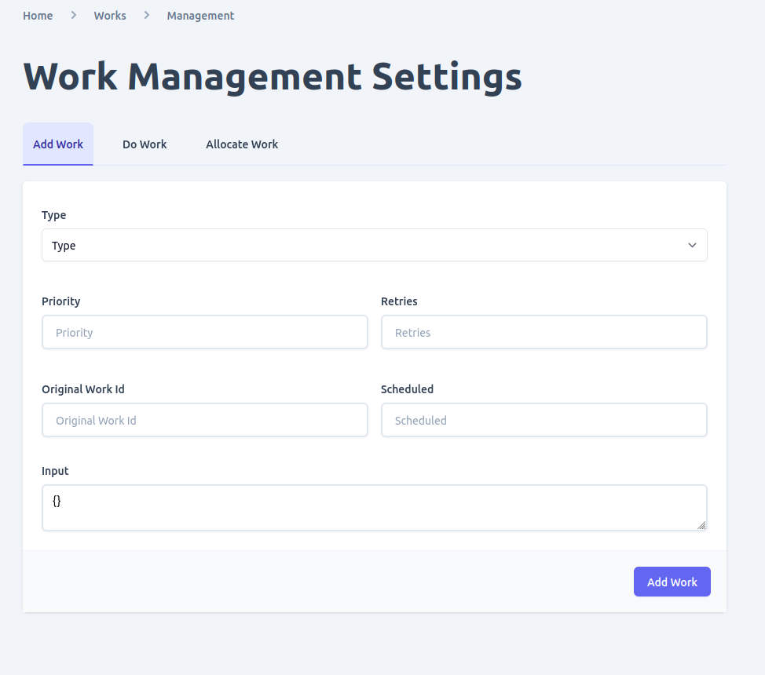
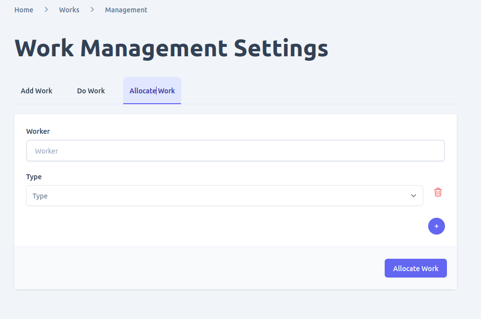
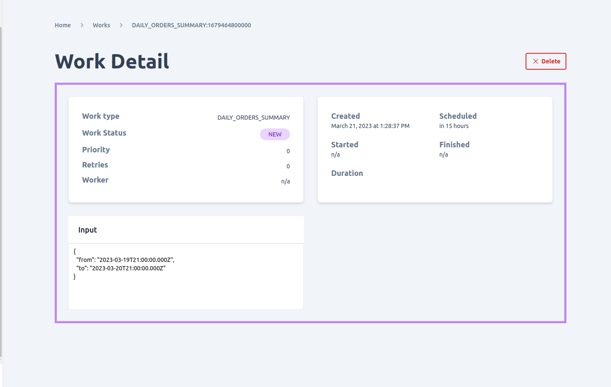

To manage workers in Unchained, you can navigate to the worker page in the system settings section of the admin UI. This page allows you to manage all the workers that are currently active in the Unchained engine.

Using the worker page, you can perform the following actions:
- **View and filter workers**: The page displays all the workers that are currently active in the Unchained engine. You can also filter the workers by various criteria, such as worker name or status.
- **Add work to the queue**: You can add new work to the worker queue by specifying the work type, priority, and other relevant information.
- **Allocate work to specific workers**: You can allocate specific work to specific workers, allowing you to prioritize certain tasks or ensure that certain workers are handling specific types of work.
- **Delete work from the queue**: If work is no longer needed, you can delete it from the worker queue.

By using the worker page in the admin UI, you can easily manage the workers that are responsible for executing tasks related to the shop's operations. This allows you to monitor the status of tasks and allocate resources as needed to ensure that tasks are completed in a timely and efficient manner.

Please note that workers are typically controlled by the plugin logic itself. This means that adding or deleting work in the admin UI does not necessarily guarantee that it will be executed by the workers. You will need to make sure that the plugin code and configurations are properly set up and maintained to ensure the smooth functioning of your workers.
## View work queue
To manage the workers in your Unchained engine, you can navigate to the activities > work queue page in the admin UI. This page displays all active and completed workers in your system and provides several filtering options to help you find the specific information you need.

By using the work queue page, you can perform the following tasks:
- **View and filter work queue**: The page displays all the workers that are currently active or completed in your Unchained engine. You can use various filters to narrow down the list, such as work start and end date, worker type, and worker status.
- **Add work to the queue**: You can add new work to the queue by clicking on the "Add Work" button on the work queue page. This opens a form where you can enter the required information for the work, such as the worker type, payload, and priority.
- **Allocate work to specific workers**: You can allocate specific work to a particular worker by using the "Assign" button on the work queue page. This allows you to distribute workloads across different workers based on their capabilities and availability.
- **Delete work from the queue**: If work is no longer needed or has been completed, you can delete it from the work queue by clicking on the "Delete" button next to the work item. This removes the work from the queue and frees up resources for other tasks.

By using the work queue page in the admin UI, you can easily manage the workers in your Unchained engine and ensure that all tasks are being executed efficiently and effectively. The filtering and allocation options available on this page make it easy to keep track of your workers' performance and adjust your workload as needed.

It is important to note that the workers in your Unchained engine are responsible for executing critical tasks related to your e-commerce shop's operations, such as order processing and inventory management. Therefore, it is crucial to monitor the work queue regularly to ensure that all tasks are being completed successfully and in a timely manner.

## Work detail
To manage the worker module in Unchained engine, you can navigate to the "activities" section in the admin UI and select "work queue". Here, you can view all the active and completed workers in the engine.

The work queue page provides search and filter functionalities that allow you to easily locate specific workers. You can search for workers based on their start and end date, worker type, or worker status.

Once you locate a specific worker, you can click on its list item to explore more details about the worker. The worker detail page provides you with information such as its status, start and end time, duration, input, result, and any error that occurred during execution. This information can be useful for debugging and troubleshooting issues related to worker operations in your e-commerce shop.

By having access to the worker module in the Unchained engine, you can manage various tasks related to the shop's operations such as order processing, inventory management, and shipping. The ability to monitor and manage the workers in your e-commerce shop ensures that your business runs smoothly and efficiently.

## Add work
To add new work to the work queue in Unchained engine, you can navigate to the work list page and click on the "Manage" button. However, before you can add new work, you need to ensure that the worker adapter is configured and activated in the engine.

Once you have access to the "Add Work" page, you will be prompted to provide information such as the Worker type and any additional information required by the worker module. Some of the optional fields available when adding work include:
- `Priority`: This field allows you to assign a priority value to the worker, with values closer to 0 being given higher priority over those with larger priority values.
- `Retries`: This field specifies the number of times the worker should be retried in case of a failure.
- `Original Work ID`: If you want to use a previously run worker, you can provide its ID in this field.
- `Scheduled`: This field allows you to specify a time when the worker should be run. If left undefined, the worker will be run as soon as possible.
- `Input`: This field allows you to pass data to the worker based on its configuration.

Once you have provided all the necessary information, you can click on the "Add Work" button to add the new worker to the work queue. The worker will be assigned a status of "New" automatically.

By using the "Add Work" feature, you can easily add new tasks to the work queue and ensure that they are processed by the Unchained engine as needed. This allows you to manage your e-commerce shop more effectively and ensure that all operations are carried out smoothly and efficiently.

## Allocate work
To manually start a worker with a status of "NEW" in the work queue, you can use the "Allocate Work" button found in the work list page. This action will allocate the worker to an available worker adapter for processing.

When allocating work, you have the option to select a specific worker adapter to handle the task or let the engine choose the adapter automatically. You can also specify the number of workers to allocate to the task.

Once the worker has been allocated, its status will change to "Allocated". The worker will then be processed by the worker adapter until it is completed, at which point its status will be updated to "Complete". If an error occurs during processing, the worker's status will be changed to "Error" and you can view the details of the error in the worker details page.

It is important to note that not all workers can be manually allocated. Some workers may require specific conditions to be met before they can be processed, such as dependencies on other workers or certain data being available. In these cases, the engine will automatically allocate the worker when the necessary conditions are met.

## Delete work
Only work items with a status of "NEW" can be deleted in Unchained. To delete a work item, you can open its detail page by clicking on its entry in the work queue list. From there, you can click on the "Delete" button to remove the work item from the queue. It's important to note that once a work item has been deleted, it cannot be recovered and any associated data or results will also be lost. Therefore, it's recommended to only delete work items that are no longer needed and have not yet been started by the worker module.

