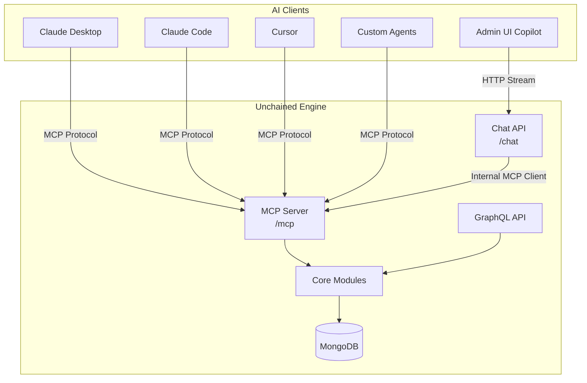

# AI Integration

Unchained Engine provides first-class AI integration through three complementary surfaces:

| Surface | Who uses it | Protocol | Auth | Endpoint |
|---------|-------------|----------|------|----------|
| [MCP Server](./mcp-server) | AI agents & IDEs (Claude Desktop, Cursor, Claude Code) | Streamable HTTP (MCP) | Admin bearer token | `/mcp` |
| [Admin Copilot](./admin-copilot) | Store operators via Admin UI chat | HTTP streaming (Vercel AI SDK) | Session cookie | `/chat` |
| `llms.txt` | LLMs & web crawlers | Static files | None | `/llms.txt`, `/llms-full.txt` |

## Architecture

The MCP server exposes the full commerce API as AI-callable tools. The Chat API (used by the Admin UI Copilot) connects to the MCP server internally and streams responses back to the browser.

## Quick links

- **[MCP Server Reference](./mcp-server)** — Tool categories, resources, authentication, and connection examples for AI agents
- **[Admin Copilot Setup](./admin-copilot)** — Configure the built-in chat assistant in the Admin UI
- **[AI FAQ](./ai-faq)** — Common questions about AI capabilities, answered for both humans and AI agents

## llms.txt

This documentation site publishes [`/llms.txt`](https://docs.unchained.shop/llms.txt) and [`/llms-full.txt`](https://docs.unchained.shop/llms-full.txt) following the [llms.txt standard](https://llmstxt.org/). These files help AI models discover and navigate the documentation efficiently.
