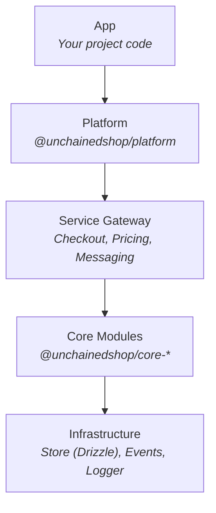
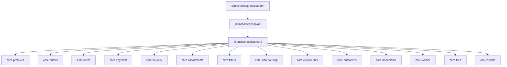

# Architecture

Unchained Engine is built using a layered architecture that separates concerns and enables customization at every level.

## Layered Approach

| Layer | Description |
|-------|-------------|
| **App** | Your project-specific code |
| **Platform** | Orchestration, GraphQL API, configuration |
| **Service Gateway** | Cross-module workflows (checkout, pricing) |
| **Core Modules** | Business logic and database abstractions |



## App Layer

The user-land app is where your project-specific code lives. Unchained Engine is loaded as a framework into a Node.js project.

```typescript
import { startPlatform } from '@unchainedshop/platform';

// Your app boots the platform
const engine = await startPlatform({
  modules: { /* custom modules */ },
  services: { /* custom services */ },
  options: { /* configuration */ },
});
```

## Platform Layer

The platform layer (`@unchainedshop/platform` and `@unchainedshop/api`) handles:

- Loading all default core modules
- Defining the GraphQL schema and resolvers
- Starting the API server (Express or Fastify)
- Managing the work queue for background jobs
- Orchestrating module configuration
- Email templates and messaging
- Authentication and session management

In rare cases, you might skip this layer to directly access core modules for:
- Federated microservices
- Custom non-GraphQL APIs
- Batch processing scripts

## Service Gateway Layer

The service gateway composes functions from multiple modules to enable complex workflows:

| Service | Description |
|---------|-------------|
| `orders` | Checkout workflow, order pricing sheets |
| `products` | Product pricing calculations |
| `users` | User-related operations |
| `files` | File operations with storage adapters |

You can modify services by:
1. Using existing plugins
2. Writing custom plugins
3. Adding functions to `startPlatform` options

```typescript
await startPlatform({
  services: {
    orders: {
      // Custom order service methods
    },
  },
});
```

## Core Modules Layer

Core modules contain business logic and database abstractions. Each module is responsible for a specific domain:

| Module | Package | Description |
|--------|---------|-------------|
| Products | `@unchainedshop/core-products` | Product catalog management |
| Orders | `@unchainedshop/core-orders` | Order lifecycle and cart |
| Users | `@unchainedshop/core-users` | User accounts and auth |
| Payment | `@unchainedshop/core-payment` | Payment providers |
| Delivery | `@unchainedshop/core-delivery` | Shipping providers |
| Assortments | `@unchainedshop/core-assortments` | Categories and collections |
| Filters | `@unchainedshop/core-filters` | Product search and filtering |
| Warehousing | `@unchainedshop/core-warehousing` | Inventory management |
| Enrollments | `@unchainedshop/core-enrollments` | Subscriptions |
| Quotations | `@unchainedshop/core-quotations` | Request for quote (RFQ) |
| Bookmarks | `@unchainedshop/core-bookmarks` | Wishlists |
| Worker | `@unchainedshop/core-worker` | Background jobs |
| Files | `@unchainedshop/core-files` | File metadata |
| Events | `@unchainedshop/core-events` | Event history |

You can modify modules through:
1. Configuration options at startup
2. Plugins (Director/Adapter pattern)
3. Custom module implementations

## Infrastructure Layer

Foundation utilities used across all layers:

| Package | Description |
|---------|-------------|
| `@unchainedshop/store` | Drizzle ORM storage layer for SQLite/Turso |
| `@unchainedshop/events` | Event emitter with pluggable backends |
| `@unchainedshop/logger` | High-performance logging |
| `@unchainedshop/utils` | Common utilities and base classes |
| `@unchainedshop/roles` | Role-based access control (RBAC) |
| `@unchainedshop/file-upload` | File storage adapters |

## API Design Principles

1. **Stateless**: All data stored in SQLite/Turso database, cookie-based sessions
2. **Guest Users**: Anonymous users use `loginAsGuest` mutation for cart operations
3. **Server-side Logic**: All business logic remains server-side for omni-channel support

### Implications

**Carts as Open Orders**
- Carts are stored server-side as orders with `status: null`
- Users can add items on one device and checkout on another
- After checkout, the cart becomes an immutable order

**User Conversion**
- Anonymous users can register without losing order history
- Carts merge when a user logs in during purchase
- Bookmarks and preferences are preserved

## Package Dependency Graph



## Next Steps

- Learn about the [Director/Adapter Pattern](./director-adapter-pattern.md) for extending functionality
- Understand the [Order Lifecycle](./order-lifecycle.md) for checkout implementation
- Explore the [Pricing System](./pricing-system.md) for custom pricing logic
