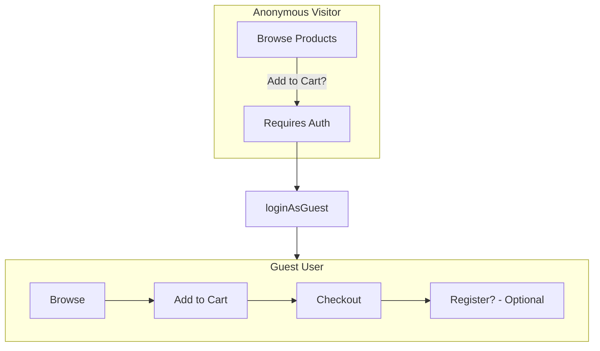

# Authentication

Unchained Engine supports multiple authentication patterns to accommodate different user flows and integration requirements.

## Authentication Strategies

| Strategy | Use Case |
|----------|----------|
| **Guest** | Anonymous browsing and checkout |
| **Email/Password** | Traditional user registration |
| **WebAuthn** | Passwordless authentication |
| **OIDC** | External identity providers (Google, Keycloak, etc.) |
| **API Token** | Machine-to-machine authentication |

## Anonymous vs Guest Users

Unchained distinguishes between anonymous visitors and guest users:

| Type | Can Browse | Can Add to Cart | Can Checkout |
|------|-----------|-----------------|--------------|
| **Anonymous** | Yes | No | No |
| **Guest** | Yes | Yes | Yes |
| **Registered** | Yes | Yes | Yes |

Anonymous users can browse products and assortments without authentication. To perform state-changing operations (cart, checkout), a guest or registered user session is required.

### Flow



### Implementation

```graphql
mutation LoginAsGuest {
  loginAsGuest {
    _id
    tokenExpires
  }
}
```

The session token is set as an HTTP-only cookie automatically. For subsequent requests, ensure cookies are sent with your requests.

```graphql
mutation AddToCart {
  addCartProduct(productId: "...", quantity: 1) {
    _id
  }
}
```

```graphql
mutation Checkout {
  checkoutCart {
    _id
    orderNumber
  }
}
```

### Guest to Registered Conversion

Guests can register without losing their cart or order history:

```graphql
mutation CreateUser {
  createUser(
    email: "user@example.com"
    password: "securepassword"
  ) {
    _id
    tokenExpires
  }
}
```

The new account inherits:
- Current cart
- Order history
- Bookmarks
- Preferences

## Email/Password Authentication

Traditional authentication with email and password.

### Registration

```graphql
mutation CreateUserWithProfile {
  createUser(
    email: "user@example.com"
    password: "securepassword"
    profile: {
      displayName: "John Doe"
    }
  ) {
    _id
    tokenExpires
    user {
      _id
      primaryEmail {
        address
      }
      profile {
        displayName
      }
    }
  }
}
```

### Login

```graphql
mutation Login {
  loginWithPassword(
    email: "user@example.com"
    password: "securepassword"
  ) {
    _id
    tokenExpires
    user {
      _id
      primaryEmail {
        address
      }
    }
  }
}
```

### Password Reset

```graphql
mutation ForgotPassword {
  forgotPassword(email: "user@example.com") {
    success
  }
}
```

Reset with token (from email):

```graphql
mutation ResetPassword {
  resetPassword(
    token: "reset-token-from-email"
    newPassword: "newpassword"
  ) {
    _id
    tokenExpires
  }
}
```

### Change Password

```graphql
mutation {
  changePassword(
    oldPassword: "currentpassword"
    newPassword: "newpassword"
  ) {
    success
  }
}
```

## WebAuthn (Passwordless)

Unchained Engine supports WebAuthn for passwordless authentication using biometrics or security keys.

### Registration Flow

1. Get registration options (returns JSON with challenge, rp, user, pubKeyCredParams, etc.):

```graphql
mutation GetCredentialCreationOptions {
  createWebAuthnCredentialCreationOptions(username: "user@example.com")
}
```

2. Create credential with browser WebAuthn API using the returned options:

```javascript
const credential = await navigator.credentials.create({
  publicKey: creationOptions
});
```

3. Store the credential:

```graphql
mutation AddWebAuthnCredentials($credentials: JSON!) {
  addWebAuthnCredentials(credentials: $credentials) {
    _id
    webAuthnCredentials {
      _id
    }
  }
}
```

### Authentication Flow

1. Get authentication options (returns JSON with challenge, rpId, allowCredentials, etc.):

```graphql
mutation GetCredentialRequestOptions {
  createWebAuthnCredentialRequestOptions(username: "user@example.com")
}
```

2. Authenticate with browser WebAuthn API:

```javascript
const credential = await navigator.credentials.get({
  publicKey: requestOptions
});
```

3. Verify and login:

```graphql
mutation LoginWithWebAuthn($credentials: JSON!) {
  loginWithWebAuthn(webAuthnPublicKeyCredentials: $credentials) {
    _id
    tokenExpires
    user {
      _id
    }
  }
}
```

## OIDC (External Identity Providers)

Integrate with external identity providers using OpenID Connect.

### Supported Providers

Any OIDC-compliant provider:
- Google
- Apple
- Keycloak
- Zitadel
- Auth0
- Azure AD
- Custom providers

### Configuration

OIDC integration is configured through the GraphQL context. See the [OIDC Example](https://github.com/unchainedshop/unchained/tree/master/examples/oidc) for a complete implementation using `startPlatform`'s `context` parameter to add custom authentication logic.

### Login Flow

OIDC authentication is implemented via custom GraphQL resolvers. The flow typically involves:

1. **Get authorization URL**: Custom query that returns the provider's OAuth URL
2. **User redirected to provider**: User authenticates with the identity provider
3. **Exchange code for token**: Custom mutation that validates the authorization code and creates a session

See the [OIDC Example](https://github.com/unchainedshop/unchained/tree/master/examples/oidc) for a complete implementation showing how to add custom OIDC queries and mutations.

## API Token Authentication

For server-to-server or automated access.

### Using Tokens

Unchained users have a `tokens` field that stores authentication tokens. You can query a user's tokens:

```graphql
query MyTokens {
  me {
    tokens {
      _id
    }
  }
}
```

### Invalidating Tokens

To invalidate a token:

```graphql
mutation InvalidateToken {
  invalidateToken(tokenId: "token-id") {
    _id
  }
}
```

### Including Token in Requests

Include the token in the Authorization header:

```http
Authorization: Bearer <token>
```

## Session Management

### Token Format

Unchained uses JWT tokens for authentication. Configure the token secret via environment variable:

```bash
UNCHAINED_TOKEN_SECRET=your-32-character-minimum-secret-here
```

### Logout

```graphql
mutation {
  logout {
    success
  }
}
```

### Current User

```graphql
query CurrentUser {
  me {
    _id
    primaryEmail {
      address
    }
    username
    profile {
      displayName
      address {
        firstName
        lastName
        company
        city
        postalCode
        countryCode
      }
    }
    roles
    cart {
      _id
    }
  }
}
```

## Role-Based Access Control

Unchained uses RBAC for authorization:

### Built-in Roles

| Role | Description |
|------|-------------|
| `admin` | Full access to all operations |
| `user` | Authenticated user with standard permissions |

### Checking Permissions

```typescript
import { checkAction } from '@unchainedshop/roles';

// In a resolver
if (!checkAction(context, 'manageOrders')) {
  throw new Error('Permission denied');
}
```

### Custom Roles

```typescript
import { Roles, Role } from '@unchainedshop/roles';

// Define custom role
const supportRole = new Role('support');

supportRole.allow('viewOrders', () => true);
supportRole.allow('updateOrderStatus', (context, { order }) => {
  // Only pending orders
  return order.status === 'PENDING';
});

Roles.registerRole(supportRole);

// Assign role to user
await modules.users.updateRoles(userId, ['support']);
```

## Security Best Practices

For comprehensive security documentation, see the [Security Guide](../deployment/security).

### Cryptographic Standards

Unchained uses industry-standard cryptography for authentication:

| Operation | Algorithm | Details |
|-----------|-----------|---------|
| Password Hashing | PBKDF2-SHA512 | 300,000 iterations, 16-byte salt |
| Token Storage | SHA-256 | Tokens hashed before database storage |
| Token Generation | CSPRNG | `crypto.randomUUID()` |
| Session Encryption | AES-256-GCM | Optional, via kruptein |

### 1. Token Secret

Use a strong, unique secret:

```bash
UNCHAINED_TOKEN_SECRET=your-32-character-minimum-secret-here
```

### 2. HTTPS Only

Always use HTTPS in production. When connecting Unchained to your web server framework, configure secure cookies:

```typescript
// When using Fastify
connect(fastify, platform, {
  allowRemoteToLocalhostSecureCookies: process.env.NODE_ENV !== 'production',
});
```

### 3. Rate Limiting

Implement rate limiting for authentication endpoints:

```typescript
import rateLimit from 'express-rate-limit';

const authLimiter = rateLimit({
  windowMs: 15 * 60 * 1000, // 15 minutes
  max: 5, // 5 attempts
  message: 'Too many login attempts',
});

app.use('/graphql', authLimiter);
```

### 4. Password Requirements

Configure password validation through the users module options:

```typescript
await startPlatform({
  options: {
    users: {
      validatePassword: async (password: string) => {
        if (password.length < 8) {
          throw new Error('Password must be at least 8 characters');
        }
        if (!/[A-Z]/.test(password)) {
          throw new Error('Password must contain an uppercase letter');
        }
        if (!/[0-9]/.test(password)) {
          throw new Error('Password must contain a number');
        }
        return true;
      },
    },
  },
});
```

## Related

- [Security Guide](../deployment/security) - Security features and compliance
- [Users Module](../platform-configuration/modules/users.md) - User configuration options
- [Admin UI](../admin-ui/overview.md) - Admin UI overview
