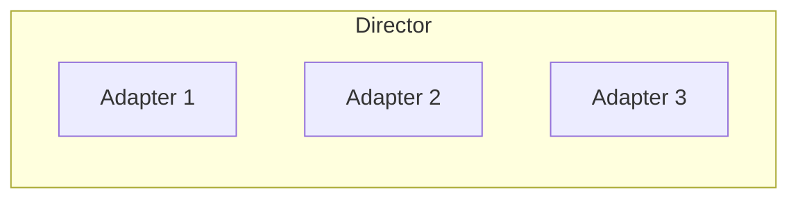

# Director/Adapter Pattern

The Director/Adapter pattern is the foundation of Unchained Engine's extensibility. Understanding this pattern is essential for customizing payment processing, delivery, pricing, and other behaviors.

## Overview

**Directors** are singleton factories that manage collections of adapters. They provide methods to register, unregister, and retrieve adapters.

**Adapters** implement specific behaviors and are registered with directors. When functionality is needed, the director selects and invokes the appropriate adapter(s).



## Available Directors

| Director | Purpose | Example Adapters |
|----------|---------|------------------|
| `PaymentDirector` | Payment processing | Stripe, PayPal, Invoice |
| `DeliveryDirector` | Shipping/delivery | Post, Store Pickup, Digital |
| `WarehousingDirector` | Inventory management | Stock, NFT Minting |
| `WorkerDirector` | Background jobs | Email, SMS, HTTP Webhooks |
| `FilterDirector` | Product search | Full-text, Strict Equal |
| `ProductPricingDirector` | Product prices | Base price, Tax, Discount |
| `OrderPricingDirector` | Order totals | Items, Delivery, Payment |
| `DeliveryPricingDirector` | Delivery fees | Flat rate, Weight-based |
| `PaymentPricingDirector` | Payment fees | Card fees, Invoice fees |
| `OrderDiscountDirector` | Order discounts | Coupon codes, Auto-discounts |
| `ProductDiscountDirector` | Product discounts | Bulk pricing, Member pricing |
| `MessagingDirector` | Notifications | Email templates, SMS |
| `QuotationDirector` | RFQ processing | Manual quotes, Auto quotes |
| `EnrollmentDirector` | Subscriptions | Recurring billing |

## Base Classes

All adapters extend from base classes provided by `@unchainedshop/utils`:

```typescript
import { BaseAdapter, BaseDirector } from '@unchainedshop/utils';
```

- **BaseDirector**: Factory function creating a director with adapter management
- **BaseAdapter**: Base implementation with logging and utility methods

## Creating a Custom Adapter

All adapters share a common structure:

```typescript
const MyAdapter = {
  key: 'my-adapter',           // Unique identifier
  label: 'My Custom Adapter',  // Human-readable label
  version: '1.0.0',            // Adapter version

  // Optional: order of execution (lower = first)
  orderIndex: 10,

  // Adapter-specific methods...
};

// Register with the appropriate director
SomeDirector.registerAdapter(MyAdapter);
```

## Payment Director

Manages payment processing and orchestrates payment adapters.

```typescript
import { PaymentDirector, type IPaymentAdapter } from '@unchainedshop/core';

const MyPaymentAdapter: IPaymentAdapter = {
  key: 'my-payment',
  label: 'My Payment Gateway',
  version: '1.0.0',

  // Which payment types this adapter supports
  typeSupported(type) {
    return type === 'CARD'; // CARD, INVOICE, or GENERIC
  },

  actions(config, context) {
    return {
      // Return configuration errors (e.g., missing API key)
      configurationError() {
        if (!process.env.PAYMENT_API_KEY) {
          return { code: 'MISSING_API_KEY' };
        }
        return null;
      },

      // Is this adapter active for the current context?
      isActive() { return true; },

      // Can order be confirmed before payment completes?
      isPayLaterAllowed() { return false; },

      // Process payment charge
      async charge() {
        // Return { transactionId } on success
        // Return false if payment not yet complete
        // Throw error to abort checkout
        return { transactionId: '...' };
      },

      // Confirm a previously authorized payment
      async confirm() {
        return { transactionId: '...' };
      },

      // Cancel/refund a payment
      async cancel() {
        return true;
      },

      // Register a payment method (e.g., save card)
      async register() {
        return { token: '...' };
      },

      // Sign payment request for client-side SDK
      async sign() {
        return '...';
      },

      // Validate a payment token
      async validate(token) {
        return true;
      },
    };
  },
};

PaymentDirector.registerAdapter(MyPaymentAdapter);
```

## Delivery Director

Manages delivery operations and coordinates shipping adapters.

```typescript
import { DeliveryDirector, type IDeliveryAdapter } from '@unchainedshop/core';

const MyDeliveryAdapter: IDeliveryAdapter = {
  key: 'my-delivery',
  label: 'My Shipping Provider',
  version: '1.0.0',

  // Which delivery types this adapter supports
  typeSupported(type) {
    return type === 'SHIPPING'; // SHIPPING, PICKUP, or DELIVERY
  },

  actions(config, context) {
    return {
      configurationError() { return null; },
      isActive() { return true; },

      // Can order be auto-released for delivery?
      isAutoReleaseAllowed() { return false; },

      // Trigger delivery
      async send() {
        return { trackingNumber: '...' };
      },

      // Estimated delivery time in milliseconds
      estimatedDeliveryThroughput(warehousingTime) {
        return 3 * 24 * 60 * 60 * 1000; // 3 days
      },

      // For PICKUP type: available locations
      async pickUpLocations() {
        return [];
      },

      async pickUpLocationById(locationId) {
        return null;
      },
    };
  },
};

DeliveryDirector.registerAdapter(MyDeliveryAdapter);
```

## Warehousing Director

Manages inventory and stock operations, including NFT/token support.

```typescript
import { WarehousingDirector, type IWarehousingAdapter } from '@unchainedshop/core';

const MyWarehousingAdapter: IWarehousingAdapter = {
  key: 'my-warehouse',
  label: 'My Inventory System',
  version: '1.0.0',

  typeSupported(type) {
    return type === 'PHYSICAL';
  },

  actions(config, context) {
    return {
      configurationError() { return null; },
      isActive() { return true; },

      // Current stock quantity
      async stock(referenceDate) {
        return 100;
      },

      // Production time in ms (for made-to-order)
      async productionTime(quantity) {
        return 0;
      },

      // Time to prepare for shipping in ms
      async commissioningTime(quantity) {
        return 24 * 60 * 60 * 1000; // 1 day
      },

      async estimatedStock() {
        return 100;
      },

      async estimatedDispatch() {
        return new Date();
      },

      // For tokenized products (NFTs):
      async tokenize() { return []; },
      async tokenMetadata(serial, date) { return {}; },
      async isInvalidateable(serial, date) { return false; },
    };
  },
};

WarehousingDirector.registerAdapter(MyWarehousingAdapter);
```

## Worker Director

Manages background job processing and scheduled tasks.

```typescript
import { WorkerDirector, type IWorkerAdapter } from '@unchainedshop/core';

interface MyInput { email: string; subject: string; }
interface MyOutput { messageId: string; }

const MyWorkerAdapter: IWorkerAdapter<MyInput, MyOutput> = {
  key: 'my-worker',
  label: 'My Background Worker',
  version: '1.0.0',
  type: 'MY_WORK_TYPE',          // Work type identifier
  external: false,                // Runs in-process
  maxParallelAllocations: 10,     // Max concurrent executions

  async doWork(input, unchainedAPI, workId) {
    const { email, subject } = input;

    // Process the work item
    // ...

    return {
      success: true,
      result: { messageId: 'msg-123' },
    };
  },
};

WorkerDirector.registerAdapter(MyWorkerAdapter);
```

### Scheduling Recurring Work

```typescript
WorkerDirector.configureAutoscheduling({
  type: 'MY_WORK_TYPE',
  input: { email: 'test@example.com', subject: 'Test' },
  schedule: '0 * * * *', // Every hour (cron syntax)
});
```

## Pricing Directors

Pricing directors calculate prices using a **chain of adapters**. Each adapter can add, modify, or discount prices. Adapters execute in order of their `orderIndex`.

```typescript
import { ProductPricingDirector, type IProductPricingAdapter } from '@unchainedshop/core';

const MyPricingAdapter: IProductPricingAdapter = {
  key: 'my-pricing',
  label: 'My Pricing Logic',
  version: '1.0.0',
  orderIndex: 10, // Lower numbers run first

  // Should this adapter run for the current context?
  isActivatedFor(context) {
    return true;
  },

  actions(params, pricingAdapter) {
    return {
      calculate() {
        // Access existing calculations
        const { calculation } = pricingAdapter;

        // Add price item
        pricingAdapter.resultSheet().addItem({
          category: 'BASE',
          amount: 1000, // in smallest currency unit (cents)
          isTaxable: true,
          isNetPrice: true,
        });

        // Continue chain
        return pricingAdapter.calculate();
      },
    };
  },
};

ProductPricingDirector.registerAdapter(MyPricingAdapter);
```

### Pricing Categories

| Category | Description |
|----------|-------------|
| `BASE` | Base product price |
| `TAX` | Tax amount |
| `DISCOUNT` | Discount amount (negative) |
| `DELIVERY` | Delivery fee |
| `PAYMENT` | Payment fee |

## Discount Directors

Discount directors manage coupon codes and automatic discounts.

```typescript
import { OrderDiscountDirector, type IDiscountAdapter } from '@unchainedshop/core';

const MyDiscountAdapter: IDiscountAdapter = {
  key: 'my-discount',
  label: 'My Discount System',
  version: '1.0.0',
  orderIndex: 10,

  // Allow manual code entry starting with 'PROMO'
  isManualAdditionAllowed(code) {
    return code.startsWith('PROMO');
  },

  isManualRemovalAllowed() {
    return true;
  },

  actions(context) {
    return {
      // Auto-apply discount without code?
      isValidForSystemTriggering() {
        return false;
      },

      // Apply when specific code entered?
      isValidForCodeTriggering(code) {
        return code === 'PROMO10';
      },

      // Return discount configuration
      discountForPricingAdapterKey(params) {
        return {
          isNetPrice: false,
          rate: 0.1, // 10% off
        };
      },

      // Reserve discount (e.g., decrement coupon balance)
      async reserve(code) {},

      // Release reservation on order cancellation
      async release() {},
    };
  },
};

OrderDiscountDirector.registerAdapter(MyDiscountAdapter);
```

## Filter Director

Manages product filtering and search functionality.

```typescript
import { FilterDirector, type IFilterAdapter } from '@unchainedshop/core';

const MyFilterAdapter: IFilterAdapter = {
  key: 'my-filter',
  label: 'My Search Filter',
  version: '1.0.0',
  orderIndex: 10,

  actions(context) {
    return {
      // Return product IDs matching filter
      async aggregateProductIds(params) {
        return ['product-1', 'product-2'];
      },

      // Search products
      async searchProducts(params, options) {
        return { productIds: [], totalCount: 0 };
      },

      // Search assortments
      async searchAssortments(params, options) {
        return { assortmentIds: [], totalCount: 0 };
      },

      // Modify product query conditions
      transformProductSelector(selector, options) {
        return selector;
      },

      // Modify filter query conditions
      transformFilterSelector(selector, options) {
        return selector;
      },

      // Modify sort stage
      transformSortStage(sort, options) {
        return sort;
      },
    };
  },
};

FilterDirector.registerAdapter(MyFilterAdapter);
```

## Messaging Director

The Messaging Director uses a template resolver pattern for notifications.

```typescript
import { MessagingDirector } from '@unchainedshop/core';

// Register a message template
MessagingDirector.registerTemplate('ORDER_CONFIRMATION', async (context) => {
  const { order, user } = context;

  return [
    {
      type: 'EMAIL',
      input: {
        to: user.email,
        subject: `Order Confirmation #${order.orderNumber}`,
        html: '<h1>Thank you for your order!</h1>',
      },
    },
    {
      type: 'SMS',
      input: {
        to: user.phone,
        text: `Order #${order.orderNumber} confirmed!`,
      },
    },
  ];
});
```

## Quotation Director

Handles quotation/RFQ (Request for Quote) operations.

```typescript
import { QuotationDirector, type IQuotationAdapter } from '@unchainedshop/core';

const MyQuotationAdapter: IQuotationAdapter = {
  key: 'my-quotation',
  label: 'My Quote System',
  version: '1.0.0',

  isActivatedFor(quotationContext, unchainedAPI) {
    return true;
  },

  actions(context) {
    return {
      configurationError() { return null; },

      // Require manual quote creation?
      isManualProposalRequired() { return true; },

      // Require manual request verification?
      isManualRequestVerificationRequired() { return false; },

      // Generate quote
      async quote() {
        return { price: 1000, currency: 'CHF' };
      },

      async submitRequest(quotationContext) {},
      async verifyRequest(quotationContext) {},
      async rejectRequest(quotationContext) {},

      transformItemConfiguration(params) {
        return params.configuration;
      },
    };
  },
};

QuotationDirector.registerAdapter(MyQuotationAdapter);
```

## Enrollment Director

Manages subscription/enrollment plans and recurring billing.

```typescript
import { EnrollmentDirector, type IEnrollmentAdapter } from '@unchainedshop/core';

const MyEnrollmentAdapter: IEnrollmentAdapter = {
  key: 'my-enrollment',
  label: 'My Subscription System',
  version: '1.0.0',

  isActivatedFor(productPlan) {
    return productPlan.type === 'PLAN_PRODUCT';
  },

  transformOrderItemToEnrollmentPlan(orderPosition, unchainedAPI) {
    return {
      configuration: orderPosition.configuration,
    };
  },

  actions(context) {
    return {
      // Calculate next billing period
      async nextPeriod() {
        return {
          start: new Date(),
          end: new Date(Date.now() + 30 * 24 * 60 * 60 * 1000),
        };
      },

      isValidForActivation() {
        return true;
      },

      isOverdue() {
        return false;
      },

      // Order configuration for billing period
      async configurationForOrder(period) {
        return {};
      },
    };
  },
};

EnrollmentDirector.registerAdapter(MyEnrollmentAdapter);
```

## Best Practices

### 1. Unique Keys
Always use unique, namespaced keys for your adapters:
```typescript
key: 'com.mycompany.payment.stripe-custom'
```

### 2. Error Handling
Return `configurationError()` for missing configuration rather than throwing:
```typescript
configurationError() {
  if (!process.env.API_KEY) {
    return { code: 'MISSING_API_KEY', message: 'API key required' };
  }
  return null;
}
```

### 3. Async Operations in Workers
For long-running operations, use the Worker system instead of blocking adapters:
```typescript
// In delivery adapter
async send() {
  // Queue work instead of blocking
  await context.modules.worker.addWork({
    type: 'EXTERNAL_SHIPPING_API',
    input: { orderId: order._id },
  });
  return false; // Not complete yet
}
```

### 4. Order Index
Use appropriate `orderIndex` values for pricing adapters:
- 0-10: Base price calculation
- 10-20: Discounts
- 20-30: Tax calculation
- 30+: Final adjustments

## Related

- [Payment Plugins](../plugins/payment/stripe) - Payment adapters
- [Delivery Plugins](../plugins/) - Delivery adapters
- [Filter Plugins](../plugins/) - Filter adapters
- [Warehousing Plugins](../plugins/) - Warehousing adapters
- [Pricing System](../concepts/pricing-system) - Pricing adapters and chain
- [Worker](../extend/worker.md) - Background job processing
