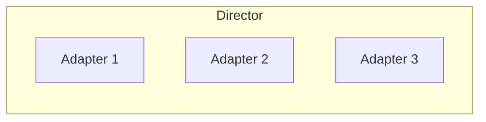

# Plugin System (Directors & Adapters)

The Director/Adapter pattern is the foundation of Unchained Engine's extensibility. Understanding it is essential for customizing payment processing, delivery, pricing, and other behaviors.

## Overview

**Adapters** implement a specific behavior (a payment gateway, a pricing rule, a delivery method…). **Directors** are the internal machinery that holds the adapters for a domain and selects/invokes the right one(s) at runtime. In v5 you rarely touch a director directly — adapters self-route to their director via an `adapterType` symbol when you register the plugin.


```mermaid
flowchart LR
    subgraph Director
        A1[Adapter 1]
        A2[Adapter 2]
        A3[Adapter 3]
    end
```

## How to register a plugin

There are three ways, recommended-first:

| Layer | When to use | API |
|---|---|---|
| **Presets** | The built-in plugins | `registerBasePlugins()` / `registerAllPlugins()` — see [Plugin Presets](../platform-configuration/plugin-presets.md) |
| **`registerX(...)` factories** | Your own custom adapters (**recommended**) | `registerPaymentProvider({ … })` etc. — see [Plugin Factories](../extend/plugin-factories.md) |
| **Hand-built `IPlugin`** | Custom key/version, HTTP routes, a module, lifecycle hooks | `pluginRegistry.register(MyPlugin)` |

All three are imported from `@unchainedshop/core`. Register **before** calling `startPlatform()`.

```ts
import { registerPaymentProvider, pluginRegistry } from '@unchainedshop/core';

// Recommended: a factory builds and registers the plugin for you
registerPaymentProvider({ adapterId: 'acme', charge: async (c, ctx) => ({ transactionId: '…' }) });

// Low-level: hand-built IPlugin (custom key/version, routes, lifecycle hooks)
pluginRegistry.register({ key: 'com.acme.payment', label: 'Acme', version: '1.0.0', adapters: [AcmeAdapter] });
```

:::info `IPlugin` shape
A plugin bundles one or more adapters with optional infrastructure:

```ts
interface IPlugin {
  key: string;
  label: string;
  version: string;
  adapters?: IBaseAdapter[];                  // self-route to their director
  module?: PluginModuleFactory;               // DB-backed module
  routes?: PluginHttpRoute[];                 // WHATWG Fetch handlers (e.g. webhooks)
  onRegister?: (api) => void | boolean | Promise<…>; // return false / throw to skip
  onShutdown?: (api) => void | Promise<void>;
}
```
:::

## Available Directors

You don't register *with* these — they're the internal dispatch targets. Listed for reference (and for cross-module work):

| Director | Purpose | Authoring factory |
|----------|---------|-------------------|
| `PaymentDirector` | Payment processing | [`registerPaymentProvider`](../extend/plugin-factories.md#payment) |
| `DeliveryDirector` | Shipping/delivery | [`registerDeliveryProvider`](../extend/plugin-factories.md#delivery) |
| `WarehousingDirector` | Inventory / tokenization | [`registerPhysicalWarehousing`](../extend/plugin-factories.md#warehousing) |
| `WorkerDirector` | Background jobs | [`registerWorker`](../extend/plugin-factories.md#workers) |
| `FilterDirector` | Product/assortment search | [`registerProductSearchFilter`](../extend/plugin-factories.md#filters--search) |
| `ProductPricingDirector` | Product prices | [`registerProductPricing`](../extend/plugin-factories.md#pricing) |
| `OrderPricingDirector` | Order totals | [`registerOrderPricing`](../extend/plugin-factories.md#pricing) |
| `DeliveryPricingDirector` | Delivery fees | [`registerDeliveryPricing`](../extend/plugin-factories.md#pricing) |
| `PaymentPricingDirector` | Payment fees | [`registerPaymentPricing`](../extend/plugin-factories.md#pricing) |
| `OrderDiscountDirector` | Order discounts | [`registerOrderDiscount`](../extend/plugin-factories.md#discounts) |
| `ProductDiscountDirector` | Product discounts | [`registerProductDiscount`](../extend/plugin-factories.md#discounts) |
| `QuotationDirector` | RFQ processing | [`registerQuotation`](../extend/plugin-factories.md#quotations) |
| `EnrollmentDirector` | Subscriptions | [`registerEnrollment`](../extend/plugin-factories.md#enrollments) |
| `FileDirector` | File storage | [`registerFileAdapter`](../extend/plugin-factories.md#files) |

## Adapter contracts

An adapter is a plain object: identity fields (`key`, `label`, `version`) plus the behavior the director expects. Payment/delivery/warehousing expose their behavior through an `actions(config, context)` factory; pricing/discount adapters expose a `calculate`; file adapters expose storage methods directly. The matching [`registerX` factory](../extend/plugin-factories.md) lets you supply just the behavior without writing the wrapper.

| Domain | Adapter interface | Key behavior to implement | Deep dive |
|---|---|---|---|
| Payment | `IPaymentAdapter` | `typeSupported`, `actions().{charge, isActive, isPayLaterAllowed, sign, validate, cancel, confirm}` | [Payment](../extend/order-fulfilment/fulfilment-plugins/payment.md) |
| Delivery | `IDeliveryAdapter` | `typeSupported`, `actions().{send, isActive, isAutoReleaseAllowed, estimatedDeliveryThroughput}` | [Delivery](../extend/order-fulfilment/fulfilment-plugins/delivery.md) |
| Warehousing | `IWarehousingAdapter` | `actions().{stock, productionTime, commissioningTime}` (physical) / `{tokenize, tokenMetadata}` (virtual) | [Warehousing](../extend/order-fulfilment/fulfilment-plugins/warehousing.md) |
| Pricing | `I*PricingAdapter` | `isActivatedFor`, `actions().calculate` (push rows onto the sheet) | [Pricing](./pricing-system.md) |
| Discount | `IDiscountAdapter` | `isValidForSystemTriggering`/`isValidForCodeTriggering`, `discountForPricingAdapterKey` | [Order discounts](../extend/pricing/order-discounts.md) |
| Filter | `IFilterAdapter` | `actions().{searchProducts, searchAssortments, transformProductSelector, …}` | [Filters](../extend/catalog/filter.md) |
| Worker | `IWorkerAdapter` | `type`, `doWork(input, api, workId)` | [Work Queue](../extend/worker.md) |
| File | `IFileAdapter` | `createSignedURL`, `uploadFileFromStream`, `createDownloadURL`, `removeFiles` | [Files](../plugins/files/index.md) |
| Quotation | `IQuotationAdapter` | `actions().{quote, transformItemConfiguration, submitRequest, …}` | [Quotation](../extend/quotation.md) |
| Enrollment | `IEnrollmentAdapter` | `isActivatedFor`, `transformOrderItemToEnrollmentPlan`, `actions().{configurationForOrder, nextPeriod}` | [Enrollment](../extend/enrollment.md) |

Each deep-dive page shows the full method signatures and a worked example — leading with the [`registerX` factory](../extend/plugin-factories.md) and falling back to the hand-built form.

## Best Practices

### 1. Use stable, namespaced keys
Factories namespace keys for you (`shop.unchained.<domain>.<adapterId>`). For hand-built plugins, use a reverse-DNS key like `com.mycompany.payment.gateway`. A stable key makes registration idempotent (the registry dedupes by key).

### 2. Report configuration errors, don't throw
Return a `configurationError()` for missing configuration rather than throwing — the provider is then surfaced as misconfigured instead of crashing checkout:

```typescript
configurationError() {
  if (!process.env.API_KEY) return { code: 'MISSING_API_KEY', message: 'API key required' };
  return null;
}
```

For plugins, you can also fail fast in `onRegister` (return `false` or throw to skip registration).

### 3. Offload long work to the Worker queue
For slow external calls, enqueue work instead of blocking the adapter:

```typescript
async send() {
  await context.modules.worker.addWork({ type: 'EXTERNAL_SHIPPING_API', input: { orderId: order._id } });
  return false; // not complete yet
}
```

### 4. Mind the pricing `orderIndex`
Pricing/discount adapters run in ascending `orderIndex`: base price (0–9) → discounts (10–19) → tax (20–29) → adjustments (30+).

## Related

- [Plugin Factories](../extend/plugin-factories.md) — the recommended `registerX()` authoring layer
- [Plugin Presets](../platform-configuration/plugin-presets.md) — registering the built-ins
- [Pricing System](./pricing-system.md) — the pricing chain and leveled tiers
- [Work Queue](../extend/worker.md) — background job processing
