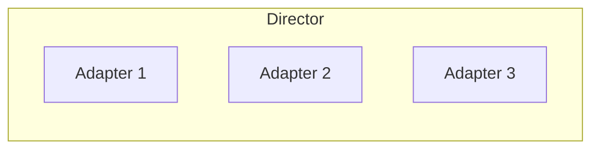

# Director/Adapter Pattern

The Director/Adapter pattern is the foundation of Unchained Engine's extensibility. Understanding this pattern is essential for customizing payment processing, delivery, pricing, and other behaviors.

## Overview

**Directors** are singleton factories that manage collections of adapters. They provide methods to register, unregister, and retrieve adapters.

**Adapters** implement specific behaviors and are registered with directors. When functionality is needed, the director selects and invokes the appropriate adapter(s).


```mermaid
flowchart LR
    subgraph Director
        A1[Adapter 1]
        A2[Adapter 2]
        A3[Adapter 3]
    end
```

## Available Directors

| Director | Purpose | Example Adapters |
|----------|---------|------------------|
| `PaymentDirector` | Payment processing | Stripe, PayPal, Invoice |
| `DeliveryDirector` | Shipping/delivery | Post, Store Pickup, Digital |
| `WarehousingDirector` | Inventory management | Stock, NFT Minting |
| `WorkerDirector` | Background jobs | Email, SMS, HTTP Webhooks |
| `FilterDirector` | Product search | Full-text, Strict Equal |
| `ProductPricingDirector` | Product prices | Base price, Tax, Discount |
| `OrderPricingDirector` | Order totals | Items, Delivery, Payment |
| `DeliveryPricingDirector` | Delivery fees | Flat rate, Weight-based |
| `PaymentPricingDirector` | Payment fees | Card fees, Invoice fees |
| `OrderDiscountDirector` | Order discounts | Coupon codes, Auto-discounts |
| `ProductDiscountDirector` | Product discounts | Bulk pricing, Member pricing |
| `MessagingDirector` | Notifications | Email templates, SMS |
| `QuotationDirector` | RFQ processing | Manual quotes, Auto quotes |
| `EnrollmentDirector` | Subscriptions | Recurring billing |

## Adapter Objects

Adapters are objects composed from base implementations. `BaseDirector` is a factory and `BaseAdapter` supplies shared logging and metadata utilities in `@unchainedshop/utils`. Domain bases such as `PaymentAdapter` and `ProductPricingAdapter` are exported by `@unchainedshop/core`.

Spread the domain base into your adapter, then spread its action methods before overriding the behavior you need. This retains required defaults and keeps the example compatible with the domain interface.

## Payment Director

Payment adapters use `actions(configuration, context)`. The context supplies the order, order payment, payment provider, and modules. Payment types are `GENERIC` and `INVOICE`.

```typescript
import { PaymentAdapter, PaymentDirector, type IPaymentAdapter } from '@unchainedshop/core';

const ManualPayment: IPaymentAdapter = {
  ...PaymentAdapter,
  key: 'com.example.payment.manual',
  label: 'Manual payment',
  version: '1.0.0',
  typeSupported: (type) => type === 'INVOICE',
  actions(configuration, context) {
    const baseActions = PaymentAdapter.actions(configuration, context);
    return {
      ...baseActions,
      configurationError: () => null,
      isActive: () => true,
      isPayLaterAllowed: () => true,
      charge: async () => false,
    };
  },
};

PaymentDirector.registerAdapter(ManualPayment);
```

A successful `charge()` returns payment information such as `{ transactionId }`. Returning `false` leaves the payment unpaid; throwing aborts checkout. `confirm()` and `cancel()` return booleans. `configurationError()` returns a `PaymentError` code or `null`.

## Delivery and Warehousing Directors

Both use `actions(configuration, context)` and provider configuration selected in the Admin UI.

| Base | Provider types | Main actions |
|------|----------------|--------------|
| `DeliveryAdapter` | `SHIPPING`, `PICKUP` | `send`, `isAutoReleaseAllowed`, `estimatedDeliveryThroughput`, `pickUpLocations` |
| `WarehousingAdapter` | `PHYSICAL`, `VIRTUAL` | `stock`, `productionTime`, `commissioningTime`, `tokenize`, `tokenMetadata`, `isInvalidateable` |

`send()` resolves to a boolean or a queued work item. Delivery and warehousing throughput methods are asynchronous and return durations in milliseconds. Spread the relevant base actions to retain defaults for operations you do not override.

## Pricing Directors

Pricing adapters use `actions(params)`, where `params` contains `context`, `calculationSheet` (the accumulated rows), and discount configurations. The base actions expose a separate `resultSheet()` for the rows contributed by this adapter.

```typescript
import {
  ProductPricingAdapter,
  ProductPricingDirector,
  type IProductPricingAdapter,
} from '@unchainedshop/core';

const ExamplePrice: IProductPricingAdapter = {
  ...ProductPricingAdapter,
  key: 'com.example.pricing.example',
  label: 'Example product price',
  version: '1.0.0',
  orderIndex: 0,
  isActivatedFor: ({ product, currencyCode }) =>
    Boolean(product.tags?.includes('example-price')) && currencyCode === 'CHF',
  actions(params) {
    const baseActions = ProductPricingAdapter.actions(params);
    return {
      ...baseActions,
      async calculate() {
        if (!params.calculationSheet.calculation.length) {
          baseActions.resultSheet().addItem({
            amount: 1000 * params.context.quantity,
            isTaxable: false,
            isNetPrice: true,
            meta: { adapter: ExamplePrice.key },
          });
        }
        return baseActions.calculate();
      },
    };
  },
};

ProductPricingDirector.registerAdapter(ExamplePrice);
```

The director executes active adapters in ascending `orderIndex`, appends each returned array, and invokes the next adapter. Returning `null` aborts the calculation; returning an empty array contributes no rows. `baseActions.calculate()` returns this adapter's rows, rather than invoking the next adapter itself.

Product rows use `ITEM`, `DISCOUNT`, and `TAX`. Delivery and payment fee sheets add `DELIVERY` and `PAYMENT` respectively. Order aggregation uses `ITEMS`, `DISCOUNTS`, `TAXES`, `DELIVERY`, and `PAYMENT`. Use the sheet helpers (`addItem`, `addFee`, `addTax`, `addDiscount`) to assign the appropriate category.

Choose order indexes relative to the plugins you enable; the indexes are not fixed category ranges. See [Pricing System](./pricing-system.md).

## Discount Directors

`OrderDiscountAdapter` and `ProductDiscountAdapter` provide asynchronous trigger and reservation methods. Their `actions({ context })` method is asynchronous. `discountForPricingAdapterKey({ pricingAdapterKey, calculationSheet })` returns configuration for a matching pricing adapter or `null`. The pricing adapter applies the discount to its result sheet.

See [Order Discounts](../extend/pricing/order-discounts.md) for a complete implementation.

## Filter Director

`FilterAdapter.actions(context)` supplies search and selector transformations. `aggregateProductIds({ productIds })` returns an array synchronously. `searchProducts` and `searchAssortments` resolve to ID arrays or `undefined`; they do not return paginated result objects. Selector and sort transformations are asynchronous.

See [Filters](../extend/catalog/filter.md) for custom filtering.

## Worker Director

Workers compose `WorkerAdapter` and implement `doWork(input, unchainedAPI, workId)`. The generic interface is `IWorkerAdapter<Input, Result>`. Return `{ success: true, result }` or `{ success: false, error }`. Use `modules.worker.addWork()` to queue a task and `WorkerDirector.configureAutoscheduling()` with a parsed schedule for recurring work.

See [Worker](../extend/worker.md) for registration and scheduling.

## Messaging Director

Messaging uses template resolvers rather than an adapter action object. `MessagingDirector.registerTemplate(type, resolver)` registers a resolver that produces work items such as email or SMS tasks. Read recipients from the current user/profile or order data through module APIs; users do not have generic `email` and `phone` properties.

## Quotation Director

Compose `QuotationAdapter` and override `isActivatedFor(quotationContext, unchainedAPI)` plus the methods returned by `actions(quotationContext)`. Proposal, request verification, and item-configuration methods are asynchronous. `quote()` returns a `QuotationProposal`, not a product price object.

## Enrollment Director

Compose `EnrollmentAdapter`. `isActivatedFor()` receives the product's plan configuration; `transformOrderItemToEnrollmentPlan()` is asynchronous and returns a plan containing the product ID and quantity. The action context contains the enrollment and product. `nextPeriod()` returns a period including `isTrial`, and `configurationForOrder({ period })` returns order-position templates or `null`.

## Registration and Configuration

Use unique, namespaced keys, register adapters before platform initialization, and import plugin files using their exported path including `.js` (or `/index.js` for directory modules). Importing built-in plugins registers them.

Keep gateway-specific configuration and long-running background jobs in their respective adapters. Return the domain's configuration-error code for incomplete configuration, and use worker tasks when delivery or other external work must complete asynchronously.

## Related

- [Payment Plugins](../plugins/payment/stripe) - Payment adapters
- [Delivery Plugins](../plugins/) - Delivery adapters
- [Filter Plugins](../plugins/) - Filter adapters
- [Warehousing Plugins](../plugins/) - Warehousing adapters
- [Pricing System](../concepts/pricing-system) - Pricing adapters and chain
- [Worker](../extend/worker.md) - Background job processing
