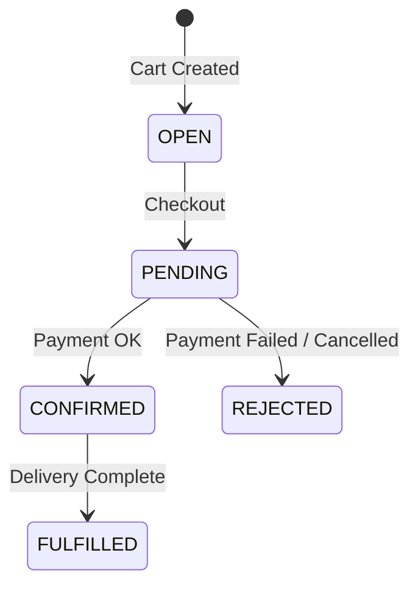
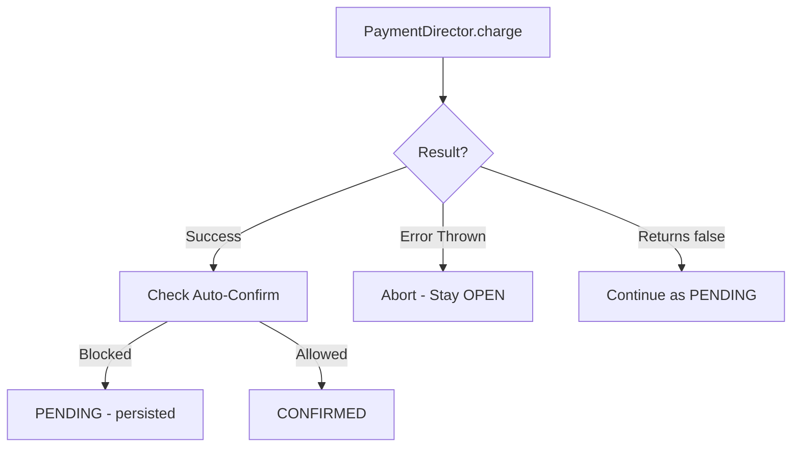

# Order Lifecycle

Orders in Unchained Engine follow a well-defined lifecycle from cart creation through fulfillment. Understanding this lifecycle is essential for implementing checkout flows and integrating with external systems.

## Order States



| Status | Description |
|--------|-------------|
| `null` (OPEN) | Cart - actively being modified |
| `PENDING` | Checkout initiated, awaiting payment confirmation |
| `CONFIRMED` | Payment confirmed, awaiting delivery |
| `FULFILLED` | Delivery complete, order finished |
| `REJECTED` | Order cancelled/rejected |

## Distributed Locking

:::note Locking
Unchained uses "Distributed Locking" during checkout, order confirmation, and order rejection. All of these services trigger the order processor state machine.
:::

:::note State Persistence
Every time the order processor persists an order status in the database (think "auto-save" in games), order status notification messages are triggered asynchronously. If it does not persist, the status is in memory only.
:::

## OPEN (Cart)

An order starts its life with a status of `null`, indicating it's a cart.

### Key Characteristics

- **User Required**: A cart always has a `userId`. For anonymous users, call `loginAsGuest` mutation first.
- **Created on Demand**: Carts only exist when at least one cart mutation has been called. Before that, `Query.me.cart` returns `null`.
- **Automatic Recalculation**: With every cart mutation, prices and delivery dates are recalculated.
- **Side-Effect Free Reading**: Reading a cart doesn't trigger any calculations or state changes.

### Cart Behavior

```graphql
mutation LoginAsGuest {
  loginAsGuest {
    _id
    tokenExpires
  }
}
```

```graphql
mutation AddToCart {
  addCartProduct(productId: "...", quantity: 1) {
    _id
    product { _id }
    quantity
  }
}
```

See [Cart Behavior](../extend/order-fulfilment/carts.md) for customization options.

## OPEN → PENDING (Checkout)

Checkout is typically triggered server-to-server from payment plugin webhooks. In error cases, clients may call checkout directly to analyze errors.

### Checkout Validation

When checkout is initiated, the order is validated:

1. **Payment Provider**: Order must have a payment provider set
2. **Delivery Provider**: Order must have a delivery provider set
3. **Cart Items**: At least one order position must be present
4. **Position Validation**: Each position is validated via `validateOrderPosition`:
   - By default, checks if the product is still active
   - Can be customized via platform settings
5. **Quotation Check**: If position is a quotation proposal, the Quotation plugin verifies it's still valid

:::warning No Recalculation
The order validation step **DOES NOT** recalculate the order. Prices and delivery dates may have changed since the last cart mutation. If you need such validation, throw an error in `validateOrderPosition` and let the client application fix the problem.
:::

### Transition to PENDING

After validation passes, the order enters `PENDING` status as an in-flight status (not yet persisted to database).

```graphql
mutation {
  checkoutCart {
    _id
    status
    orderNumber
  }
}
```

## PENDING → CONFIRMED (Confirmation)

The system proceeds with payment processing via the `PaymentDirector`.

### Payment Processing Flow



### Payment Outcomes

| `charge()` Result | Order Status | Behavior |
|-------------------|--------------|----------|
| Returns `{ transactionId }` | Continues to confirmation | Payment successful |
| Returns `false` | Continues to confirmation | Payment not yet complete |
| Throws error | Stays `OPEN` | Checkout aborted |

### Auto-Confirmation Check

After payment, Unchained checks if auto-confirmation is allowed:

- **Payment Plugin**: `isPayLaterAllowed()` method
- **Delivery Plugin**: `isAutoReleaseAllowed()` method

:::info Pay Later Example
A post-paid invoice plugin typically returns `true` for `isPayLaterAllowed` because delivery can proceed without payment.

A pre-paid invoice plugin typically returns `false`, blocking order confirmation until payment is received.
:::

### If Confirmation Blocked

Checkout ends with order persisted as `PENDING`, waiting for:
- Payment webhook events
- Manual confirmation via `Mutation.confirmOrder`

### If Confirmation Allowed

1. Payment plugin's `confirm()` method is called (payment may have been only reserved)
2. Order transitions to `CONFIRMED`
3. Status is persisted to database

## PENDING → REJECTED (Rejection)

An order in `PENDING` state can be rejected, typically via manual API call.

```graphql
mutation {
  rejectOrder(orderId: "...") {
    _id
    status
  }
}
```

### Rejection Flow

1. `PaymentDirector` calls `cancel()` on the payment adapter
2. If `cancel()` throws, order stays `PENDING`
3. Otherwise, order is persisted as `REJECTED`

## CONFIRMED → FULFILLED (Fulfillment)

The system proceeds with delivery via the `DeliveryDirector`.

### Delivery Processing

1. **Delivery Initiation**: `DeliveryDirector` calls `send()` on the delivery adapter
   - If throws: Process interrupted, order stays `CONFIRMED`
   - If returns `false`: Delivery not complete yet
   - If returns `{ trackingNumber }`: Delivery initiated

2. **Position Processing**: For each order position:
   - **TokenizedProduct**: `WarehousingDirector.tokenize()` creates digital tokens/NFTs
   - **PlanProduct**: `EnrollmentDirector.transformOrderItemToEnrollment()` creates subscriptions
   - **Quotation**: `QuotationDirector` marks linked quotations as fulfilled

3. **Final Status Check**:
   - If delivery is `DELIVERED` AND payment is `PAID` → `FULFILLED`
   - Otherwise → stays `CONFIRMED`

:::danger Avoid Throwing in Plugins
If any position processing throws (e.g., in a `WarehousingAdapter`), the process is interrupted in an unsupported state. Resolving this requires custom code and deep knowledge of internals.

**Best Practice**: Build these actions to be asynchronous and forgiving:

```typescript
async send() {
  // Queue work instead of blocking
  await context.modules.worker.addWork({
    type: 'EXTERNAL_ERP_SYNC',
    input: { orderId: order._id },
  });
  return false; // Not complete yet - will be updated by worker
}
```

This approach also makes checkouts faster!
:::

## Order Processor State Machine

```typescript
// Simplified state machine logic
async function processOrder(order) {
  if (order.status === null) {
    // Cart - ready for checkout
    return await checkout(order);
  }

  if (order.status === 'PENDING') {
    // Awaiting payment confirmation
    // Can transition to CONFIRMED or REJECTED
  }

  if (order.status === 'CONFIRMED') {
    // Awaiting delivery
    // Can transition to FULFILLED
  }
}
```

## Event Notifications

Order status changes trigger asynchronous notifications:

| Event | When Triggered |
|-------|----------------|
| `ORDER_CHECKOUT` | Order moves from OPEN to PENDING |
| `ORDER_CONFIRMED` | Order confirmed |
| `ORDER_REJECTED` | Order rejected |
| `ORDER_FULFILLED` | Order fulfilled |
| `ORDER_PAYMENT_STATUS_CHANGED` | Payment status changes |
| `ORDER_DELIVERY_STATUS_CHANGED` | Delivery status changes |

Subscribe to these events for:
- Sending customer notifications
- Syncing with external systems (ERP, CRM)
- Analytics and reporting

## Sub-Statuses

Orders have separate statuses for payment and delivery:

### Payment Status
| Status | Description |
|--------|-------------|
| `OPEN` | No payment action taken |
| `PAID` | Payment received |
| `REFUNDED` | Payment refunded |

### Delivery Status
| Status | Description |
|--------|-------------|
| `OPEN` | No delivery action taken |
| `DELIVERED` | Delivery complete |
| `RETURNED` | Items returned |

## GraphQL Queries

```graphql
query GetOrder {
  order(orderId: "...") {
    _id
    status
    orderNumber
    payment {
      status
    }
    delivery {
      status
    }
    items {
      _id
      quantity
      total {
        amount
        currencyCode
      }
    }
    total {
      amount
      currencyCode
    }
  }
}
```

## Related

- [Orders Module](../platform-configuration/modules/orders.md) - Order configuration
- [Payment Plugins](../plugins/payment/stripe.md) - Payment adapters
- [Delivery Plugins](../plugins/) - Delivery adapters
- [Pricing System](./pricing-system.md) - Pricing chain
