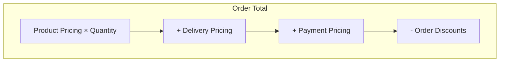
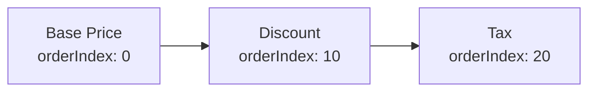

# Pricing System

Unchained Engine uses a chain-of-responsibility pattern for pricing calculations. Multiple pricing adapters execute in sequence, each adding, modifying, or discounting prices.

## Overview

Prices are calculated at multiple levels:


```mermaid
flowchart TD
    subgraph Order Total
        PP[Product Pricing × Quantity]
        DP[+ Delivery Pricing]
        PAY[+ Payment Pricing]
        OD[- Order Discounts]
        PP --> DP --> PAY --> OD
    end
```

| Director | Purpose |
|----------|---------|
| `ProductPricingDirector` | Base product price, taxes, product-level discounts |
| `DeliveryPricingDirector` | Shipping and handling fees |
| `PaymentPricingDirector` | Payment processing fees |
| `OrderPricingDirector` | Combines all pricing, applies order-level discounts |

## Pricing Chain

Adapters execute in order of their `orderIndex` (ascending). Lower numbers run first.


```mermaid
flowchart LR
    BP[Base Price<br/>orderIndex: 0] --> D[Discount<br/>orderIndex: 10] --> T[Tax<br/>orderIndex: 20]
```

Each adapter:
1. Receives the current calculation state (a pricing `sheet`)
2. Adds items/fees/discounts to the sheet
3. Hands control to the next adapter in the chain

### Order Index Guidelines

| Range | Purpose | Examples |
|-------|---------|----------|
| 0-9 | Base price calculation | Catalog price, ERP integration |
| 10-19 | Discounts | Member discounts, bulk pricing |
| 20-29 | Tax calculation | VAT, sales tax |
| 30+ | Final adjustments | Rounding, currency conversion |

## Pricing Categories

| Category | Description | Typical Use |
|----------|-------------|-------------|
| `BASE` | Base product/service price | Initial price calculation |
| `DISCOUNT` | Price reduction (negative amount) | Coupons, promotions |
| `TAX` | Tax amount | VAT, sales tax |
| `DELIVERY` | Shipping fees | Delivery pricing |
| `PAYMENT` | Payment processing fees | Card fees, invoice fees |

## Price Item Properties

When adding items to the calculation, each item has:

| Property | Type | Description |
|----------|------|-------------|
| `amount` | number | Price in smallest currency unit (cents) |
| `isTaxable` | boolean | Should tax be calculated on this amount? |
| `isNetPrice` | boolean | Is this a net price (excluding tax)? |
| `category` | string | Price category (BASE, TAX, DISCOUNT, etc.) |
| `meta` | object | Additional metadata |

## Pricing Sheet

Access calculated prices via the pricing sheet:

```typescript
const pricingSheet = await modules.orders.pricingSheet(order);

// Get totals
const total = pricingSheet.total(); // { amount, currency }
const gross = pricingSheet.gross(); // Before discounts
const net = pricingSheet.net(); // After discounts, before tax
const taxes = pricingSheet.taxes(); // Tax breakdown

// Get items by category
const discounts = pricingSheet.discounts();
const delivery = pricingSheet.delivery();
const payment = pricingSheet.payment();

// Sum specific items
const taxableAmount = pricingSheet.sum({ isTaxable: true });
const baseAmount = pricingSheet.sum({ category: 'BASE' });
```

## Leveled (Quantity-Tier) Catalog Pricing

A product's catalog price can have several **quantity tiers** per `(countryCode, currencyCode)` — for example a lower unit price when buying 10 or more.

Each tier is keyed by **`minQuantity`**, the *inclusive lower bound* of the quantity range it applies to:

- The **base tier** is `minQuantity: 0` (applies from the first unit).
- Tiers are sorted ascending by `minQuantity`. The applicable tier for a requested quantity `q` is the **highest tier whose `minQuantity ≤ q`**.
- The **highest tier is open-ended** — it applies to every quantity at or above its floor (there is no upper cap).

### Example — three tiers (CHF / CH)

| `minQuantity` | `amount` | Applies to |
|---|---|---|
| `0` | `1000` | quantity 1–4 → 10.00 each |
| `5` | `900` | quantity 5–9 → 9.00 each |
| `10` | `800` | quantity ≥ 10 → 8.00 each |

:::info Upgrading from v4: `maxQuantity` → `minQuantity`
Before v5, tiers were keyed by `maxQuantity` (an inclusive *upper* bound). v5 uses `minQuantity` (a *lower* bound). An **automatic, idempotent migration runs on startup** and converts existing `commerce.pricing` data per `(countryCode, currencyCode)` — no operator action is required, and re-running is safe. If you write product prices from a storefront, import pipeline, or client codegen, switch those payloads from `maxQuantity` to `minQuantity`.
:::

### Set tiers (GraphQL)

`UpdateProductCommercePricingInput` takes `minQuantity` (omit it for the base tier):

```graphql
mutation SetTiers($productId: ID!) {
  updateProductCommerce(
    productId: $productId
    commerce: {
      pricing: [
        { amount: 1000, currencyCode: "CHF", countryCode: "CH" }
        { amount: 900, minQuantity: 5, currencyCode: "CHF", countryCode: "CH" }
        { amount: 800, minQuantity: 10, currencyCode: "CHF", countryCode: "CH" }
      ]
    }
  ) {
    _id
  }
}
```

### Read tiers (GraphQL)

`leveledCatalogPrices` returns each tier as a `PriceLevel`. `minQuantity` is the stored floor; `maxQuantity` is **derived for display** (the next tier's floor − 1; `null` on the open-ended top tier):

```graphql
query Tiers($productId: ID!) {
  product(productId: $productId) {
    ... on SimpleProduct {
      leveledCatalogPrices(currencyCode: "CHF") {
        minQuantity
        maxQuantity
        price { amount currencyCode }
      }
    }
  }
}
```

## GraphQL Price Fields

Query product prices:

```graphql
query ProductPrice($productId: ID!) {
  product(productId: $productId) {
    ... on SimpleProduct {
      simulatedPrice(currencyCode: "CHF", quantity: 1) {
        amount
        currencyCode
        isTaxable
        isNetPrice
      }
    }
  }
}
```

Query cart pricing:

```graphql
query CartPricing {
  me {
    cart {
      total {
        amount
        currencyCode
      }
      items {
        total {
          amount
          currencyCode
        }
      }
      delivery {
        fee {
          amount
          currencyCode
        }
      }
      payment {
        fee {
          amount
          currencyCode
        }
      }
      discounts {
        total {
          amount
        }
        code
      }
    }
  }
}
```

## Best Practices

### 1. Author with the pricing factories

Use [`registerProductPricing` / `registerOrderPricing` / `registerPaymentPricing` / `registerDeliveryPricing`](../extend/plugin-factories.md#pricing). You push rows onto the `sheet` and the factory continues the chain for you:

```typescript
import { registerProductPricing } from '@unchainedshop/core';

registerProductPricing({
  adapterId: 'my-surcharge',
  calculate: async (sheet, context) => {
    sheet.addItem({ amount: 100, isTaxable: true, isNetPrice: true, meta: { adapter: 'my-surcharge' } });
    // Do NOT continue the chain yourself — the factory does it.
  },
});
```

### 2. Handle Currency Properly

Always work in smallest currency units (cents) to avoid floating-point errors:

```typescript
// Good
const amount = 1999; // $19.99 in cents

// Bad
const amount = 19.99; // Floating point issues
```

### 3. Include Metadata

Add metadata for debugging and reporting:

```typescript
sheet.addItem({
  amount: 100,
  isTaxable: false,
  isNetPrice: true,
  meta: {
    adapter: 'shop.unchained.pricing.product-tax',
    rate: 0.081,
  },
});
```

## Related

- [Product Pricing](../extend/pricing/product-pricing.md) - Custom product pricing adapters
- [Delivery Pricing](../extend/pricing/delivery-pricing.md) - Shipping fee calculation
- [Payment Pricing](../extend/pricing/payment-pricing.md) - Payment fee calculation
- [Order Discounts](../extend/pricing/order-discounts.md) - Discount adapters
- [Director/Adapter Pattern](./director-adapter-pattern.md) - Plugin architecture
