# Pricing System

Unchained Engine uses a chain-of-responsibility pattern for pricing calculations. Multiple pricing adapters execute in sequence, each adding, modifying, or discounting prices.

## Overview

Prices are calculated at multiple levels:

```mermaid
flowchart TD
    subgraph Order Total
        PP[Product Pricing × Quantity]
        DP[+ Delivery Pricing]
        PAY[+ Payment Pricing]
        OD[- Order Discounts]
        PP --> DP --> PAY --> OD
    end
```



| Director | Purpose |
|----------|---------|
| `ProductPricingDirector` | Base product price, taxes, product-level discounts |
| `DeliveryPricingDirector` | Shipping and handling fees |
| `PaymentPricingDirector` | Payment processing fees |
| `OrderPricingDirector` | Combines all pricing, applies order-level discounts |

## Pricing Chain

Adapters execute in order of their `orderIndex` (ascending). Lower numbers run first.


Each adapter:
1. Receives the current calculation state
2. Can add items to the calculation
3. Passes control to the next adapter via `super.calculate()`

### Order Index Guidelines

| Range | Purpose | Examples |
|-------|---------|----------|
| 0-9 | Base price calculation | Catalog price, ERP integration |
| 10-19 | Discounts | Member discounts, bulk pricing |
| 20-29 | Tax calculation | VAT, sales tax |
| 30+ | Final adjustments | Rounding, currency conversion |

## Pricing Categories

| Category | Description | Typical Use |
|----------|-------------|-------------|
| `BASE` | Base product/service price | Initial price calculation |
| `DISCOUNT` | Price reduction (negative amount) | Coupons, promotions |
| `TAX` | Tax amount | VAT, sales tax |
| `DELIVERY` | Shipping fees | Delivery pricing |
| `PAYMENT` | Payment processing fees | Card fees, invoice fees |

## Price Item Properties

When adding items to the calculation, each item has:

| Property | Type | Description |
|----------|------|-------------|
| `amount` | number | Price in smallest currency unit (cents) |
| `isTaxable` | boolean | Should tax be calculated on this amount? |
| `isNetPrice` | boolean | Is this a net price (excluding tax)? |
| `category` | string | Price category (BASE, TAX, DISCOUNT, etc.) |
| `meta` | object | Additional metadata |

## Pricing Sheet

Access calculated prices via the pricing sheet:

```typescript
const pricingSheet = await modules.orders.pricingSheet(order);

// Get totals
const total = pricingSheet.total(); // { amount, currency }
const gross = pricingSheet.gross(); // Before discounts
const net = pricingSheet.net(); // After discounts, before tax
const taxes = pricingSheet.taxes(); // Tax breakdown

// Get items by category
const discounts = pricingSheet.discounts();
const delivery = pricingSheet.delivery();
const payment = pricingSheet.payment();

// Sum specific items
const taxableAmount = pricingSheet.sum({ isTaxable: true });
const baseAmount = pricingSheet.sum({ category: 'BASE' });
```

## GraphQL Price Fields

Query product prices:

```graphql
query ProductPrice($productId: ID!) {
  product(productId: $productId) {
    ... on SimpleProduct {
      simulatedPrice(currencyCode: "CHF", quantity: 1) {
        amount
        currencyCode
        isTaxable
        isNetPrice
      }
    }
  }
}
```

Query cart pricing:

```graphql
query CartPricing {
  me {
    cart {
      total {
        amount
        currencyCode
      }
      items {
        total {
          amount
          currencyCode
        }
      }
      delivery {
        fee {
          amount
          currencyCode
        }
      }
      payment {
        fee {
          amount
          currencyCode
        }
      }
      discounts {
        total {
          amount
        }
        code
      }
    }
  }
}
```

## Best Practices

### 1. Always Call super.calculate()

```typescript
async calculate() {
  // Your logic here

  // IMPORTANT: Continue the chain
  return super.calculate();
}
```

Returning without calling `super.calculate()` stops the pricing chain.

### 2. Handle Currency Properly

Always work in smallest currency units (cents) to avoid floating-point errors:

```typescript
// Good
const amount = 1999; // $19.99 in cents

// Bad
const amount = 19.99; // Floating point issues
```

### 3. Include Metadata

Add metadata for debugging and reporting:

```typescript
this.result.addItem({
  amount: 100,
  category: 'TAX',
  meta: {
    adapter: this.constructor.key,
    rate: 0.081,
  },
});
```

## Related

- [Product Pricing](../extend/pricing/product-pricing.md) - Custom product pricing adapters
- [Delivery Pricing](../extend/pricing/delivery-pricing.md) - Shipping fee calculation
- [Payment Pricing](../extend/pricing/payment-pricing.md) - Payment fee calculation
- [Order Discounts](../extend/pricing/order-discounts.md) - Discount adapters
- [Director/Adapter Pattern](./director-adapter-pattern.md) - Plugin architecture
