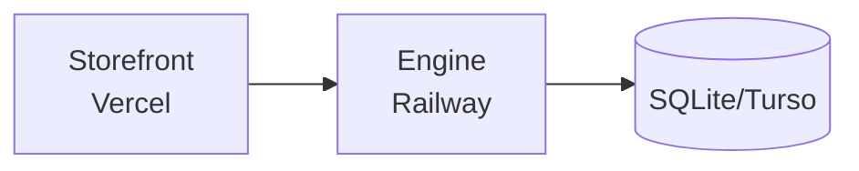
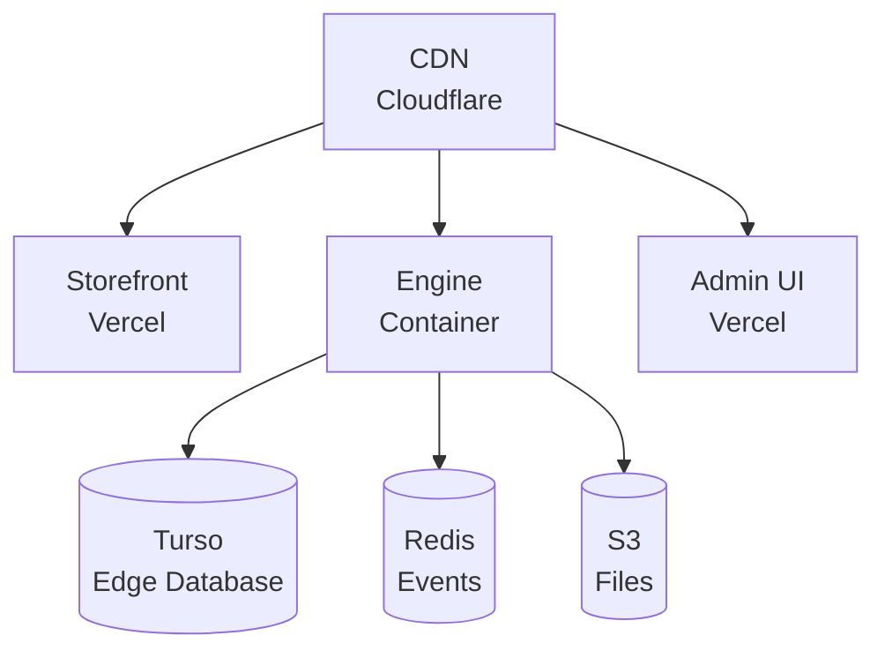

# Deployment

This section covers deploying Unchained Engine to production environments.

## Deployment Options

| Platform | Complexity | Best For |
|----------|------------|----------|
| [Railway](../quick-start/run-railway) | Low | Quick setup, managed infrastructure |
| [Docker](./docker) | Medium | Custom infrastructure, Kubernetes |
| [Manual](./production-checklist) | High | Full control, existing infrastructure |

## Quick Start: Railway

The fastest way to deploy Unchained Engine:

```bash
# Create project and deploy to Railway
npm init @unchainedshop -- --template railway
```

See [Railway Deployment](../quick-start/run-railway) for details.

## Docker Deployment

For container-based deployments:

```bash
# Build and run with Docker
docker build -t my-shop .
docker run -p 4010:4010 my-shop
```

See [Docker Deployment](./docker) for details.

## Production Requirements

### Infrastructure

- **Node.js 22+** - Runtime environment
- **SQLite/Turso** - Local SQLite or Turso for cloud deployments
- **File Storage** - S3, MinIO, or local storage for media
- **Redis** (optional) - For distributed events and caching

### Environment Variables

Essential production variables:

```bash
# Required
NODE_ENV=production
ROOT_URL=https://api.myshop.com
DRIZZLE_DB_URL=libsql://your-db.turso.io
DRIZZLE_DB_TOKEN=your-turso-auth-token
UNCHAINED_TOKEN_SECRET=your-32-char-secret-minimum

# File Storage (when using MinIO plugin)
MINIO_ENDPOINT=s3.amazonaws.com
MINIO_ACCESS_KEY=...
MINIO_SECRET_KEY=...
MINIO_BUCKET=my-shop-files

# Email
MAIL_URL=smtp://...
EMAIL_FROM=noreply@myshop.com
EMAIL_WEBSITE_NAME=My Shop
```

See [Environment Variables](../platform-configuration/environment-variables) for complete list.

## Architecture Recommendations

### Basic Setup



### Production Setup



## Guides

- [Railway Deployment](../quick-start/run-railway) - Deploy with Railway
- [Docker Deployment](./docker) - Container deployment
- [Production Checklist](./production-checklist) - Pre-launch checklist
- [Security](./security) - Security features and compliance
- [Environment Variables](../platform-configuration/environment-variables) - Configuration reference
