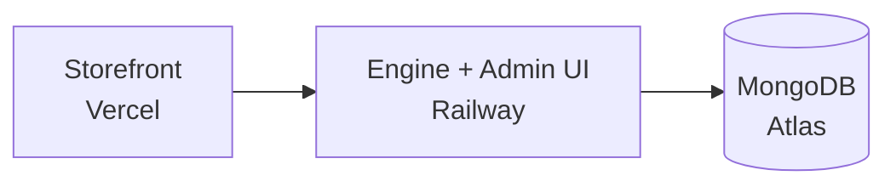
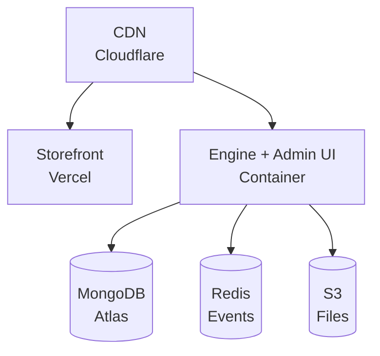

# Deployment

This section covers deploying Unchained Engine to production environments.

## Deployment Options

| Platform | Complexity | Best For |
|----------|------------|----------|
| [Railway](../quick-start/run-railway) | Low | Quick setup, managed infrastructure |
| [Docker](./docker) | Medium | Custom infrastructure, Kubernetes |
| [Manual](./production-checklist) | High | Full control, existing infrastructure |

The fastest path is the [Railway template](../quick-start/run-railway), which deploys the [unchained-app](https://github.com/unchainedshop/unchained-app) starter together with a MongoDB service via a one-click deploy button. For container-based deployments on your own infrastructure, see [Docker Deployment](./docker).

## Production Requirements

### Infrastructure

- **Node.js 24+** - Runtime environment
- **MongoDB** - Primary database (`MONGO_URL`; in development the engine falls back to an in-memory server when unset)
- **File Storage** - MinIO/S3 or GridFS (MongoDB built-in) for media
- **Redis** (optional) - For distributed events

### Environment Variables

`startPlatform` exits at boot if any of these are missing:

```bash
ROOT_URL=https://api.myshop.com
UNCHAINED_TOKEN_SECRET=your-32-char-secret-minimum
EMAIL_WEBSITE_NAME=My Shop
EMAIL_WEBSITE_URL=https://myshop.com
EMAIL_FROM=noreply@myshop.com
```

Additionally for production:

```bash
NODE_ENV=production
MONGO_URL=mongodb://...
MAIL_URL=smtp://...          # emails cannot be sent without it

# File storage (when using the MinIO plugin)
MINIO_ENDPOINT=https://s3.amazonaws.com   # full URL
MINIO_ACCESS_KEY=...
MINIO_SECRET_KEY=...
MINIO_BUCKET_NAME=my-shop-files
```

See [Environment Variables](../platform-configuration/environment-variables) for the canonical reference; plugin-specific variables (MinIO, Stripe, ...) are documented with their plugins.

## Architecture Recommendations

### Basic Setup


```mermaid
flowchart LR
    S[Storefront<br/>Vercel] --> E[Engine + Admin UI<br/>Railway] --> D[(MongoDB<br/>Atlas)]
```

### Production Setup


```mermaid
flowchart TD
    CDN[CDN<br/>Cloudflare]

    CDN --> Storefront[Storefront<br/>Vercel]
    CDN --> Engine[Engine + Admin UI<br/>Container]

    Engine --> MongoDB[(MongoDB<br/>Atlas)]
    Engine --> Redis[(Redis<br/>Events)]
    Engine --> S3[(S3<br/>Files)]
```

The Admin UI is served by the engine itself (`connect(fastify, platform, { adminUI: true })`) — it needs no separate deployment.

## Guides

- [Railway Deployment](../quick-start/run-railway) - Deploy with Railway
- [Docker Deployment](./docker) - Container deployment
- [Production Checklist](./production-checklist) - Pre-launch checklist
- [Security](./security) - Security features and practices
- [Environment Variables](../platform-configuration/environment-variables) - Configuration reference
