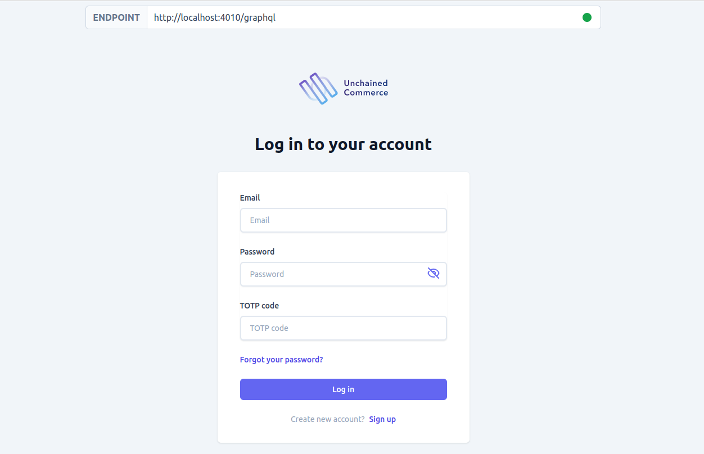

:::
Usage and Configuration Options for the Cryptopay Plugin
:::

This section walks you through the steps to start an Unchained Engine API server locally.

## Step 1: Installation

1. Create a new folder for your project.

```bash
mkdir my-unchained-engine
cd my-unchained-engine
```

2. Use the Unchained initialization script to download the code.

```bash
npm init @unchainedshop
```

3. Select the installation template. Choose **Unchained engine**.

```bash
? What type of template do you want ›
Full stack e-commerce
Storefront
Unchained engine <--
```

4. Select the directory (press `enter` to use the current directory) and whether to initialize git.

```bash
? Directory name relative to current directory
 (press Enter to use current directory) ›
? Do you want Initialize git? no / yes
```

5. Ensure your Node version is 22+ and install the npm packages.

```bash
npm install
```

## Step 2: Start the Unchained Engine

```bash
npm run dev
```

Open [localhost:4010](http://localhost:4010) to check if your Unchained Engine is running correctly. You should see the following **Landing page** in your browser:


## Open Admin UI sandbox

On the initial landing page, click [Use sandbox Admin UI](https://sandbox-v3.unchained.shop/log-in) to manage your local engine instance using the admin UI sandbox. Use the following credentials to log in and change them as soon as possible:

**Username**: _admin@unchained.local_<br />
**Password**: _password_



You can also click on [GraphQL playground](http://localhost:4010/graphql) to open the GraphQL playground for executing queries and mutations.

## Step 3: Add Products

To set up the store and add products and categories using the admin UI, follow the instructions in the [Add Products](/getting-started/add-products) guide using your local instance at [localhost:4010](http://localhost:4010).

Follow the examples to learn how to add products, initiate a checkout, and use plugins with GraphQL.

## Run the Storefront template

To test the Unchained Engine, set up the test storefront web app created with [React.js](https://reactjs.org/) and [Next.js](https://nextjs.org/) locally and connect it to your local Unchained Engine GraphQL API, as covered in the next chapter.