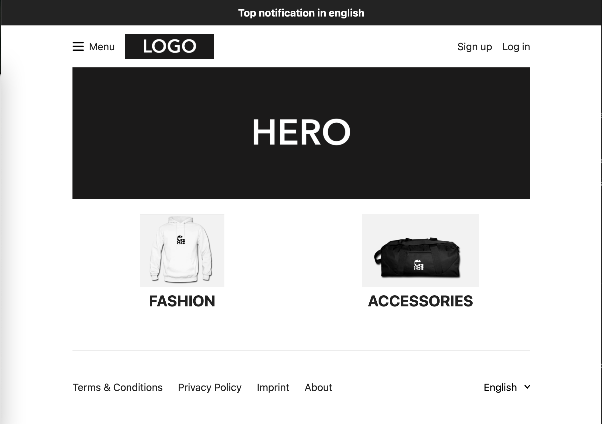

> To test the Unchained Engine we setup the test frontend project **Storefront** created with [React.js](https://reactjs.org/) and [Next.js](https://nextjs.org/) locally.


This tutorial helps you:

- Install the storefront web app locally
- Conntect to the local Unchained Engine via [graphQL](https://graphql.org/)

## Prerequisites

The storefront installation requires a Node version > 14.

```bash
node --version
v14.17.1
```

## Step 1: Installation

The **Storefront** project is a [Next.js](https://nextjs.org/) based web app and connects to your Unchained Engine through [graphQL](https://graphql.org/) queries.

1. First create a new folder for your project to be installed.

```bash
mkdir my-storefront-webapp
cd my-storefront-webapp
```

2. Use the Unchained initialisation script to download the code.

```bash
npm init @unchainedshop
```

3. A message prompts you to select the installation template. Choose **storefront** by using the `down key` and press `enter`

```bash
? What type of template do you want ›
Full stack e-commerce
Storefront <--
Unchained engine
```

4. Next two steps are to select the directory, as we already created a new empty directory you can simply press `enter`, and whether you want to initialise git which is up to you.

```bash
? Directory name relative to current directory
 (press Enter to use current directory) ›
? Do you want Initialize git? no / yes
```

5. Install the npm packages

```bash
npm install
```

The installation script downloads, installs and initialises all files and packages required to build and run the storefront web app.

## Step 2: Start the app

Now, start the app by using the following command. Make sure that the engine runs that you set the `UNCHAINED_ENDPOINT` environment variable to.

```bash
npm run dev
```

Open [localhost:3000](http://localhost:3000) to check your storefront webapp is running correctly.

And that's it!

Your Unchained E-Commerce environment is fully setup and running locally.

## (Connect to a remote test Unchained Engine)

Currently the store is empty since you haven't  added any product so far. With a little update of our `.env` settings we can change that by connecting to Unchained's remote test engine which contains some prefilled product data.

- Stop the app: `ctrl+c`
- Open the file in the _my-storefront-webapp_
- Update the endpoint in the `.env` file to: `UNCHAINED_ENDPOINT=https://engine.swag.unchained.shop/graphql`
- Restart the app:

```bash
npm run dev
```

- Open `localhost:3000` again to see some swaggy products popping up in your store. 😎

