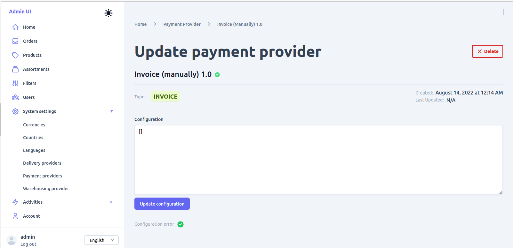
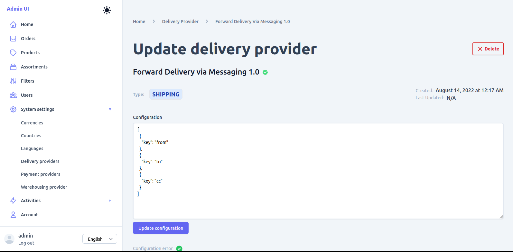
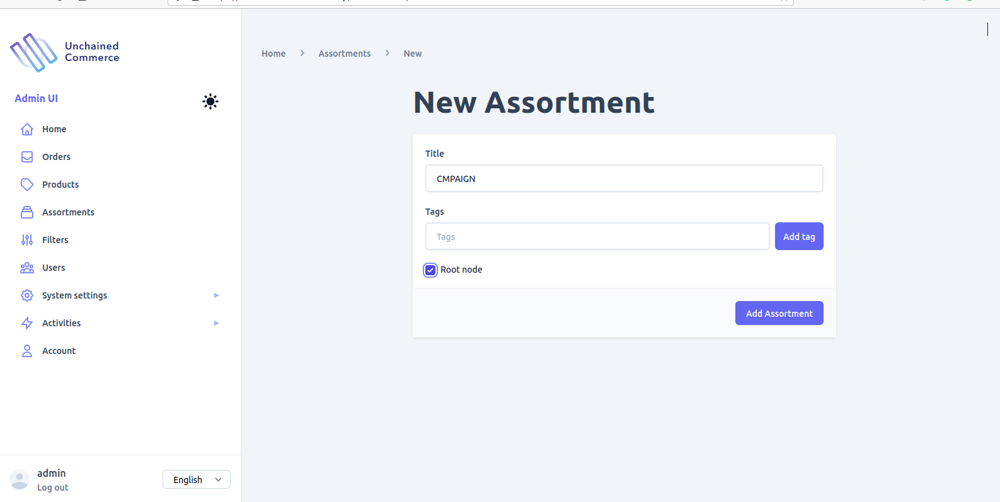

 <!-- <-->

This chapter teaches you how to add new products and categories to your store. It explains the major entities like categories, pricing & products required to show some products in the storefront app.

Steps:

- Log into your Admin UI
- Fill your store with content using the Admin UI
- Understand the store's data entities
- Use graphQL queries and mutations to feed and search over the Unchained Engine api.

This is an example application of a management admin UI. The Unchained Engine is designed for professional enterprise applications and uses powerful plugins to connect to existing CRM solutions which should be the choice if you build the store. However, to start we can manage a simple shop catalogue and add a basic payment option using the provide Admin UI.

## Step 1: Access Admin UI

In order to add content to your store, you need to log into the store's admin UI [sandbox](https://sandbox-v3.unchained.shop/). By default the sandbox is pointed to your `localhost:4010` port but in case you change the local engine endpoint to something else you can simply change the **ENDPOINT** URL

Navigate to the login window of your admin UI

Initially the username and password are set as following:

**Username**: _admin@unchained.local_ 
**Password**: _password_

This is a test project using common hard-coded credentials. Change your password as soon as you intend to work professionally with the engine. (<b class="normal"><code class="language-text">Account</code> ➤ <code class="language-text">Change password</code></b>)

## Step 1: Add Payment Provider

One of the basic settings besides the **currency** & **language** is the **payment provider** for your store. We gonna add a simple _Pay per invoice_ method to our shop. 
Check [Further Reading](#further-reading) at the end of this chapter for a (growing) list of payment plugins available for the Unchained Engine.

- On side navigation choose the menu entry **`System setting` ➤ `Payment providers`**
  
- Click on **`Add`** in the empty list view.
- Select type **`Invoice`**, choose the adapter **`Invoice (manually)`** and click on **`Add new adapter`** to save invoice payment provider.
  
- Click **`Save`** in the next screen as we do not need to add any additional configuration keys in this example project.
- The new payment provider **INVOICE** page will open.
  

## Step 2: Set Delivery Option

The second important configuration is **delivery option** which defines where and how orders should be send to for furhter processing. 

- On top choose the menu entry **`System settings` ➤ `Delivery providers`**
- Click on **`Add`** in the empty list view.
- Select type **`Shipping`**, choose the adapter **`Forward Delivery via Messaging`** and click on **`Add Delivery provider`** to continue.
  
- In the configuration window set email addresses (can be non-existing phantom addresses) for the keys **from** and **to**, delete the **cc** key and click **`Save`**.
- The new delivery provider **SHIPPING** should appear in the list. (You might need to select the delivery list again in the top menu)
  

## Step 3: Add Product

It's time to add our first product to the store.

- On side navigation menu entry **`Products`**
- Click on **`Add`** in the empty product list.
- Give the product a **name** and set the **type** to `Simple Product`.
  
- Click **`Add product`** to save the product and navigate to the product detail view.
- (If you have one ready, add a nice product image under `Media`.)
- Select **`Commerce`** on the left and set the price for your product.
- Per default a product is in the state **draft**. To make it available in the shop we need to **`publish`** it. On the right you find the option to publish (and unpublish) to product.
  
- Great! The product is ready to be assigned to a category.
- Do it again and add a second product!

## Step 4: Create Category (Assortment) with Products

Firstly, we will add two new categories which are called _Assortments_ in the Admin UI.

- On side navigation menu entry **`Assortments`**.
- Click on **`Add`**.

- Give your category a **title**, keep the _root node_ option checked.
- Click **`Add Assortment`** to save the category and navigate to the category detail view.
- (Same here, add a nice category image under `Media`.)
  
- Select **`Products`** tab.
- Search for the **(exact)** name of the product you added in [Step 3](#step-3-add-product), select it
  and click **`Add Product`** to link the product to the category

## Step 5. Admire the Products

Open your local storefront app http://localhost:3000 and verify that the categories appear on the entry page.
Choose a category to see the underlying products and start shopping! 😎

## Step 6: Place an Order
Now, you are able to go through a complete check-out and buy a product with the pay-per-invoice payment method.

On successful completion of an order you will find a new entry in the **Orders** list and a detailed order view including the the **Invoice Paid** option.

## Further Reading

Those are only the basic steps to fill some products into your store and process an order.

Check out further guides in the list below and do not hesitate to contact us if you need help 🍫!

- [Plugins](../plugins/plugin-overview)
- [API](https://docs.unchained.shop/api)