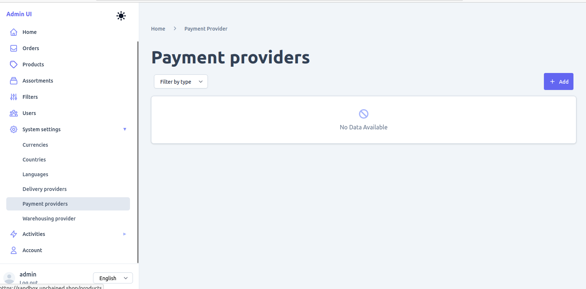

 <!-- <-->

This chapter teaches you how to add new products and categories to your store. It explains the major entities like categories, pricing & products required to show some products in the storefront app.

Steps:

- Log into your Admin UI
- Fill your store with content using the Admin UI

## Open Admin UI sandbox

:::info
The Unchained Admin UI needs a browser that allows cross-origin requests to localhost such as Chrome or Firefox. Safari is not supported.
:::

On the initial landing page, click [Use sandbox Admin UI](https://sandbox-v3.unchained.shop/log-in) to manage your local engine instance using the admin UI sandbox. Use the following credentials to log in and change them as soon as possible:

**Username**: _admin@unchained.local_ 
**Password**: _password_

You can also click on [GraphQL playground](http://localhost:4010/graphql) to open the GraphQL playground for executing queries and mutations.

This is a test project using common hard-coded credentials. Change your password as soon as you intend to work professionally with the engine. (<b class="normal"><code class="language-text">Account</code> ➤ <code class="language-text">Change password</code></b>)

## Add Payment Provider

One of the basic settings besides the **currency** & **language** is the **payment provider** for your store. We gonna add a simple _Pay per invoice_ method to our shop. 
Check [Further Reading](#further-reading) at the end of this chapter for a (growing) list of payment plugins available for the Unchained Engine.

- On side navigation choose the menu entry **`System setting` ➤ `Payment providers`**
  
- Click on **`Add`** in the empty list view.
- Select type **`Invoice`**, choose the adapter **`Invoice (manually)`** and click on **`Add new adapter`** to save invoice payment provider.
  
- Click **`Save`** in the next screen as we do not need to add any additional configuration keys in this example project.
- The new payment provider **INVOICE** page will open.
  

## Add Delivery Provider

The second important configuration is **delivery providers** which defines where and how orders should be send to for furhter processing.

- On top choose the menu entry **`System settings` ➤ `Delivery providers`**
- Click on **`Add`** in the empty list view.
- Select type **`Shipping`**, choose the adapter **`Forward Delivery via Messaging`** and click on **`Add Delivery provider`** to continue.
  
- In the configuration window set email addresses (can be non-existing phantom addresses) for the keys **from** and **to**, delete the **cc** key and click **`Save`**.
- The new delivery provider **SHIPPING** should appear in the list. (You might need to select the delivery list again in the top menu)
  

## Add Product

It's time to add our first product to the store.

- On side navigation menu entry **`Products`**
- Click on **`Add`** in the empty product list.
- Give the product a **name** and set the **type** to `Simple Product`.
  
- Click **`Add product`** to save the product and navigate to the product detail view.
- (If you have one ready, add a nice product image under `Media`.)
- Select **`Commerce`** on the left and set the price for your product.
- Per default a product is in the state **draft**. To make it available in the shop we need to **`publish`** it. On the right you find the option to publish (and unpublish) to product.
  
- Great! The product is ready to be assigned to a category.
- Do it again and add a second product!

## Create Category (Assortment) with Products

Firstly, we will add two new categories which are called _Assortments_ in the Admin UI.

- On side navigation menu entry **`Assortments`**.
- Click on **`Add`**.

- Give your category a **title**, keep the _root node_ option checked.
- Click **`Add Assortment`** to save the category and navigate to the category detail view.
- (Same here, add a nice category image under `Media`.)
  
- Select **`Products`** tab.
- Search for the **(exact)** name of the product you added in [Step 3](#step-3-add-product), select it
  and click **`Add Product`** to link the product to the category

## See your Products in Action

To see your data in action, in the next chapter you will learn to set up a basic storefront web app created with [React.js](https://reactjs.org/) and [Next.js](https://nextjs.org/) and connect it to your local Unchained Engine GraphQL API.

## Further Reading

You just used the Admin UI to store very basic entities in the DB connected to the Unchained Engine API.
The Admin UI just called the GraphQL endpoint underneath to do that. Depending on your case you could opt-in to write your own Admin UI or feed the data in other ways, checkout the following chapters:

Do not hesitate to contact us if you need help 🍫!

- [Use other Providers](../plugins/plugin-overview)
- [Checkout the GraphQL API Reference](/api/queries)
- [Stream Entities with the Bulk Import API](/advanced/bulk-import)
