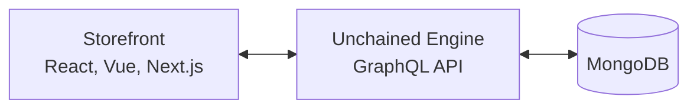

# Building a Storefront

This guide covers how to integrate a frontend application with Unchained Engine's GraphQL API.

## Overview

Unchained Engine is headless, meaning it provides a GraphQL API that any frontend can consume:



## Setting Up GraphQL Client

### Apollo Client (Recommended)

```bash
npm install @apollo/client graphql
```

```typescript
// lib/apollo-client.ts
import { ApolloClient, InMemoryCache, HttpLink } from '@apollo/client';

const httpLink = new HttpLink({
 uri: process.env.NEXT_PUBLIC_UNCHAINED_URL || 'http://localhost:4010/graphql',
  credentials: 'same-origin', // Additional fetch() options like `credentials` or `headers`
});
export const client = new ApolloClient({
  link: httpLink,
  cache: new InMemoryCache(),
});
```

### URQL

```bash
npm install urql graphql
```

```typescript
import { createClient, fetchExchange, cacheExchange } from 'urql';

const client = createClient({
  url: process.env.NEXT_PUBLIC_UNCHAINED_URL || 'http://localhost:4010/graphql',
  exchanges: [cacheExchange, fetchExchange],
});
```

## Core Queries

### Fetch Products

```graphql
query Products($limit: Int, $offset: Int) {
  products(limit: $limit, offset: $offset) {
    _id
    status
    tags
    texts {
      _id
      title
      description
      slug
    }
    media {
      _id
      file {
        url
      }
    }
    ... on SimpleProduct {
      simulatedPrice(currencyCode: "CHF") {
        amount
        currencyCode
      }
    }
  }
}
```

### Fetch Single Product

```graphql
query Product($productId: ID, $slug: String) {
  product(productId: $productId, slug: $slug) {
    _id
    texts {
      title
      description
      slug
    }
    media {
      _id
      file {
        url
      }
    }
    ... on SimpleProduct {
      simulatedPrice(currencyCode: "CHF", quantity: 1) {
        amount
        currencyCode
      }
      dimensions {
        weight
        length
        width
        height
      }
    }
    ... on ConfigurableProduct {
      variations {
        _id
        key
        type
        options {
          _id
          value
        }
      }
    }
  }
}
```

### Fetch Assortments (Categories)

```graphql
query Assortments {
  assortments {
    _id
    isRoot
    texts {
      title
      description
      slug
    }
    children {
      _id
      texts {
        title
        slug
      }
    }
    searchProducts {
      products {
        _id
        texts {
          title
        }
        ... on SimpleProduct {
          simulatedPrice(currencyCode: "CHF") {
            amount
            currencyCode
          }
        }
      }
    }
  }
}
```

### Search Products

```graphql
query SearchProducts($queryString: String, $filterQuery: [FilterQueryInput!]) {
  searchProducts(queryString: $queryString, filterQuery: $filterQuery) {
    products {
      _id
      texts {
        title
      }
      ... on SimpleProduct {
        simulatedPrice(currencyCode: "CHF") {
          amount
          currencyCode
        }
      }
    }
    filters {
      filteredProductsCount
    }
  }
}
```

## User Management

### Current User

```graphql
query Me {
  me {
    _id
    primaryEmail {
      address
    }
    username
    isGuest
    profile {
      displayName
      address {
        firstName
        lastName
        company
        addressLine
        city
        postalCode
        countryCode
      }
    }
    cart {
      _id
      total {
        amount
        currencyCode
      }
    }
    orders {
      _id
      orderNumber
      status
      ordered
    }
  }
}
```

### Update Profile

```graphql
mutation UpdateProfile {
  updateUserProfile(
    profile: {
      displayName: "John Doe"
      address: {
        firstName: "John"
        lastName: "Doe"
        addressLine: "123 Main St"
        city: "Zurich"
        postalCode: "8000"
        countryCode: "CH"
      }
    }
  ) {
    _id
    profile {
      displayName
      address {
        city
      }
    }
  }
}
```

## Cart Operations

### Get Cart

```graphql
query Cart {
  me {
    cart {
      _id
      items {
        _id
        quantity
        product {
          _id
          texts {
            title
          }
          media {
            file {
              url
            }
          }
        }
        unitPrice {
          amount
          currencyCode
        }
        total {
          amount
          currencyCode
        }
      }
      delivery {
        _id
        fee {
          amount
          currencyCode
        }
      }
      payment {
        _id
        fee {
          amount
          currencyCode
        }
      }
      total {
        amount
        currencyCode
      }
    }
  }
}
```

### Cart Mutations

```graphql
# Add item
mutation AddToCart($productId: ID!, $quantity: Int!) {
  addCartProduct(productId: $productId, quantity: $quantity) {
    _id
  }
}

# Update quantity
mutation UpdateQuantity($itemId: ID!, $quantity: Int!) {
  updateCartItem(itemId: $itemId, quantity: $quantity) {
    _id
  }
}

# Remove item
mutation RemoveItem($itemId: ID!) {
  removeCartItem(itemId: $itemId) {
    _id
  }
}

# Empty cart
mutation EmptyCart {
  emptyCart {
    _id
    items {
      _id
    }
  }
}
```

## React Component Examples

### Product List

```tsx
import { useQuery } from '@apollo/client';
import { PRODUCTS_QUERY } from './queries';

function ProductList() {
  const { data, loading, error } = useQuery(PRODUCTS_QUERY, {
    variables: { limit: 20, offset: 0 },
  });

  if (loading) return <div>Loading...</div>;
  if (error) return <div>Error: {error.message}</div>;

  return (
    <div className="grid grid-cols-3 gap-4">
      {data.products.map((product) => (
        <ProductCard key={product._id} product={product} />
      ))}
    </div>
  );
}

function ProductCard({ product }) {
  const title = product.texts?.title || 'Untitled';
  const price = product.simulatedPrice;
  const image = product.media?.[0]?.file?.url;

  return (
    <div className="border rounded p-4">
      {image && }
      <h3>{title}</h3>
      {price && (
        <p>
          {formatPrice(price.amount, price.currencyCode)}
        </p>
      )}
      <AddToCartButton productId={product._id} />
    </div>
  );
}
```

### Add to Cart Button

```tsx
import { useMutation } from '@apollo/client';
import { ADD_TO_CART, GET_CART } from './queries';

function AddToCartButton({ productId }) {
  const [addToCart, { loading }] = useMutation(ADD_TO_CART, {
    refetchQueries: [{ query: GET_CART }],
  });

  const handleClick = async () => {
    try {
      await addToCart({
        variables: { productId, quantity: 1 },
      });
    } catch (error) {
      console.error('Failed to add to cart:', error);
    }
  };

  return (
    <button onClick={handleClick} disabled={loading}>
      {loading ? 'Adding...' : 'Add to Cart'}
    </button>
  );
}
```

### Cart Component

```tsx
import { useQuery, useMutation } from '@apollo/client';
import { GET_CART, UPDATE_QUANTITY, REMOVE_ITEM } from './queries';

function Cart() {
  const { data, loading } = useQuery(GET_CART);
  const [updateQuantity] = useMutation(UPDATE_QUANTITY);
  const [removeItem] = useMutation(REMOVE_ITEM);

  const cart = data?.me?.cart;

  if (loading) return <div>Loading cart...</div>;
  if (!cart?.items?.length) return <div>Your cart is empty</div>;

  return (
    <div>
      {cart.items.map((item) => (
        <CartItem
          key={item._id}
          item={item}
          onQuantityChange={(quantity) =>
            updateQuantity({ variables: { itemId: item._id, quantity } })
          }
          onRemove={() =>
            removeItem({ variables: { itemId: item._id } })
          }
        />
      ))}

      <div className="border-t pt-4 mt-4">
        <div>Subtotal: {formatPrice(cart.itemsTotal?.amount, cart.itemsTotal?.currencyCode)}</div>
        {cart.delivery?.fee && (
          <div>Shipping: {formatPrice(cart.delivery.fee.amount, cart.delivery.fee.currencyCode)}</div>
        )}
        <div className="font-bold">
          Total: {formatPrice(cart.total?.amount, cart.total?.currencyCode)}
        </div>
      </div>

      <Link href="/checkout">
        <button>Proceed to Checkout</button>
      </Link>
    </div>
  );
}
```

## Authentication Flow

### Login Component

```tsx
import { useMutation } from '@apollo/client';
import { LOGIN, LOGIN_AS_GUEST, GET_ME } from './queries';

function LoginForm() {
  const [email, setEmail] = useState('');
  const [password, setPassword] = useState('');

  const [login] = useMutation(LOGIN, {
    refetchQueries: [{ query: GET_ME }],
  });

  const [loginAsGuest] = useMutation(LOGIN_AS_GUEST, {
    refetchQueries: [{ query: GET_ME }],
  });

  const handleLogin = async (e) => {
    e.preventDefault();
    try {
      const { data } = await login({
        variables: { email, password },
      });
      // Token is set as HTTP-only cookie automatically
      // The _id is the session ID for reference
      console.log('Logged in, session:', data.loginWithPassword._id);
    } catch (error) {
      console.error('Login failed:', error);
    }
  };

  const handleGuestCheckout = async () => {
    try {
      const { data } = await loginAsGuest();
      // Token is set as HTTP-only cookie automatically
      console.log('Guest session:', data.loginAsGuest._id);
    } catch (error) {
      console.error('Guest login failed:', error);
    }
  };

  return (
    <div>
      <form onSubmit={handleLogin}>
        <input
          type="email"
          value={email}
          onChange={(e) => setEmail(e.target.value)}
          placeholder="Email"
        />
        <input
          type="password"
          value={password}
          onChange={(e) => setPassword(e.target.value)}
          placeholder="Password"
        />
        <button type="submit">Login</button>
      </form>

      <button onClick={handleGuestCheckout}>
        Continue as Guest
      </button>
    </div>
  );
}
```

## Utility Functions

### Format Price

```typescript
export function formatPrice(amount: number, currency: string): string {
  return new Intl.NumberFormat('de-CH', {
    style: 'currency',
    currency,
  }).format(amount / 100); // Convert from cents
}
```

### Slugify

```typescript
export function productUrl(product: { texts?: { slug?: string }; _id: string }): string {
  const slug = product.texts?.slug || product._id;
  return `/products/${slug}`;
}
```

## Next.js Integration

### API Route for Server-Side Queries

```typescript
// pages/api/products.ts
import { client } from '@/lib/apollo-client';
import { PRODUCTS_QUERY } from '@/queries';

export default async function handler(req, res) {
  const { data } = await client.query({
    query: PRODUCTS_QUERY,
    variables: { limit: 20 },
  });

  res.json(data.products);
}
```

### Server-Side Rendering

```typescript
// pages/products/[slug].tsx
import { client } from '@/lib/apollo-client';
import { PRODUCT_QUERY } from '@/queries';

export async function getServerSideProps({ params }) {
  const { data } = await client.query({
    query: PRODUCT_QUERY,
    variables: { slug: params.slug },
  });

  if (!data.product) {
    return { notFound: true };
  }

  return {
    props: { product: data.product },
  };
}
```

### Static Generation

```typescript
// pages/products/[slug].tsx
export async function getStaticPaths() {
  const { data } = await client.query({ query: ALL_PRODUCT_SLUGS });

  const paths = data.products.map((product) => ({
    params: { slug: product.texts?.slug || product._id },
  }));

  return { paths, fallback: 'blocking' };
}

export async function getStaticProps({ params }) {
  const { data } = await client.query({
    query: PRODUCT_QUERY,
    variables: { slug: params.slug },
  });

  return {
    props: { product: data.product },
    revalidate: 60, // Regenerate every 60 seconds
  };
}
```

## Best Practices

### 1. Cache Management

Use Apollo's cache policies effectively:

```typescript
const client = new ApolloClient({
  cache: new InMemoryCache({
    typePolicies: {
      Product: {
        keyFields: ['_id'],
      },
      Cart: {
        keyFields: ['_id'],
        merge: true,
      },
    },
  }),
});
```

### 2. Optimistic Updates

For better UX, update the UI immediately:

```typescript
const [addToCart] = useMutation(ADD_TO_CART, {
  optimisticResponse: {
    addCartProduct: {
      __typename: 'Order',
      _id: cart?._id,
    },
  },
});
```

### 3. Error Boundaries

Handle GraphQL errors gracefully:

```typescript
function ErrorBoundary({ children }) {
  return (
    <ApolloProvider client={client}>
      <ErrorHandler>{children}</ErrorHandler>
    </ApolloProvider>
  );
}
```

### 4. Loading States

Always handle loading states:

```typescript
if (loading) return <Skeleton />;
if (error) return <ErrorMessage error={error} />;
if (!data) return <Empty />;
```

## Related

- [Checkout Implementation](./checkout-implementation) - Complete checkout flow
- [Authentication](../concepts/authentication) - Auth patterns
