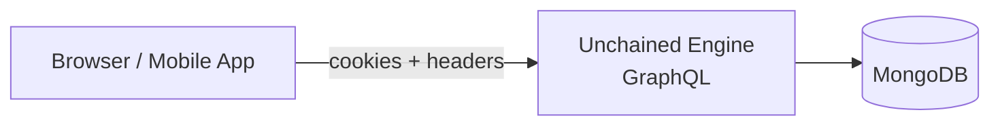

# Building a Storefront

This guide covers how to build a **production-ready storefront** on top of **Unchained Engine’s GraphQL API**.

Unchained is not just a product API — it is a **commerce engine**.  
Prices, texts, taxes, availability, shipping and discounts are resolved dynamically based on **context**.


## Overview

Unchained Engine is headless, meaning it provides a GraphQL API that any frontend can consume:


```mermaid
flowchart LR
  B[Browser / Mobile App]  
  U[Unchained Engine<br/>GraphQL]
  D[(MongoDB)]

  B -->|cookies + headers| U
  U --> D
```

## Setting Up GraphQL Client

### Apollo Client (Recommended)

```bash
npm install @apollo/client graphql
```

```typescript
// lib/apollo-client.ts
import { ApolloClient, InMemoryCache, HttpLink } from '@apollo/client';

const httpLink = new HttpLink({
 uri: process.env.NEXT_PUBLIC_UNCHAINED_URL || 'http://localhost:4010/graphql',
  credentials: 'same-origin', // Additional fetch() options like `credentials` or `headers`
});
export const client = new ApolloClient({
  link: httpLink,
  cache: new InMemoryCache(),
});
```

## Core Queries

### Fetch Products

```graphql
query Products($limit: Int, $offset: Int) {
  products(limit: $limit, offset: $offset) {
    _id
    status
    tags
    texts {
      _id
      title
      description
      slug
    }
    media {
      _id
      file {
        url
      }
    }
    ... on SimpleProduct {
      simulatedPrice(currencyCode: "CHF") {
        amount
      }
    }
  }
}
```

### Fetch Single Product

```graphql
query Product($productId: ID, $slug: String) {
  product(productId: $productId, slug: $slug) {
    _id
    texts {
      title
      description
      slug
    }
    media {
      _id
      file {
        url
      }
    }
    ... on SimpleProduct {
      simulatedPrice(currencyCode: "CHF", quantity: 1) {
        amount
        currencyCode
      }
      dimensions {
        weight
        length
        width
        height
      }
    }
    ... on ConfigurableProduct {
      variations {
        _id
        key
        type
        options {
          _id
          value
        }
      }
    }
  }
}
```

### Fetch Assortments (Categories)

```graphql
query Assortments {
  assortments {
    _id
    isRoot
    texts {
      title
      description
      slug
    }
    children {
      _id
      texts {
        title
        slug
      }
    }
    searchProducts {
      products {
        _id
        texts {
          title
        }
        ... on SimpleProduct {
          simulatedPrice(currencyCode: "CHF") {
            amount
            currencyCode
          }
        }
      }
    }
  }
}
```

### Search Products

```graphql
query SearchProducts($queryString: String, $filterQuery: [FilterQueryInput!]) {
  searchProducts(queryString: $queryString, filterQuery: $filterQuery) {
    products {
      _id
      texts {
        title
      }
      ... on SimpleProduct {
        simulatedPrice(currencyCode: "CHF") {
          amount
          currencyCode
        }
      }
    }
    filters {
      filteredProductsCount
    }
  }
}
```

## User Management

### Current User

```graphql
query Me {
  me {
    _id
    primaryEmail {
      address
    }
    username
    isGuest
    profile {
      displayName
      address {
        firstName
        lastName
        company
        addressLine
        city
        postalCode
        countryCode
      }
    }
    cart {
      _id
      total {
        amount
        currencyCode
      }
    }
    orders {
      _id
      orderNumber
      status
      ordered
    }
  }
}
```

### Update Profile

```graphql
mutation UpdateProfile {
  updateUserProfile(
    profile: {
      displayName: "John Doe"
      address: {
        firstName: "John"
        lastName: "Doe"
        addressLine: "123 Main St"
        city: "Zurich"
        postalCode: "8000"
        countryCode: "CH"
      }
    }
  ) {
    _id
    profile {
      displayName
      address {
        city
      }
    }
  }
}
```

## Cart Operations

### Get Cart

```graphql
query Cart {
  me {
    cart {
      _id
      items {
        _id
        quantity
        product {
          _id
          texts {
            title
          }
          media {
            file {
              url
            }
          }
        }
        unitPrice {
          amount
          currencyCode
        }
        total {
          amount
          currencyCode
        }
      }
      delivery {
        _id
        fee {
          amount
          currencyCode
        }
      }
      payment {
        _id
        fee {
          amount
          currencyCode
        }
      }
      itemsTotal: total(category: ITEMS) {
        amount
        currencyCode
      }
      total {
        amount
        currencyCode
      }
    }
  }
}
```

The `total` field takes an optional `category` argument (`ITEMS`, `DELIVERY`, `PAYMENT`, `TAXES`, `DISCOUNTS`) — use aliases to fetch several categories in one query.

### Cart Mutations

```graphql
# Add item
mutation AddToCart($productId: ID!, $quantity: Int!) {
  addCartProduct(productId: $productId, quantity: $quantity) {
    _id
  }
}

# Update quantity
mutation UpdateQuantity($itemId: ID!, $quantity: Int!) {
  updateCartItem(itemId: $itemId, quantity: $quantity) {
    _id
  }
}

# Remove item
mutation RemoveItem($itemId: ID!) {
  removeCartItem(itemId: $itemId) {
    _id
  }
}

# Empty cart
mutation EmptyCart {
  emptyCart {
    _id
    items {
      _id
    }
  }
}
```

## React Component Examples

### Product List

```tsx
import { useQuery } from '@apollo/client';
import { PRODUCTS_QUERY } from './queries';

function ProductList() {
  const { data, loading, error } = useQuery(PRODUCTS_QUERY, {
    variables: { limit: 20, offset: 0 },
  });

  if (loading) return <div>Loading...</div>;
  if (error) return <div>Error: {error.message}</div>;

  return (
    <div className="grid grid-cols-3 gap-4">
      {data.products.map((product) => (
        <ProductCard key={product._id} product={product} />
      ))}
    </div>
  );
}

function ProductCard({ product }) {
  const title = product.texts?.title || 'Untitled';
  const price = product.simulatedPrice;
  const image = product.media?.[0]?.file?.url;

  return (
    <div className="border rounded p-4">
      {image && }
      <h3>{title}</h3>
      {price && (
        <p>
          {formatPrice(price.amount, price.currencyCode)}
        </p>
      )}
      <AddToCartButton productId={product._id} />
    </div>
  );
}
```

### Add to Cart Button

```tsx
import { useMutation } from '@apollo/client';
import { ADD_TO_CART, GET_CART } from './queries';

function AddToCartButton({ productId }) {
  const [addToCart, { loading }] = useMutation(ADD_TO_CART, {
    refetchQueries: [{ query: GET_CART }],
  });

  const handleClick = async () => {
    try {
      await addToCart({
        variables: { productId, quantity: 1 },
      });
    } catch (error) {
      console.error('Failed to add to cart:', error);
    }
  };

  return (
    <button onClick={handleClick} disabled={loading}>
      {loading ? 'Adding...' : 'Add to Cart'}
    </button>
  );
}
```

### Cart Component

```tsx
import { useQuery, useMutation } from '@apollo/client';
import { GET_CART, UPDATE_QUANTITY, REMOVE_ITEM } from './queries';

function Cart() {
  const { data, loading } = useQuery(GET_CART);
  const [updateQuantity] = useMutation(UPDATE_QUANTITY);
  const [removeItem] = useMutation(REMOVE_ITEM);

  const cart = data?.me?.cart;

  if (loading) return <div>Loading cart...</div>;
  if (!cart?.items?.length) return <div>Your cart is empty</div>;

  return (
    <div>
      {cart.items.map((item) => (
        <CartItem
          key={item._id}
          item={item}
          onQuantityChange={(quantity) =>
            updateQuantity({ variables: { itemId: item._id, quantity } })
          }
          onRemove={() =>
            removeItem({ variables: { itemId: item._id } })
          }
        />
      ))}

      <div className="border-t pt-4 mt-4">
        <div>Subtotal: {formatPrice(cart.itemsTotal?.amount, cart.itemsTotal?.currencyCode)}</div>
        {cart.delivery?.fee && (
          <div>Shipping: {formatPrice(cart.delivery.fee.amount, cart.delivery.fee.currencyCode)}</div>
        )}
        <div className="font-bold">
          Total: {formatPrice(cart.total?.amount, cart.total?.currencyCode)}
        </div>
      </div>

      <Link href="/checkout">
        <button>Proceed to Checkout</button>
      </Link>
    </div>
  );
}
```

## Authentication Flow

```graphql
mutation Login($email: String, $password: String!) {
  loginWithPassword(email: $email, password: $password) {
    _id
    user {
      _id
      username
    }
  }
}

mutation LoginAsGuest {
  loginAsGuest {
    _id
    user {
      _id
      isGuest
    }
  }
}
```

Both mutations set the session token as an HTTP-only cookie automatically — no token handling in the frontend. If the storefront runs on a different origin than the engine, configure your GraphQL client with `credentials: 'include'` so the cookie is sent along. After login, refetch `me` to update the UI.

See [Checkout Implementation](./checkout-implementation) for how guest login fits into the checkout flow and [Authentication](../concepts/authentication) for the underlying concepts.

## Utility Functions

### Format Price

```typescript
export function formatPrice(amount: number, currency: string): string {
  return new Intl.NumberFormat('de-CH', {
    style: 'currency',
    currency,
  }).format(amount / 100); // Convert from cents
}
```

### Slugify

```typescript
export function productUrl(product: { texts?: { slug?: string }; _id: string }): string {
  const slug = product.texts?.slug || product._id;
  return `/products/${slug}`;
}
```

## Server-Side Rendering

Unchained is a plain GraphQL-over-HTTP API, so any SSR/SSG framework works without special integration. Two things are Unchained-specific:

- **Catalog data** (products, assortments, texts, `simulatedPrice` with an explicit `currencyCode`) can be fetched server-side and cached/prerendered — resolve routes via `product(slug: ...)` and use `texts.slug` for paths.
- **Session-bound data** (`me`, cart, user-specific prices) depends on the session cookie and `Accept-Language` header. When querying from the server, forward the incoming request's `Cookie` and `Accept-Language` headers to the engine; never cache these responses across users.

```typescript
// Any server runtime: forward context headers to the engine
const response = await fetch(`${UNCHAINED_URL}/graphql`, {
  method: 'POST',
  headers: {
    'Content-Type': 'application/json',
    cookie: incomingRequest.headers.cookie ?? '',
    'accept-language': incomingRequest.headers['accept-language'] ?? '',
  },
  body: JSON.stringify({ query: PRODUCT_QUERY, variables: { slug } }),
});
```

For framework-specific data fetching (`getServerSideProps`, React Server Components, load functions, …) refer to your framework's documentation.

## Related

- [Checkout Implementation](./checkout-implementation) - Complete checkout flow
- [Authentication](../concepts/authentication) - Auth patterns
