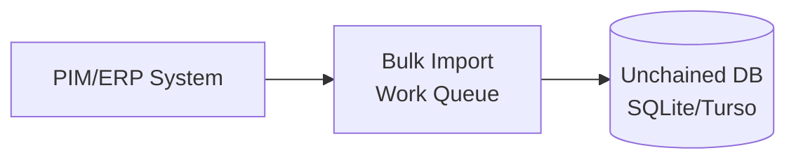

# Bulk Import

This guide covers importing large datasets from external systems like PIM (Product Information Management) or ERP (Enterprise Resource Planning) into Unchained Engine.

## Overview

The Bulk Import API is designed for high-volume data synchronization:



### Key Features

- **Cloud Native**: Background processing on dedicated worker instances
- **Transparent Process**: Results stored on work items for queryable success/failure
- **Error Reporting**: Sync issues reported via email to a central address
- **Performance**: Batch operations and intelligent asset caching
- **Push-Based**: Immediate representation of changes

## Import Methods

### GraphQL Method

For smaller imports, use the GraphQL mutation:

```graphql
mutation BulkImport {
  addWork(
    type: BULK_IMPORT
    input: {
      events: [
        {
          entity: "PRODUCT"
          operation: "CREATE"
          payload: "{}"
        }
      ]
    }
  ) {
    _id
    status
  }
}
```

### REST Endpoint

For large imports (5K+ entities or >16MB), use the REST endpoint:

```bash
curl -X POST \
  -H "Authorization: Bearer YOUR_TOKEN" \
  -H "Content-Type: application/json" \
  --data-binary @products.json \
  https://your-engine.com/bulk-import
```

## Event Structure

Every event consists of three parts:

```json
{
  "entity": "ENTITY_TYPE",
  "operation": "OPERATION_TYPE",
  "payload": { ... }
}
```

### Supported Entities

| Entity | Description |
|--------|-------------|
| `PRODUCT` | Products (simple, configurable, bundle, plan) |
| `ASSORTMENT` | Categories and collections |
| `FILTER` | Product filters and facets |

### Supported Operations

| Operation | Description |
|-----------|-------------|
| `CREATE` | Create new entity |
| `UPDATE` | Update existing entity |
| `REMOVE` | Delete entity |

## Import Options

Pass options as query parameters (REST) or in the input object (GraphQL):

| Option | Description |
|--------|-------------|
| `createShouldUpsertIfIDExists` | CREATE updates if entity exists |
| `updateShouldUpsertIfIDNotExists` | UPDATE creates if entity missing |
| `skipCacheInvalidation` | Skip filter/assortment cache updates |

```bash
# REST with options
curl -X POST \
  "https://your-engine.com/bulk-import?createShouldUpsertIfIDExists=true" \
  --data-binary @products.json
```

## Product Import

### Simple Product

```json
{
  "entity": "PRODUCT",
  "operation": "CREATE",
  "payload": {
    "_id": "product-123",
    "specification": {
      "tags": ["featured", "new"],
      "type": "SIMPLE_PRODUCT",
      "published": "2024-01-01T00:00:00Z",
      "commerce": {
        "salesUnit": "ST",
        "salesQuantityPerUnit": "1",
        "defaultOrderQuantity": "1",
        "pricing": [
          {
            "isTaxable": true,
            "isNetPrice": true,
            "countryCode": "CH",
            "currencyCode": "CHF",
            "amount": 4900,
            "maxQuantity": null
          }
        ]
      },
      "warehousing": {
        "baseUnit": "ST",
        "sku": "SKU-123",
        "dimensions": {
          "weightInGram": 500,
          "heightInMillimeters": 100,
          "lengthInMillimeters": 200,
          "widthInMillimeters": 150
        }
      },
      "meta": {
        "customField": "value"
      },
      "content": {
        "en": {
          "vendor": "Brand Name",
          "brand": "Product Line",
          "title": "Product Title",
          "slug": "product-title",
          "subtitle": "Short description",
          "description": "Detailed product description",
          "labels": ["New", "Sale"]
        },
        "de": {
          "title": "Produkttitel",
          "slug": "produkttitel",
          "description": "Ausführliche Produktbeschreibung"
        }
      }
    },
    "media": [
      {
        "asset": {
          "url": "https://example.com/images/product.jpg"
        },
        "tags": ["primary"],
        "content": {
          "en": {
            "title": "Product Image",
            "subtitle": "Main view"
          }
        }
      }
    ]
  }
}
```

### Configurable Product with Variations

```json
{
  "entity": "PRODUCT",
  "operation": "CREATE",
  "payload": {
    "_id": "configurable-product",
    "specification": {
      "type": "CONFIGURABLE_PRODUCT",
      "published": "2024-01-01T00:00:00Z",
      "variationResolvers": [
        {
          "vector": { "color": "red", "size": "M" },
          "productId": "variant-red-m"
        },
        {
          "vector": { "color": "blue", "size": "M" },
          "productId": "variant-blue-m"
        }
      ],
      "content": {
        "en": {
          "title": "Configurable T-Shirt",
          "slug": "configurable-t-shirt"
        }
      }
    },
    "variations": [
      {
        "key": "color",
        "type": "COLOR",
        "options": [
          {
            "value": "red",
            "content": {
              "en": { "title": "Red" }
            }
          },
          {
            "value": "blue",
            "content": {
              "en": { "title": "Blue" }
            }
          }
        ],
        "content": {
          "en": { "title": "Color" }
        }
      },
      {
        "key": "size",
        "type": "TEXT",
        "options": [
          {
            "value": "M",
            "content": {
              "en": { "title": "Medium" }
            }
          }
        ],
        "content": {
          "en": { "title": "Size" }
        }
      }
    ]
  }
}
```

### Bundle Product

```json
{
  "entity": "PRODUCT",
  "operation": "CREATE",
  "payload": {
    "_id": "bundle-product",
    "specification": {
      "type": "BUNDLE_PRODUCT",
      "published": "2024-01-01T00:00:00Z",
      "bundleItems": [
        {
          "productId": "product-a",
          "quantity": 2
        },
        {
          "productId": "product-b",
          "quantity": 1,
          "configuration": [
            { "key": "color", "value": "red" }
          ]
        }
      ],
      "content": {
        "en": {
          "title": "Product Bundle",
          "slug": "product-bundle"
        }
      }
    }
  }
}
```

### Plan Product (Subscriptions)

```json
{
  "entity": "PRODUCT",
  "operation": "CREATE",
  "payload": {
    "_id": "subscription-plan",
    "specification": {
      "type": "PLAN_PRODUCT",
      "published": "2024-01-01T00:00:00Z",
      "plan": {
        "billingInterval": "MONTHS",
        "billingIntervalCount": 1,
        "usageCalculationType": "LICENSED",
        "trialInterval": "DAYS",
        "trialIntervalCount": 14
      },
      "commerce": {
        "pricing": [
          {
            "currencyCode": "CHF",
            "countryCode": "CH",
            "amount": 990,
            "isTaxable": true,
            "isNetPrice": true
          }
        ]
      },
      "content": {
        "en": {
          "title": "Monthly Subscription",
          "slug": "monthly-subscription"
        }
      }
    }
  }
}
```

## Assortment Import

### Create Category Hierarchy

```json
{
  "entity": "ASSORTMENT",
  "operation": "CREATE",
  "payload": {
    "_id": "root-category",
    "specification": {
      "isActive": true,
      "isRoot": true,
      "tags": ["main-nav"],
      "content": {
        "en": {
          "title": "All Products",
          "slug": "all-products",
          "description": "Browse all products"
        }
      }
    },
    "children": [
      {
        "assortmentId": "electronics",
        "tags": []
      },
      {
        "assortmentId": "clothing",
        "tags": []
      }
    ],
    "products": [
      {
        "productId": "featured-product",
        "tags": ["featured"]
      }
    ],
    "filters": [
      {
        "filterId": "brand-filter"
      }
    ],
    "media": [
      {
        "asset": {
          "url": "https://example.com/category-banner.jpg"
        },
        "tags": ["banner"],
        "content": {
          "en": {
            "title": "Category Banner"
          }
        }
      }
    ]
  }
}
```

## Filter Import

### Create Product Filter

```json
{
  "entity": "FILTER",
  "operation": "CREATE",
  "payload": {
    "_id": "brand-filter",
    "specification": {
      "key": "brand",
      "isActive": true,
      "type": "SINGLE_CHOICE",
      "options": [
        {
          "value": "nike",
          "content": {
            "en": { "title": "Nike" },
            "de": { "title": "Nike" }
          }
        },
        {
          "value": "adidas",
          "content": {
            "en": { "title": "Adidas" },
            "de": { "title": "Adidas" }
          }
        }
      ],
      "content": {
        "en": {
          "title": "Brand",
          "subtitle": "Filter by brand"
        }
      }
    }
  }
}
```

### Filter Types

| Type | Description |
|------|-------------|
| `SINGLE_CHOICE` | Select one option |
| `MULTI_CHOICE` | Select multiple options |
| `RANGE` | Numeric range (price, weight) |
| `SWITCH` | Boolean toggle |

## Custom Import Handlers

Create custom handlers for specialized import needs:

```typescript
import { UnchainedCore } from '@unchainedshop/core';
import { BulkImportHandler, BulkImportOperation } from '@unchainedshop/platform';

const customHandlers: Record<string, BulkImportHandler> = {
  INVENTORY: {
    UPDATE: async function updateInventory(
      payload: { sku: string; quantity: number },
      options: { logger?: any },
      unchainedAPI: UnchainedCore
    ) {
      const { sku, quantity } = payload;

      await unchainedAPI.modules.warehousing.updateStock(sku, quantity);

      return {
        entity: 'INVENTORY',
        operation: 'UPDATE',
        success: true,
      };
    },
  },
};

// Register handlers
await startPlatform({
  bulkImporter: {
    handlers: customHandlers,
  },
});
```

### Usage

```json
{
  "entity": "INVENTORY",
  "operation": "UPDATE",
  "payload": {
    "sku": "SKU-123",
    "quantity": 50
  }
}
```

## Best Practices

### 1. Batch Events

Send multiple events in a single request:

```json
{
  "events": [
    { "entity": "PRODUCT", "operation": "CREATE", "payload": { ... } },
    { "entity": "PRODUCT", "operation": "CREATE", "payload": { ... } },
    { "entity": "PRODUCT", "operation": "CREATE", "payload": { ... } }
  ]
}
```

### 2. Use REST for Large Imports

Switch to REST endpoint when:
- More than 5,000 entities
- JSON payload exceeds 16MB

### 3. Order Dependencies

Import in the correct order:
1. Filters (referenced by assortments)
2. Products (referenced by assortments)
3. Assortments (may reference filters and products)

### 4. Idempotent Imports

Use `createShouldUpsertIfIDExists` for safe re-runs:

```bash
curl -X POST \
  "https://your-engine.com/bulk-import?createShouldUpsertIfIDExists=true" \
  --data-binary @products.json
```

### 5. Skip Cache for Availability Updates

For inventory-only updates, skip cache invalidation:

```bash
curl -X POST \
  "https://your-engine.com/bulk-import?skipCacheInvalidation=true" \
  --data-binary @inventory.json
```

## Monitoring Imports

### Query Import Status

```graphql
query ImportJobs {
  workQueue(types: [BULK_IMPORT], limit: 10) {
    _id
    type
    status
    started
    finished
    result
    error
  }
}
```

### Import Statuses

| Status | Description |
|--------|-------------|
| `NEW` | Queued for processing |
| `ALLOCATED` | Being processed |
| `SUCCESS` | Completed successfully |
| `FAILED` | Failed with error |

## Sync Service Example

For systems requiring pull-based sync:

```typescript
import { WorkerDirector } from '@unchainedshop/core';

const PIMSyncWorker = {
  key: 'shop.example.worker.pim-sync',
  label: 'PIM Synchronization',
  version: '1.0.0',
  type: 'PIM_SYNC',
  external: true,
  maxParallelAllocations: 1,

  async doWork(input, unchainedAPI) {
    const { lastSyncDate } = input;

    // Fetch changed products from PIM
    const products = await fetchPIMProducts({ since: lastSyncDate });

    // Transform to bulk import format
    const events = products.map(product => ({
      entity: 'PRODUCT',
      operation: 'UPDATE',
      payload: transformProduct(product),
    }));

    // Queue bulk import
    await unchainedAPI.modules.worker.addWork({
      type: 'BULK_IMPORT',
      input: {
        events,
        createShouldUpsertIfIDExists: true,
      },
    });

    return { success: true, result: { synced: events.length } };
  },
};

WorkerDirector.registerAdapter(PIMSyncWorker);

// Schedule hourly sync
WorkerDirector.configureAutoscheduling({
  type: 'PIM_SYNC',
  input: {},
  schedule: '0 * * * *',
});
```

## Related

- [Custom Modules](../extend/custom-modules) - Create custom modules for sync logic
- [Worker Module](../platform-configuration/modules/worker) - Background job processing
- [Events](../extend/events/) - React to import events
