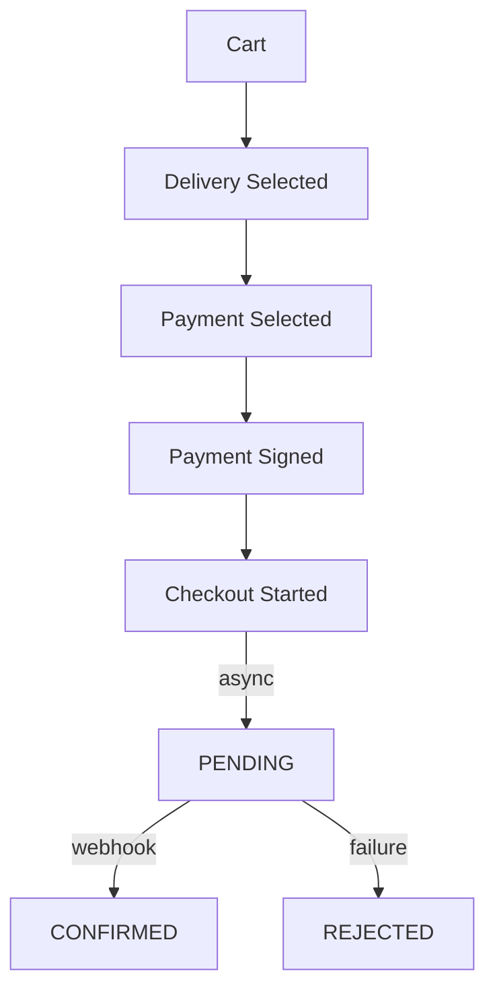

# Checkout Implementation

This guide explains how to implement a **safe, production-ready checkout flow** using Unchained Engine.

Unchained checkout is not a single mutation.  
It is a **state machine** with **locking, payment signing, stock validation and async confirmation**.

---

## Checkout State Machine



## Step 1: User Authentication

Before adding items to a cart, the user must be authenticated (as guest or registered).

### Guest Checkout

```graphql
mutation LoginAsGuest {
  loginAsGuest {
    _id
    tokenExpires
    user {
      _id
      isGuest
    }
  }
}
```

The session token is set as an HTTP-only cookie automatically. For subsequent requests, ensure cookies are sent with your requests.

### Registered User Login

```graphql
mutation Login {
  loginWithPassword(email: "user@example.com", password: "password") {
    _id
    tokenExpires
    user {
      _id
      username
    }
  }
}
```

## Step 2: Add Products to Cart

Add products to the cart. The cart is created automatically on first mutation.

### Add Simple Product

```graphql
mutation AddToCart {
  addCartProduct(productId: "product-123", quantity: 2) {
    _id
    quantity
    product {
      _id
      texts {
        title
      }
    }
    unitPrice {
      amount
      currencyCode
    }
    total {
      amount
      currencyCode
    }
    order {
      _id
      total {
        amount
        currencyCode
      }
    }
  }
}
```

### Add Configurable Product

For products with variations or configurations:

```graphql
mutation AddConfiguredProduct {
  addCartProduct(
    productId: "configurable-product-123"
    quantity: 1
    configuration: [
      { key: "size", value: "L" }
      { key: "color", value: "blue" }
    ]
  ) {
    _id
    configuration {
      key
      value
    }
  }
}
```

### Update Quantity

```graphql
mutation UpdateQuantity {
  updateCartItem(itemId: "cart-item-123", quantity: 3) {
    _id
    quantity
  }
}
```
This recalculates tax, shipping and discounts.
Always refetch the cart after this.

### Remove Item

```graphql
mutation RemoveItem {
  removeCartItem(itemId: "cart-item-123") {
    _id
  }
}
```

## Step 3: Set Delivery & Payment

### Get Available Providers

Fetch both delivery and payment providers in a single query:

```graphql
query GetProviders {
  me {
    cart {
      _id
      supportedDeliveryProviders {
        _id
        type
        interface { _id label }
        simulatedPrice { amount currencyCode }
      }
      supportedPaymentProviders {
        _id
        type
        interface { _id label }
      }
    }
  }
}
```

### Set Both Providers

Set delivery and payment providers in one mutation:

```graphql
mutation SetProviders {
  updateCart(
    deliveryProviderId: "delivery-provider-123"
    paymentProviderId: "payment-provider-123"
  ) {
    _id
    delivery {
      _id
      provider {
        _id
        type
        interface {
          label
        }
      }
      fee {
        amount
        currencyCode
      }
    }
  }
}
```

### Set Delivery Address

```graphql
mutation SetDeliveryAddress {
  updateCartDeliveryShipping(
    deliveryProviderId: "delivery-provider-123"
    address: {
      firstName: "John"
      lastName: "Doe"
      company: "ACME Inc"
      addressLine: "123 Main St"
      addressLine2: "Apt 4"
      postalCode: "12345"
      city: "Zurich"
      countryCode: "CH"
    }
  ) {
    _id
    delivery {
      ... on OrderDeliveryShipping {
        _id
        address {
          firstName
          lastName
          city
          countryCode
        }
      }
    }
  }
}
```

### Set Pickup Location (for PICKUP delivery)

```graphql
mutation SetPickupLocation {
  updateCartDeliveryPickUp(
    deliveryProviderId: "delivery-provider-123"
    orderPickUpLocationId: "pickup-location-123"
  ) {
    _id
    delivery {
      ... on OrderDeliveryPickUp {
        _id
        activePickUpLocation {
          _id
          name
          address {
            addressLine
            city
          }
        }
      }
    }
  }
}
```

### Initialize Payment (Sign)

For client-side payment SDKs (Stripe, PayPal), get the client token before checkout:

```graphql
mutation SignPayment {
  signPaymentProviderForCheckout(
    orderPaymentId: "order-payment-123"
  )
}
```

The returned value is used to initialize the payment SDK on the client.

## Step 4: Review Cart

Get the complete cart with all pricing:

```graphql
query ReviewCart {
  me {
    cart {
      _id
      items {
        _id
        quantity
        product {
          texts {
            title
          }
        }
        total {
          amount
          currencyCode
        }
      }
      delivery {
        ... on OrderDeliveryShipping {
          address {
            firstName
            lastName
            addressLine
            city
            countryCode
          }
        }
        fee {
          amount
          currencyCode
        }
      }
      payment {
        provider {
          interface {
            label
          }
        }
        fee {
          amount
          currencyCode
        }
      }
      discounts {
        total {
          amount
          currencyCode
        }
        code
      }
      total {
        amount
        currencyCode
      }
    }
  }
}
```

### Apply Discount Code

```graphql
mutation ApplyDiscount {
  addCartDiscount(code: "SAVE10") {
    _id
    code
    total {
      amount
      currencyCode
    }
    order {
      _id
      total {
        amount
        currencyCode
      }
    }
  }
}
```

### Remove Discount Code

```graphql
mutation RemoveDiscount {
  removeCartDiscount(discountId: "discount-123") {
    _id
    order {
      _id
      discounts {
        _id
      }
    }
  }
}
```

## Step 5: Checkout

### Standard Checkout

```graphql
mutation Checkout {
  checkoutCart {
    _id
    status
    orderNumber
    ordered
    payment {
      status
    }
    delivery {
      status
    }
    total {
      amount
      currencyCode
    }
  }
}
```

### Checkout with Payment Context

For payment providers that need additional data:

```graphql
mutation CheckoutWithPayment {
  checkoutCart(
    paymentContext: {
      paymentIntentId: "pi_xxx" # From Stripe
    }
  ) {
    _id
    status
    orderNumber
  }
}
```

## Step 6: Post-Checkout

### Check Order Status

```graphql
query OrderStatus {
  order(orderId: "order-123") {
    _id
    status
    orderNumber
    payment {
      status
    }
    delivery {
      status
    }
  }
}
```

### Order Statuses Explained

| Status | Meaning |
|--------|---------|
| `null` | Cart (not checked out) |
| `PENDING` | Checked out, awaiting payment |
| `CONFIRMED` | Payment confirmed, ready for delivery |
| `FULFILLED` | Order delivered and complete |
| `REJECTED` | Order cancelled |

## Complete Example: React Implementation

```tsx
import { useState } from 'react';
import { useMutation, useQuery } from '@apollo/client';

function Checkout() {
  const [step, setStep] = useState('cart');

  // Get cart data
  const { data: cartData, refetch } = useQuery(GET_CART);
  const cart = cartData?.me?.cart;

  // Mutations
  const [addToCart] = useMutation(ADD_TO_CART);
  const [updateCart] = useMutation(UPDATE_CART);
  const [setDeliveryAddress] = useMutation(SET_DELIVERY_ADDRESS);
  const [signPayment] = useMutation(SIGN_PAYMENT);
  const [checkout] = useMutation(CHECKOUT);

  const handleAddProduct = async (productId: string, quantity: number) => {
    await addToCart({ variables: { productId, quantity } });
    refetch();
  };

  const handleSetProviders = async (
    deliveryProviderId: string,
    paymentProviderId: string,
    address: Address
  ) => {
    // Set both providers in one call
    await updateCart({
      variables: { deliveryProviderId, paymentProviderId },
    });
    await setDeliveryAddress({
      variables: { deliveryProviderId, address },
    });
    refetch();
    setStep('review');
  };

  const handleCheckout = async () => {
    try {
      // Get payment client token if needed
      const { data: signData } = await signPayment({
        variables: { orderPaymentId: cart.payment._id },
      });

      // Initialize payment SDK (e.g., Stripe)
      // await stripe.confirmPayment(signData.signPaymentProviderForCheckout)

      // Complete checkout
      const { data: orderData } = await checkout();

      if (orderData.checkoutCart.status === 'CONFIRMED') {
        setStep('confirmation');
      } else if (orderData.checkoutCart.status === 'PENDING') {
        // Payment pending - show waiting message
        setStep('pending');
      }
    } catch (error) {
      console.error('Checkout failed:', error);
    }
  };

  return (
    <div>
      {step === 'cart' && (
        <CartStep cart={cart} onContinue={() => setStep('providers')} />
      )}
      {step === 'providers' && (
        <ProvidersStep
          deliveryProviders={cart?.supportedDeliveryProviders}
          paymentProviders={cart?.supportedPaymentProviders}
          onSelect={handleSetProviders}
        />
      )}
      {step === 'review' && (
        <ReviewStep cart={cart} onCheckout={handleCheckout} />
      )}
      {step === 'confirmation' && (
        <ConfirmationStep orderNumber={cart?.orderNumber} />
      )}
    </div>
  );
}
```

## Error Handling

### Common Checkout Errors

| Error | Cause | Solution |
|-------|-------|----------|
| `NoCartItems` | Empty cart | Ensure items are added |
| `NoDeliveryProvider` | Delivery not set | Set delivery provider |
| `NoPaymentProvider` | Payment not set | Set payment provider |
| `PaymentDeclined` | Payment failed | Show error, retry payment |
| `ProductNotActive` | Product unavailable | Remove item from cart |

### Handling Payment Errors

```graphql
mutation CheckoutWithErrorHandling {
  checkoutCart {
    _id
    status
  }
}
```

If the mutation throws, catch and display the error:

```typescript
try {
  await checkout();
} catch (error) {
  if (error.graphQLErrors) {
    const code = error.graphQLErrors[0]?.extensions?.code;
    switch (code) {
      case 'PAYMENT_DECLINED':
        showError('Payment was declined. Please try another method.');
        break;
      case 'INSUFFICIENT_STOCK':
        showError('Some items are no longer available.');
        refetch(); // Refresh cart
        break;
      default:
        showError('Checkout failed. Please try again.');
    }
  }
}
```

## Webhooks for Async Payments

Many payment providers confirm payments asynchronously via webhooks:

```typescript
// Express webhook handler
app.post('/webhooks/stripe', async (req, res) => {
  const event = stripe.webhooks.constructEvent(
    req.body,
    req.headers['stripe-signature'],
    process.env.STRIPE_WEBHOOK_SECRET
  );

  if (event.type === 'payment_intent.succeeded') {
    const { orderId } = event.data.object.metadata;

    // The order will automatically transition to CONFIRMED
    // via the payment adapter's charge() method
  }

  res.json({ received: true });
});
```

## Related

- [Order Lifecycle](../concepts/order-lifecycle.md) - Understanding order states
- [Payment Plugins](../plugins/payment/stripe.md) - Payment adapters
- [Delivery Plugins](../plugins/) - Delivery adapters
