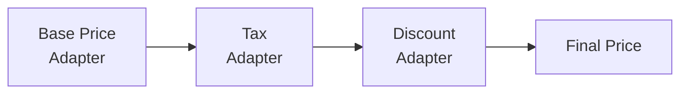

# Custom Pricing

This guide covers implementing custom pricing logic in Unchained Engine using pricing adapters.

## Overview

Unchained uses a pricing pipeline where multiple adapters can contribute to the final price:


### Key Principles

**Determinism:**
All pricing must produce the same result for the same input. Avoid using real-time external data after checkout begins. If you fetch external data, store it in meta for reproducibility.

**Immutability after checkout:**
Once checkoutCart is executed, prices are frozen. Adapters cannot change finalized orders.

**Net vs gross:**
| Flag               | Meaning                     |
| ------------------ | --------------------------- |
| `isNetPrice=true`  | Tax will be added later     |
| `isNetPrice=false` | Amount already includes tax |

**Currency awareness:**
Adapters must respect `currencyCode` in context. Do not assume base currency. Use `modules.currencies.round(amount, currencyCode)` for correct rounding.

## Prerequisites

- Node.js 22+
- Running Unchained Engine instance
- Basic TypeScript knowledge

## Creating a Product Pricing Adapter

### Basic Structure

```typescript
import {
  ProductPricingAdapter,
  ProductPricingDirector,
} from '@unchainedshop/core-pricing';

class CustomPricingAdapter extends ProductPricingAdapter {
  // Unique identifier
  static key = 'shop.example.pricing.custom';

  // Display name in admin
  static label = 'Custom Pricing Adapter';

  // Version for tracking
  static version = '1.0.0';

  // Execution order (lower = earlier)
  static orderIndex = 10;

  // When to activate this adapter
  static isActivatedFor({ product, country, currency }) {
    return true; // Activate for all products
  }

  // Calculate pricing adjustments
  async calculate() {
    // Add pricing items
    this.result.addItem({
      amount: 100, // Amount in cents
      isTaxable: true,
      isNetPrice: true,
      meta: { adapter: this.constructor.key },
    });

    // Always call super.calculate() at the end
    return super.calculate();
  }
}

// Register the adapter
ProductPricingDirector.registerAdapter(CustomPricingAdapter);
```

### Context Available

The adapter has access to context information:

```typescript
async calculate() {
  const {
    product,        // The product being priced
    quantity,       // Quantity requested
    currencyCode,   // Target currency
    countryCode,    // Target country
    user,           // Current user (if logged in)
    discounts,      // Applied discount codes
    modules,        // All Unchained modules
  } = this.context;

  // Your pricing logic here
}
```

## Example: Weather-Based Pricing

A fun example that adjusts sausage prices based on outdoor temperature:

```typescript
import {
  ProductPricingAdapter,
  ProductPricingDirector,
} from '@unchainedshop/core-pricing';

const SAUSAGE_TAG = 'sausage';
const TEMPERATURE_THRESHOLD = 20; // Celsius

class WeatherBasedPricingAdapter extends ProductPricingAdapter {
  static key = 'shop.example.pricing.weather-based';
  static label = 'Weather-Based Sausage Pricing';
  static version = '1.0.0';
  static orderIndex = 5;

  // Only activate for products tagged with "sausage"
  static isActivatedFor({ product }) {
    return product.tags?.includes(SAUSAGE_TAG);
  }

  async calculate() {
    const { quantity, currencyCode } = this.context;

    try {
      // Fetch current weather
      const weather = await this.fetchWeather('Zurich');

      if (weather.temperature > TEMPERATURE_THRESHOLD) {
        // BBQ season! Increase price
        this.result.addItem({
          amount: 100 * quantity, // +1 CHF per item
          isTaxable: true,
          isNetPrice: true,
          meta: {
            adapter: this.constructor.key,
            reason: 'bbq-season-surcharge',
            temperature: weather.temperature,
          },
        });
      }
    } catch (error) {
      console.error('Weather pricing failed:', error);
      // Gracefully continue without adjustment
    }

    return super.calculate();
  }

  private async fetchWeather(city: string): Promise<{ temperature: number }> {
    const response = await fetch(
      `https://api.weatherapi.com/v1/current.json?key=${process.env.WEATHER_API_KEY}&q=${city}`
    );
    const data = await response.json();
    return { temperature: data.current.temp_c };
  }
}

ProductPricingDirector.registerAdapter(WeatherBasedPricingAdapter);
```

## Example: Volume Discounts

Implement quantity-based discounts:

```typescript
import {
  ProductPricingAdapter,
  ProductPricingDirector,
} from '@unchainedshop/core-pricing';

const VOLUME_TIERS = [
  { minQuantity: 100, discount: 0.20 }, // 20% off for 100+
  { minQuantity: 50, discount: 0.15 },  // 15% off for 50+
  { minQuantity: 20, discount: 0.10 },  // 10% off for 20+
  { minQuantity: 10, discount: 0.05 },  // 5% off for 10+
];

class VolumeDiscountAdapter extends ProductPricingAdapter {
  static key = 'shop.example.pricing.volume-discount';
  static label = 'Volume Discount';
  static version = '1.0.0';
  static orderIndex = 20; // Run after base price

  static isActivatedFor({ product }) {
    // Only for products marked for volume discounts
    return product.meta?.allowVolumeDiscount === true;
  }

  async calculate() {
    const { quantity } = this.context;

    // Find applicable tier
    const tier = VOLUME_TIERS.find(t => quantity >= t.minQuantity);

    if (tier) {
      // Get current subtotal
      const subtotal = this.calculation.sum();

      // Apply percentage discount
      const discountAmount = Math.round(subtotal * tier.discount);

      this.result.addItem({
        amount: -discountAmount, // Negative for discount
        isTaxable: true,
        isNetPrice: true,
        meta: {
          adapter: this.constructor.key,
          tier: tier.minQuantity,
          discountPercent: tier.discount * 100,
        },
      });
    }

    return super.calculate();
  }
}

ProductPricingDirector.registerAdapter(VolumeDiscountAdapter);
```

## Example: Customer-Specific Pricing

Different prices for B2B customers:

```typescript
import {
  ProductPricingAdapter,
  ProductPricingDirector,
} from '@unchainedshop/core-pricing';

class B2BPricingAdapter extends ProductPricingAdapter {
  static key = 'shop.example.pricing.b2b';
  static label = 'B2B Customer Pricing';
  static version = '1.0.0';
  static orderIndex = 3; // Run early

  static isActivatedFor({ product, context }) {
    // Only for logged-in B2B customers
    return context.user?.tags?.includes('b2b');
  }

  async calculate() {
    const { product, user, modules } = this.context;

    // Check for customer-specific price
    const customerPrice = await this.getCustomerPrice(product, user);

    if (customerPrice) {
      // Replace base price with customer price
      this.result.resetCalculation();
      this.result.addItem({
        amount: customerPrice.amount,
        isTaxable: customerPrice.isTaxable,
        isNetPrice: true,
        meta: {
          adapter: this.constructor.key,
          priceListId: customerPrice.priceListId,
        },
      });
    }

    return super.calculate();
  }

  private async getCustomerPrice(product, user) {
    // Look up price from customer-specific price list
    const priceList = user.meta?.priceListId;
    if (!priceList) return null;

    // Your price list lookup logic here
    return null;
  }
}

ProductPricingDirector.registerAdapter(B2BPricingAdapter);
```

## Example: Time-Based Pricing

Happy hour or flash sale pricing:

```typescript
import {
  ProductPricingAdapter,
  ProductPricingDirector,
} from '@unchainedshop/core-pricing';

class HappyHourPricingAdapter extends ProductPricingAdapter {
  static key = 'shop.example.pricing.happy-hour';
  static label = 'Happy Hour Pricing';
  static version = '1.0.0';
  static orderIndex = 15;

  static isActivatedFor({ product }) {
    return product.tags?.includes('happy-hour-eligible');
  }

  async calculate() {
    const now = new Date();
    const hour = now.getHours();

    // Happy hour: 16:00 - 18:00
    if (hour >= 16 && hour < 18) {
      const subtotal = this.calculation.sum();
      const discount = Math.round(subtotal * 0.25); // 25% off

      this.result.addItem({
        amount: -discount,
        isTaxable: true,
        isNetPrice: true,
        meta: {
          adapter: this.constructor.key,
          reason: 'happy-hour',
          validUntil: new Date(now.setHours(18, 0, 0, 0)).toISOString(),
        },
      });
    }

    return super.calculate();
  }
}

ProductPricingDirector.registerAdapter(HappyHourPricingAdapter);
```

## Other Pricing Adapter Types

### Order Pricing

Adjust order-level pricing (shipping discounts, order minimums):

```typescript
import {
  OrderPricingAdapter,
  OrderPricingDirector,
} from '@unchainedshop/core-pricing';

class FreeShippingAdapter extends OrderPricingAdapter {
  static key = 'shop.example.pricing.free-shipping';
  static label = 'Free Shipping Over 100';
  static version = '1.0.0';
  static orderIndex = 10;

  static isActivatedFor() {
    return true;
  }

  async calculate() {
    const { order } = this.context;
    const itemsTotal = order.calculation?.items || 0;

    // Free shipping for orders over 100
    if (itemsTotal >= 10000) { // 100.00 in cents
      const shippingCost = this.calculation.sum({ category: 'DELIVERY' });

      if (shippingCost > 0) {
        this.result.addItem({
          amount: -shippingCost,
          category: 'DELIVERY',
          isTaxable: false,
          isNetPrice: true,
          meta: {
            adapter: this.constructor.key,
            reason: 'free-shipping-threshold',
          },
        });
      }
    }

    return super.calculate();
  }
}

OrderPricingDirector.registerAdapter(FreeShippingAdapter);
```

### Delivery Pricing

Custom delivery cost calculations:

```typescript
import {
  DeliveryPricingAdapter,
  DeliveryPricingDirector,
} from '@unchainedshop/core-pricing';

class WeightBasedDeliveryAdapter extends DeliveryPricingAdapter {
  static key = 'shop.example.pricing.weight-delivery';
  static label = 'Weight-Based Delivery';
  static version = '1.0.0';
  static orderIndex = 5;

  static isActivatedFor({ provider }) {
    return provider.type === 'SHIPPING';
  }

  async calculate() {
    const { order, modules } = this.context;

    // Calculate total weight
    let totalWeight = 0;
    for (const item of order.items) {
      const product = await modules.products.findProduct({ productId: item.productId });
      totalWeight += (product.warehousing?.dimensions?.weightInGram || 0) * item.quantity;
    }

    // Price tiers by weight
    let deliveryCost = 500; // Base 5.00
    if (totalWeight > 5000) deliveryCost = 1500; // 15.00 for 5kg+
    else if (totalWeight > 2000) deliveryCost = 1000; // 10.00 for 2kg+
    else if (totalWeight > 1000) deliveryCost = 750; // 7.50 for 1kg+

    this.result.addItem({
      amount: deliveryCost,
      isTaxable: true,
      isNetPrice: true,
      meta: {
        adapter: this.constructor.key,
        totalWeightGrams: totalWeight,
      },
    });

    return super.calculate();
  }
}

DeliveryPricingDirector.registerAdapter(WeightBasedDeliveryAdapter);
```

### Payment Pricing

Payment method surcharges or discounts:

```typescript
import {
  PaymentPricingAdapter,
  PaymentPricingDirector,
} from '@unchainedshop/core-pricing';

class CashDiscountAdapter extends PaymentPricingAdapter {
  static key = 'shop.example.pricing.cash-discount';
  static label = 'Cash Payment Discount';
  static version = '1.0.0';
  static orderIndex = 5;

  static isActivatedFor({ provider }) {
    return provider.adapterKey === 'shop.unchained.payment.invoice';
  }

  async calculate() {
    const { order } = this.context;
    const orderTotal = order.calculation?.total || 0;

    // 2% discount for bank transfer
    const discount = Math.round(orderTotal * 0.02);

    this.result.addItem({
      amount: -discount,
      isTaxable: false,
      isNetPrice: true,
      meta: {
        adapter: this.constructor.key,
        reason: 'cash-discount',
      },
    });

    return super.calculate();
  }
}

PaymentPricingDirector.registerAdapter(CashDiscountAdapter);
```

## Registration

Register your adapter by importing it in your boot file:

```typescript
// boot.ts
import './pricing/weather-based';
import './pricing/volume-discount';
import './pricing/b2b-pricing';
```

## Testing Your Adapter

Use the GraphQL playground to test:

```graphql
query TestPricing {
  product(productId: "your-product-id") {
    ... on SimpleProduct {
      simulatedPrice(quantity: 10) {
        amount
        currencyCode
        isTaxable
        isNetPrice
      }
    }
  }
}
```

## Best Practices

### 1. Order Index Strategy

```typescript
// Suggested order indices:
// 0-5:   Base price, currency conversion
// 5-10:  Customer-specific pricing
// 10-20: Product-level discounts
// 20-30: Tax calculations
// 30+:   Final adjustments
```

### 2. Always Call Super

```typescript
async calculate() {
  // Your logic here

  return super.calculate(); // Don't forget this!
}
```

### 3. Use Meta for Transparency

```typescript
this.result.addItem({
  amount: discountAmount,
  meta: {
    adapter: this.constructor.key,
    reason: 'volume-discount',
    appliedTier: '20+',
    originalAmount: baseAmount,
  },
});
```

### 4. Handle Errors Gracefully

```typescript
async calculate() {
  try {
    const externalData = await fetchExternalPricing();
    // Apply pricing
  } catch (error) {
    console.error('External pricing failed:', error);
    // Continue without failing the entire pricing
  }

  return super.calculate();
}
```

### 5. Cache External Calls

```typescript
const priceCache = new Map();

async calculate() {
  const cacheKey = `${this.context.product._id}-${this.context.currencyCode}`;

  if (!priceCache.has(cacheKey)) {
    const price = await this.fetchExternalPrice();
    priceCache.set(cacheKey, { price, expires: Date.now() + 60000 });
  }

  const cached = priceCache.get(cacheKey);
  if (cached.expires > Date.now()) {
    // Use cached price
  }
}
```

## Related

- [Pricing System](../concepts/pricing-system) - Pricing architecture overview
- [Order Discounts](../extend/pricing/order-discounts) - Discount system
- [Product Pricing](../extend/pricing/product-pricing) - Product pricing details
