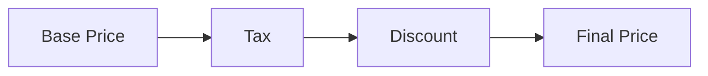

# Custom Pricing

This guide covers implementing custom pricing logic using pricing adapters. For the conceptual model (the chain, categories, and leveled tiers), see [Pricing System](../concepts/pricing-system.md). For the full factory reference, see [Plugin Factories](../extend/plugin-factories.md#pricing).

## Overview

Unchained uses a pricing pipeline where multiple adapters contribute to the final price:


```mermaid
flowchart LR
    BP[Base Price] --> TA[Tax] --> DA[Discount] --> FP[Final Price]
```

### Key principles

- **Determinism** — the same input must produce the same price. If you fetch external data, store it in `meta` for reproducibility.
- **Immutability after checkout** — once `checkoutCart` runs, prices are frozen.
- **Net vs gross** — `isNetPrice: true` means tax is added later; `false` means the amount already includes tax.
- **Currency awareness** — respect `context.currencyCode`; work in the smallest currency unit (cents).

## Creating a product pricing adapter

Use the [`registerProductPricing`](../extend/plugin-factories.md#pricing) factory. Push rows onto the `sheet`; **the factory continues the chain for you** — don't call it yourself.

```typescript
import { registerProductPricing } from '@unchainedshop/core';

registerProductPricing({
  adapterId: 'custom',
  orderIndex: 10,
  isActivatedFor: (context) => true, // all products
  calculate: async (sheet, context) => {
    sheet.addItem({ amount: 100, isTaxable: true, isNetPrice: true, meta: { adapter: 'custom' } });
  },
});
```

`calculate(sheet, context)` receives the running `sheet` and the pricing `context` (`product`, `quantity`, `currencyCode`, `countryCode`, `user`, `modules`, …).

## Example: weather-based pricing

Adjust prices based on outdoor temperature (store the reading in `meta` for determinism):

```typescript
registerProductPricing({
  adapterId: 'weather-based',
  orderIndex: 5,
  isActivatedFor: (context) => context.product?.tags?.includes('sausage'),
  calculate: async (sheet, context) => {
    try {
      const weather = await fetchWeather('Zurich');
      if (weather.temperature > 20) {
        sheet.addItem({
          amount: 100 * (context.quantity ?? 1), // +1.00 per item in BBQ season
          isTaxable: true,
          isNetPrice: true,
          meta: { reason: 'bbq-season-surcharge', temperature: weather.temperature },
        });
      }
    } catch (error) {
      // Gracefully continue without an adjustment
    }
  },
});
```

## Example: volume discounts

```typescript
const VOLUME_TIERS = [
  { minQuantity: 100, discount: 0.2 },
  { minQuantity: 50, discount: 0.15 },
  { minQuantity: 20, discount: 0.1 },
  { minQuantity: 10, discount: 0.05 },
];

registerProductPricing({
  adapterId: 'volume-discount',
  orderIndex: 20, // after base price
  isActivatedFor: (context) => context.product?.meta?.allowVolumeDiscount === true,
  calculate: async (sheet, context) => {
    const tier = VOLUME_TIERS.find((t) => (context.quantity ?? 1) >= t.minQuantity);
    if (tier) {
      const subtotal = sheet.sum();
      sheet.addItem({
        amount: -Math.round(subtotal * tier.discount), // negative = discount
        isTaxable: true,
        isNetPrice: true,
        category: 'DISCOUNT',
        meta: { tier: tier.minQuantity, discountPercent: tier.discount * 100 },
      });
    }
  },
});
```

:::tip Simple quantity tiers don't need an adapter
For plain "cheaper at 10+" unit prices, set [leveled catalog prices](../concepts/pricing-system.md#leveled-quantity-tier-catalog-pricing) (`minQuantity` tiers) on the product instead of writing an adapter.
:::

## Example: customer-specific (B2B) pricing

```typescript
registerProductPricing({
  adapterId: 'b2b',
  orderIndex: 5,
  isActivatedFor: (context) => context.user?.tags?.includes('b2b'),
  calculate: async (sheet, context) => {
    const customerPrice = await getCustomerPrice(context.product, context.user);
    if (customerPrice) {
      // Adjust toward the negotiated price (delta vs the current subtotal)
      sheet.addItem({
        amount: customerPrice.amount - sheet.sum(),
        isTaxable: true,
        isNetPrice: true,
        meta: { priceListId: customerPrice.priceListId },
      });
    }
  },
});
```

> To **replace** rather than adjust the base price (reset the sheet), build a low-level adapter — see [Plugin System](../concepts/director-adapter-pattern.md#adapter-contracts).

## Order, delivery & payment pricing

The same pattern applies with the matching factory and sheet method:

```typescript
import {
  OrderPricingSheet,
  registerDeliveryPricing,
  registerPaymentPricing,
} from '@unchainedshop/core';

// Free shipping over 100.00
registerDeliveryPricing({
  adapterId: 'free-shipping',
  orderIndex: 10,
  calculate: async (sheet) => {
    const delivery = sheet.sum({ category: 'DELIVERY' });
    if (sheet.sum({ category: 'ITEMS' }) >= 10000 && delivery > 0) {
      sheet.addDiscount({ amount: -delivery, isTaxable: false, isNetPrice: true, discountId: 'free-shipping' });
    }
  },
});

// 2% discount for invoice payment
registerPaymentPricing({
  adapterId: 'cash-discount',
  isActivatedFor: (context) => context.provider?.adapterKey === 'shop.unchained.payment.invoice',
  calculate: async (sheet, context) => {
    const orderPricing = OrderPricingSheet({
      calculation: context.order?.calculation,
      currencyCode: context.order?.currencyCode,
    });
    sheet.addFee({
      amount: -Math.round(orderPricing.total().amount * 0.02),
      isTaxable: false,
      isNetPrice: true,
    });
  },
});
```

See [Order Pricing / Delivery Pricing / Payment Pricing](../extend/pricing/product-pricing.md) for details.

## Registration

Factories register the plugin when called — just import the module that calls them in your boot file, before `startPlatform()`:

```typescript
// boot.ts
import './pricing/weather-based';
import './pricing/volume-discount';
```

## Testing

```graphql
query TestPricing {
  product(productId: "your-product-id") {
    ... on SimpleProduct {
      simulatedPrice(quantity: 10) { amount currencyCode isTaxable isNetPrice }
    }
  }
}
```

## Best practices

1. **Order index** — base price (0–9) → customer/volume pricing (10–19) → tax (20–29) → adjustments (30+).
2. **Meta for transparency** — record the reason/rate/source in `meta` for debugging and reporting.
3. **Fail gracefully** — wrap external calls in `try/catch`; never let a pricing adapter throw and break checkout. (For missing configuration, surface it rather than throwing.)
4. **Cache external lookups** — memoize slow rate/price-list lookups per `(product, currencyCode)`.

## Related

- [Pricing System](../concepts/pricing-system.md) — architecture and leveled tiers
- [Plugin Factories](../extend/plugin-factories.md#pricing) — all four pricing factories
- [Order Discounts](../extend/pricing/order-discounts.md) · [Product Pricing](../extend/pricing/product-pricing.md)
