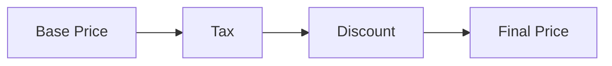

# Custom Pricing

This guide covers implementing custom pricing logic using pricing adapters. For the conceptual model (the chain, categories, and leveled tiers), see [Pricing System](../concepts/pricing-system.md). For the full factory reference, see [Plugin Factories](../extend/plugin-factories.md#pricing).

## Overview

Unchained uses a pricing pipeline where multiple adapters contribute to the final price:


```mermaid
flowchart LR
    BP[Base Price] --> TA[Tax] --> DA[Discount] --> FP[Final Price]
```

### Key principles

- **Determinism** — the same input must produce the same price. If you fetch external data, store it in `meta` for reproducibility.
- **Immutability after checkout** — once `checkoutCart` runs, prices are frozen.
- **Net vs gross** — `isNetPrice: true` means tax is added later; `false` means the amount already includes tax.
- **Currency awareness** — respect `context.currencyCode`; work in the smallest currency unit (cents).

## Creating a product pricing adapter

Use the [`registerProductPricing`](../extend/plugin-factories.md#pricing) factory. Push rows onto the `sheet`; **the factory continues the chain for you** — don't call it yourself.

```typescript
import { registerProductPricing } from '@unchainedshop/core';

registerProductPricing({
  adapterId: 'custom',
  orderIndex: 10,
  isActivatedFor: (context) => true, // all products
  calculate: async (sheet, context) => {
    sheet.addItem({ amount: 100, isTaxable: true, isNetPrice: true, meta: { adapter: 'custom' } });
  },
});
```

`calculate(sheet, context)` receives a fresh result sheet for this adapter — it contains only the rows *you* add — and the pricing `context` (`product`, `quantity`, `currencyCode`, `countryCode`, `user`, `modules`, …). To read rows produced by earlier adapters, build the adapter object directly and use the running `params.calculationSheet` — see [reading rows of earlier adapters](../extend/pricing/product-pricing.md#reading-rows-of-earlier-adapters-taxes-discounts).

## Example: weather-based pricing

Adjust prices based on outdoor temperature (store the reading in `meta` for determinism):

```typescript
registerProductPricing({
  adapterId: 'weather-based',
  orderIndex: 5,
  isActivatedFor: (context) => context.product?.tags?.includes('sausage'),
  calculate: async (sheet, context) => {
    try {
      const weather = await fetchWeather('Zurich');
      if (weather.temperature > 20) {
        sheet.addItem({
          amount: 100 * (context.quantity ?? 1), // +1.00 per item in BBQ season
          isTaxable: true,
          isNetPrice: true,
          meta: { reason: 'bbq-season-surcharge', temperature: weather.temperature },
        });
      }
    } catch (error) {
      // Gracefully continue without an adjustment
    }
  },
});
```

## Example: volume discounts

A percentage off the base price needs the rows of earlier adapters, which the factory's `sheet` never contains — build the adapter object directly and read the running `params.calculationSheet`:

```typescript
import {
  ProductPricingAdapter,
  pluginRegistry,
  type IProductPricingAdapter,
} from '@unchainedshop/core';

const VOLUME_TIERS = [
  { minQuantity: 100, discount: 0.2 },
  { minQuantity: 50, discount: 0.15 },
  { minQuantity: 20, discount: 0.1 },
  { minQuantity: 10, discount: 0.05 },
];

const VolumeDiscount: IProductPricingAdapter = {
  ...ProductPricingAdapter,

  key: 'com.example.pricing.volume-discount',
  label: 'Volume Discount',
  version: '1.0.0',
  orderIndex: 20, // informational — run order follows registration order

  isActivatedFor: (context) => context.product?.meta?.allowVolumeDiscount === true,

  actions: (params) => {
    const pricingAdapter = ProductPricingAdapter.actions(params);
    return {
      ...pricingAdapter,
      calculate: async () => {
        const tier = VOLUME_TIERS.find((t) => (params.context.quantity ?? 1) >= t.minQuantity);
        if (tier) {
          // rows added by earlier adapters (e.g. the base price)
          const subtotal = params.calculationSheet.sum({ category: 'ITEM' });
          pricingAdapter.resultSheet().addItem({
            amount: -Math.round(subtotal * tier.discount), // negative = discount
            isTaxable: true,
            isNetPrice: true,
            meta: { tier: tier.minQuantity, discountPercent: tier.discount * 100 },
          });
        }
        return pricingAdapter.calculate();
      },
    };
  },
};

pluginRegistry.register({
  key: VolumeDiscount.key,
  label: VolumeDiscount.label,
  version: VolumeDiscount.version,
  adapters: [VolumeDiscount],
});
```

:::tip Simple quantity tiers don't need an adapter
For plain "cheaper at 10+" unit prices, set [leveled catalog prices](../concepts/pricing-system.md#leveled-quantity-tier-catalog-pricing) (`minQuantity` tiers) on the product instead of writing an adapter.
:::

## Example: customer-specific (B2B) pricing

Computing the delta against the running subtotal again needs `params.calculationSheet`, so this is a direct adapter too:

```typescript
const B2BPricing: IProductPricingAdapter = {
  ...ProductPricingAdapter,

  key: 'com.example.pricing.b2b',
  label: 'B2B Price Lists',
  version: '1.0.0',
  orderIndex: 10,

  isActivatedFor: (context) => Boolean(context.user?.tags?.includes('b2b')),

  actions: (params) => {
    const pricingAdapter = ProductPricingAdapter.actions(params);
    return {
      ...pricingAdapter,
      calculate: async () => {
        const customerPrice = await getCustomerPrice(params.context.product, params.context.user);
        if (customerPrice) {
          // Adjust toward the negotiated price (delta vs the current subtotal)
          pricingAdapter.resultSheet().addItem({
            amount: customerPrice.amount - params.calculationSheet.sum(),
            isTaxable: true,
            isNetPrice: true,
            meta: { priceListId: customerPrice.priceListId },
          });
        }
        return pricingAdapter.calculate();
      },
    };
  },
};

pluginRegistry.register({
  key: B2BPricing.key,
  label: B2BPricing.label,
  version: B2BPricing.version,
  adapters: [B2BPricing],
});
```

> To **replace** rather than adjust the base price, first invert the earlier rows with `pricingAdapter.resultSheet().resetCalculation(params.calculationSheet)` before adding your own — see [Plugin System](../concepts/director-adapter-pattern.md#adapter-contracts).

## Order, delivery & payment pricing

The same pattern applies with the matching factory and sheet method:

```typescript
import {
  OrderPricingSheet,
  registerDeliveryPricing,
  registerPaymentPricing,
} from '@unchainedshop/core';

// Free shipping over 100.00 — the delivery sheet starts empty too, so this
// adapter is the fee source itself and reads the item total from the order's
// last calculation (see Delivery Pricing for details)
registerDeliveryPricing({
  adapterId: 'free-shipping',
  orderIndex: 10,
  calculate: async (sheet, context) => {
    const itemsTotal = OrderPricingSheet({
      calculation: context.order?.calculation ?? [],
      currencyCode: context.currencyCode,
    }).total({ category: 'ITEMS' }).amount;
    if (itemsTotal < 10000) {
      sheet.addFee({ amount: 800, isTaxable: true, isNetPrice: true, meta: { threshold: 10000 } });
    }
  },
});

// 2% discount for invoice payment
registerPaymentPricing({
  adapterId: 'cash-discount',
  isActivatedFor: (context) => context.provider?.adapterKey === 'shop.unchained.invoice',
  calculate: async (sheet, context) => {
    const orderPricing = OrderPricingSheet({
      calculation: context.order?.calculation,
      currencyCode: context.order?.currencyCode,
    });
    sheet.addFee({
      amount: -Math.round(orderPricing.total().amount * 0.02),
      isTaxable: false,
      isNetPrice: true,
    });
  },
});
```

See [Delivery Pricing](../extend/pricing/delivery-pricing.md) and [Payment Pricing](../extend/pricing/payment-pricing.md) for details.

## Registration

Calling a `register*Pricing()` factory (or `pluginRegistry.register()`) registers the adapter immediately. Make sure the calls run before `startPlatform({})`.

Adapters run in plugin **registration order** (`orderIndex` is currently informational). Adapters that read the running calculation sheet must therefore register *after* the preset plugins, so the base-price rows exist — use dynamic imports (static imports are hoisted above the `registerAllPlugins()` call):

```typescript
// boot.ts
import { startPlatform } from '@unchainedshop/platform';
import { registerAllPlugins } from '@unchainedshop/plugins/presets/all';

registerAllPlugins();
await import('./pricing/weather-based.ts'); // calls registerProductPricing(...)
await import('./pricing/volume-discount.ts'); // calls pluginRegistry.register(...)

const platform = await startPlatform({});
```

## Testing

```graphql
query TestPricing {
  product(productId: "your-product-id") {
    ... on SimpleProduct {
      simulatedPrice(quantity: 10) { amount currencyCode isTaxable isNetPrice }
    }
  }
}
```

## Best practices

1. **Registration order** — adapters run in the order their plugins were registered: base price first, then customer/volume pricing, then taxes and adjustments.
2. **Meta for transparency** — record the reason/rate/source in `meta` for debugging and reporting.
3. **Fail gracefully** — wrap external calls in `try/catch`; never let a pricing adapter throw and break checkout. (For missing configuration, surface it rather than throwing.)
4. **Cache external lookups** — memoize slow rate/price-list lookups per `(product, currencyCode)`.

## Related

- [Pricing System](../concepts/pricing-system.md) — architecture and leveled tiers
- [Plugin Factories](../extend/plugin-factories.md#pricing) — all four pricing factories
- [Order Discounts](../extend/pricing/order-discounts.md) · [Product Pricing](../extend/pricing/product-pricing.md)
