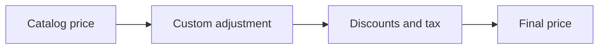

# Custom Pricing

Unchained runs registered pricing adapters in ascending `orderIndex` order. Each adapter reads the previous calculation sheet and returns its own rows. Adapters are objects composed from the base adapters exported by `@unchainedshop/core`.


```mermaid
flowchart LR
    BP[Catalog price] --> CP[Custom adjustment] --> DP[Discounts and tax] --> FP[Final price]
```

## Creating a Product Pricing Adapter

The following adapter applies a quantity-based reduction before the built-in discount and tax adapters. It assumes its preceding item prices are net prices; preserve the appropriate tax treatment when adapting it for a gross-price catalog.

```typescript
import {
  ProductPricingAdapter,
  ProductPricingDirector,
  ProductPricingRowCategory,
  type IProductPricingAdapter,
} from '@unchainedshop/core';

const VOLUME_TIERS = [
  { minQuantity: 100, discount: 0.20 },
  { minQuantity: 50, discount: 0.15 },
  { minQuantity: 20, discount: 0.10 },
  { minQuantity: 10, discount: 0.05 },
];

export const VolumePricing: IProductPricingAdapter = {
  ...ProductPricingAdapter,
  key: 'shop.example.pricing.volume',
  label: 'Volume pricing',
  version: '1.0.0',
  orderIndex: 20,

  isActivatedFor: ({ product }) => product.meta?.allowVolumeDiscount === true,

  actions(params) {
    const pricingAdapter = ProductPricingAdapter.actions(params);
    return {
      ...pricingAdapter,
      async calculate() {
        const tier = VOLUME_TIERS.find(({ minQuantity }) => params.context.quantity >= minQuantity);
        if (tier) {
          const subtotal = params.calculationSheet.sum({
            category: ProductPricingRowCategory.Item,
            isNetPrice: true,
            isTaxable: true,
          });
          pricingAdapter.resultSheet().addItem({
            amount: -Math.round(subtotal * tier.discount),
            isTaxable: true,
            isNetPrice: true,
            meta: { adapter: VolumePricing.key, minQuantity: tier.minQuantity },
          });
        }
        return pricingAdapter.calculate();
      },
    };
  },
};

ProductPricingDirector.registerAdapter(VolumePricing);
```

This example adjusts the item price. Use the [discount system](../extend/pricing/order-discounts.md) when you need named discounts or coupon codes with their own discount records.

## Context and Calculation Sheets

`actions(params)` receives:

- `params.context`: Product, quantity, `countryCode`, `currencyCode`, optional user and order, plus module and service APIs.
- `params.calculationSheet`: Rows contributed by preceding adapters, with methods such as `sum`, `total`, and `filterBy`.
- `params.discounts`: Resolved discount configurations for this adapter.

Create the base actions with `ProductPricingAdapter.actions(params)`. Add new rows to `pricingAdapter.resultSheet()` and return `pricingAdapter.calculate()`. To replace earlier rows, call `resultSheet().resetCalculation(params.calculationSheet)`; this contributes inverse rows rather than mutating another adapter's sheet.

## Other Pricing Rules

### Customer-Specific Pricing

Select customers using `isActivatedFor: ({ user }) => Boolean(user?.tags?.includes('b2b'))`. Resolve the customer's price list through your own service, offset the previous sheet, and add the replacement price multiplied by `params.context.quantity`. Include currency and customer identity in any external-price cache key.

### Time or Weather Adjustments

Select eligible product tags in `isActivatedFor`. Fetch or read cached external data inside `calculate`, then add an item adjustment through `resultSheet().addItem`. Define the time zone for time-based rules and the behavior when external data is unavailable. Refresh expired cache entries instead of retaining them indefinitely.

### Delivery and Payment Fees

Use [Delivery Pricing](../extend/pricing/delivery-pricing.md) for weight, zone, and free-shipping rules and [Payment Pricing](../extend/pricing/payment-pricing.md) for payment method fees. These adapters use `resultSheet().addFee()` instead of the product adapter's `addItem()`.

### Currency Conversion and Rounding

The built-in [rate conversion](../plugins/pricing/pricing-product-rate-conversion.md) and [rounding](../plugins/pricing/pricing-product-round.md) adapters provide examples that preserve calculation row metadata and tax treatment.

## Registration

Import your adapter module before starting the platform so its registration runs:

```typescript
// boot.ts; use the extension matching your application's build setup.
import './pricing/volume.js';
```

## Testing Your Adapter

Use the GraphQL explorer to compare quantities:

```graphql
query TestPricing {
  product(productId: "your-product-id") {
    ... on SimpleProduct {
      simulatedPrice(quantity: 10) {
        amount
        currencyCode
        isTaxable
        isNetPrice
      }
    }
  }
}
```

Test the calculation with the presets used by your application. Check quantities around each threshold, multiple currencies, tax-inclusive and tax-exclusive prices, and checkout recalculation.

## Ordering and Metadata

Choose `orderIndex` relative to the adapters you load. The catalog price runs at `0`, the built-in product discount adapter at `30`, and the country tax adapters at `80`; inspect custom adapters before choosing an index. Store the adapter key and adjustment reason in each row's `meta` so calculations can be inspected.

## Related

- [Pricing System](../concepts/pricing-system.md)
- [Order Discounts](../extend/pricing/order-discounts.md)
- [Product Pricing](../extend/pricing/product-pricing.md)
