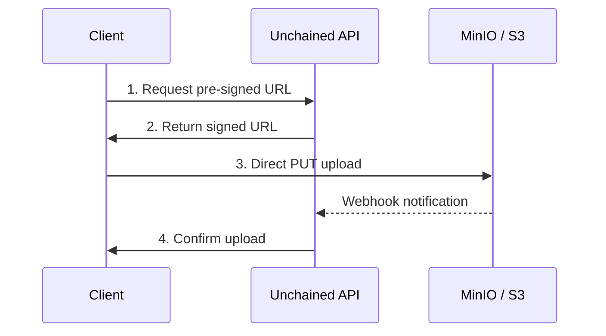

# File Uploads

This guide covers configuring and using file uploads in Unchained Engine with MinIO or any S3-compatible storage.

## Overview

Unchained Engine uses pre-signed URLs for secure, efficient file uploads directly to storage:



## MinIO Setup

### Installation

Download and install MinIO for your platform from the [official website](https://min.io/download), or use Docker:

```bash
docker run -p 9000:9000 -p 9001:9001 \
  -e "MINIO_ROOT_USER=minioadmin" \
  -e "MINIO_ROOT_PASSWORD=minioadmin" \
  minio/minio server /data --console-address ":9001"
```

### Configuration

Set the following environment variables:

```bash
# MinIO Server
MINIO_ENDPOINT=http://localhost:9000

# Credentials
MINIO_ACCESS_KEY=minioadmin
MINIO_SECRET_KEY=minioadmin

# Storage
MINIO_BUCKET_NAME=unchained-files

# Webhook (for automatic confirmation)
MINIO_WEBHOOK_AUTH_TOKEN=your-secure-jwt-token
```

### Bucket Setup

Create a bucket and set public read access:

```bash
# Using MinIO Client (mc)
mc alias set local http://localhost:9000 minioadmin minioadmin
mc mb local/unchained-files
mc anonymous set download local/unchained-files
```

## Upload Flow

The recommended approach uses pre-signed URLs for secure, direct-to-storage uploads:

### Step 1: Get Pre-signed URL

Request a pre-signed upload URL from the API:

```graphql
mutation PrepareUpload($mediaName: String!, $productId: ID!) {
  prepareProductMediaUpload(mediaName: $mediaName, productId: $productId) {
    _id
    putURL
    expires
  }
}
```

Response:

```json
{
  "data": {
    "prepareProductMediaUpload": {
      "_id": "media-ticket-123",
      "putURL": "https://minio.example.com/bucket/file.jpg?X-Amz-Signature=...",
      "expires": "2024-01-01T01:00:00Z"
    }
  }
}
```

### Step 2: Upload Directly to Storage

Upload the file directly to the pre-signed URL:

```typescript
async function uploadFile(file: File, putURL: string) {
  const response = await fetch(putURL, {
    method: 'PUT',
    body: file,
    headers: {
      'Content-Type': file.type,
    },
  });

  if (!response.ok) {
    throw new Error('Upload failed');
  }
}
```

### Step 3: Confirm Upload

**Option A: Manual Confirmation**

```graphql
mutation ConfirmUpload($mediaUploadTicketId: ID!, $size: Int!, $type: String!) {
  confirmMediaUpload(
    mediaUploadTicketId: $mediaUploadTicketId
    size: $size
    type: $type
  ) {
    _id
    name
    type
    size
    url
  }
}
```

**Option B: Webhook Confirmation (Recommended)**

Configure MinIO to automatically confirm uploads via webhook.

## Webhook Setup

### Enable Webhook Handler

Import the webhook handler in your boot file:

```typescript
// For Express
import { minioHandler } from '@unchainedshop/plugins/files/minio/minio-webhook-express';

// For Fastify
import { minioHandler } from '@unchainedshop/plugins/files/minio/minio-webhook-fastify';
```

### Configure MinIO Webhook

1. Create a webhook endpoint in MinIO console or via mc:

```bash
# Set webhook endpoint
mc admin config set local notify_webhook:unchained \
  endpoint="https://your-engine.com/minio" \
  auth_token="your-secure-jwt-token"

# Restart MinIO to apply
mc admin service restart local

# Configure bucket notification
mc event add local/unchained-files arn:minio:sqs::unchained:webhook \
  --event "put"
```

2. Ensure `MINIO_WEBHOOK_AUTH_TOKEN` matches the `auth_token` in the webhook configuration.

### Webhook Flow

```
1. Client requests pre-signed URL from API
2. Client uploads directly to MinIO using PUT
3. MinIO sends webhook notification to /minio endpoint
4. Unchained confirms the upload automatically
```

## Frontend Implementation

### React Upload Component

```tsx
import { useState } from 'react';
import { useMutation, gql } from '@apollo/client';

const PREPARE_UPLOAD = gql`
  mutation PrepareUpload($mediaName: String!, $productId: ID!) {
    prepareProductMediaUpload(mediaName: $mediaName, productId: $productId) {
      _id
      putURL
      expires
    }
  }
`;

const CONFIRM_UPLOAD = gql`
  mutation ConfirmUpload($mediaUploadTicketId: ID!, $size: Int!, $type: String!) {
    confirmMediaUpload(
      mediaUploadTicketId: $mediaUploadTicketId
      size: $size
      type: $type
    ) {
      _id
      url
    }
  }
`;

function ProductMediaUpload({ productId }: { productId: string }) {
  const [uploading, setUploading] = useState(false);
  const [progress, setProgress] = useState(0);

  const [prepareUpload] = useMutation(PREPARE_UPLOAD);
  const [confirmUpload] = useMutation(CONFIRM_UPLOAD);

  const handleFileSelect = async (event: React.ChangeEvent<HTMLInputElement>) => {
    const file = event.target.files?.[0];
    if (!file) return;

    setUploading(true);
    setProgress(0);

    try {
      // Step 1: Get pre-signed URL
      const { data } = await prepareUpload({
        variables: {
          mediaName: file.name,
          productId,
        },
      });

      const { _id: ticketId, putURL } = data.prepareProductMediaUpload;

      // Step 2: Upload to MinIO
      await uploadWithProgress(file, putURL, setProgress);

      // Step 3: Confirm upload (skip if using webhook)
      await confirmUpload({
        variables: {
          mediaUploadTicketId: ticketId,
          size: file.size,
          type: file.type,
        },
      });

      alert('Upload complete!');
    } catch (error) {
      console.error('Upload failed:', error);
      alert('Upload failed');
    } finally {
      setUploading(false);
    }
  };

  return (
    <div>
      <input
        type="file"
        accept="image/*"
        onChange={handleFileSelect}
        disabled={uploading}
      />
      {uploading && (
        <div>
          <progress value={progress} max={100} />
          <span>{progress}%</span>
        </div>
      )}
    </div>
  );
}

async function uploadWithProgress(
  file: File,
  url: string,
  onProgress: (percent: number) => void
): Promise<void> {
  return new Promise((resolve, reject) => {
    const xhr = new XMLHttpRequest();

    xhr.upload.addEventListener('progress', (event) => {
      if (event.lengthComputable) {
        const percent = Math.round((event.loaded / event.total) * 100);
        onProgress(percent);
      }
    });

    xhr.addEventListener('load', () => {
      if (xhr.status >= 200 && xhr.status < 300) {
        resolve();
      } else {
        reject(new Error(`Upload failed: ${xhr.status}`));
      }
    });

    xhr.addEventListener('error', () => reject(new Error('Upload failed')));

    xhr.open('PUT', url);
    xhr.setRequestHeader('Content-Type', file.type);
    xhr.send(file);
  });
}
```

### Drag and Drop Upload

```tsx
function DragDropUpload({ onUpload }: { onUpload: (files: File[]) => void }) {
  const [isDragging, setIsDragging] = useState(false);

  const handleDrag = (e: React.DragEvent) => {
    e.preventDefault();
    e.stopPropagation();
  };

  const handleDragIn = (e: React.DragEvent) => {
    e.preventDefault();
    e.stopPropagation();
    setIsDragging(true);
  };

  const handleDragOut = (e: React.DragEvent) => {
    e.preventDefault();
    e.stopPropagation();
    setIsDragging(false);
  };

  const handleDrop = (e: React.DragEvent) => {
    e.preventDefault();
    e.stopPropagation();
    setIsDragging(false);

    const files = Array.from(e.dataTransfer.files);
    onUpload(files);
  };

  return (
    <div
      onDragEnter={handleDragIn}
      onDragLeave={handleDragOut}
      onDragOver={handleDrag}
      onDrop={handleDrop}
      style={{
        border: `2px dashed ${isDragging ? '#0070f3' : '#ccc'}`,
        padding: '2rem',
        textAlign: 'center',
        backgroundColor: isDragging ? '#f0f7ff' : 'transparent',
      }}
    >
      {isDragging ? 'Drop files here' : 'Drag files here or click to upload'}
    </div>
  );
}
```

## Available Mutations

### Product Media

```graphql
mutation PrepareProductMediaUpload($mediaName: String!, $productId: ID!) {
  prepareProductMediaUpload(mediaName: $mediaName, productId: $productId) {
    _id
    putURL
    expires
  }
}
```

```graphql
mutation ReorderProductMedia($sortKeys: [ReorderProductMediaInput!]!) {
  reorderProductMedia(sortKeys: $sortKeys) {
    _id
  }
}
```

```graphql
mutation RemoveProductMedia($productMediaId: ID!) {
  removeProductMedia(productMediaId: $productMediaId) {
    _id
  }
}
```

### Assortment Media

```graphql
mutation PrepareAssortmentMediaUpload($mediaName: String!, $assortmentId: ID!) {
  prepareAssortmentMediaUpload(mediaName: $mediaName, assortmentId: $assortmentId) {
    _id
    putURL
    expires
  }
}
```

### User Avatar

```graphql
mutation PrepareUserAvatarUpload($mediaName: String!) {
  prepareUserAvatarUpload(mediaName: $mediaName) {
    _id
    putURL
    expires
  }
}
```

### Confirm Upload

```graphql
mutation ConfirmMediaUpload($mediaUploadTicketId: ID!, $size: Int!, $type: String!) {
  confirmMediaUpload(mediaUploadTicketId: $mediaUploadTicketId, size: $size, type: $type) {
    _id
    name
    type
    size
    url
  }
}
```

## S3-Compatible Services

Unchained works with any S3-compatible storage:

### AWS S3

```bash
MINIO_ENDPOINT=https://s3.amazonaws.com
MINIO_ACCESS_KEY=your-aws-access-key
MINIO_SECRET_KEY=your-aws-secret-key
MINIO_BUCKET_NAME=your-bucket
```

### DigitalOcean Spaces

```bash
MINIO_ENDPOINT=https://nyc3.digitaloceanspaces.com
MINIO_ACCESS_KEY=your-spaces-key
MINIO_SECRET_KEY=your-spaces-secret
MINIO_BUCKET_NAME=your-space-name
```

### Cloudflare R2

```bash
MINIO_ENDPOINT=https://account-id.r2.cloudflarestorage.com
MINIO_ACCESS_KEY=your-r2-access-key
MINIO_SECRET_KEY=your-r2-secret-key
MINIO_BUCKET_NAME=your-bucket
```

## Best Practices

### 1. Validate File Types

```typescript
const ALLOWED_TYPES = ['image/jpeg', 'image/png', 'image/webp', 'application/pdf'];

function validateFile(file: File): boolean {
  return ALLOWED_TYPES.includes(file.type);
}
```

### 2. Compress Images Before Upload

```typescript
import imageCompression from 'browser-image-compression';

async function compressImage(file: File): Promise<File> {
  const options = {
    maxSizeMB: 1,
    maxWidthOrHeight: 1920,
    useWebWorker: true,
  };

  return imageCompression(file, options);
}
```

### 3. Handle Upload Failures

```typescript
async function uploadWithRetry(
  file: File,
  url: string,
  maxRetries = 3
): Promise<void> {
  for (let attempt = 1; attempt <= maxRetries; attempt++) {
    try {
      await uploadFile(file, url);
      return;
    } catch (error) {
      if (attempt === maxRetries) throw error;
      await new Promise(resolve => setTimeout(resolve, 1000 * attempt));
    }
  }
}
```

## Related

- [Files Module](../platform-configuration/modules/files.md) - File module configuration
