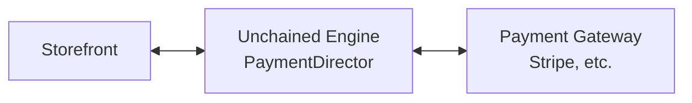
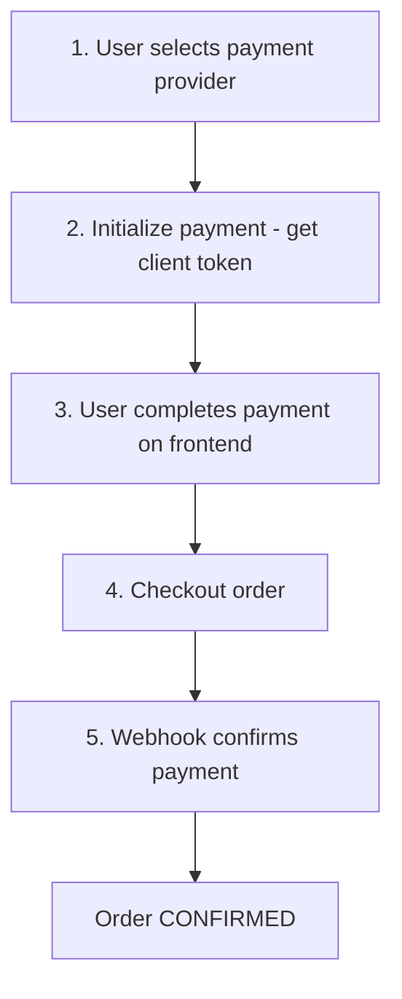

# Payment Integration

This guide covers setting up payment processing in Unchained Engine, from configuring built-in providers to creating custom integrations.

## Overview

Unchained Engine supports multiple payment providers through the plugin system:



## Built-in Payment Providers

| Provider | Type | Use Case |
|----------|------|----------|
| [Stripe](../plugins/payment/stripe.md) | CARD | Credit/debit cards |
| [Braintree](../plugins/payment/braintree.md) | CARD | Cards, PayPal |
| [Datatrans](../plugins/payment/datatrans.md) | CARD | Swiss payment gateway |
| [Saferpay](../plugins/payment/saferpay.md) | CARD | Swiss payment gateway |
| [Cryptopay](../plugins/payment/cryptopay.md) | GENERIC | Cryptocurrency |
| [Invoice](../plugins/payment/invoice.md) | INVOICE | Manual invoicing |

## Quick Start: Stripe

### 1. Install and Configure

```bash
npm install stripe
```

```typescript
// boot.ts
import '@unchainedshop/plugins/payment/stripe';
```

```bash
# .env
STRIPE_SECRET_KEY=sk_test_xxx
STRIPE_WEBHOOK_SECRET=whsec_xxx
```

### 2. Create Payment Provider

Create a payment provider in the Admin UI or via GraphQL:

```graphql
mutation CreateStripeProvider {
  createPaymentProvider(paymentProvider: {
    type: GENERIC
    adapterKey: "shop.unchained.payment.stripe"
  }) {
    _id
    type
    interface {
      _id
      label
    }
  }
}
```

### 3. Frontend Integration

```tsx
import { loadStripe } from '@stripe/stripe-js';
import { Elements, PaymentElement, useStripe, useElements } from '@stripe/react-stripe-js';

const stripePromise = loadStripe('pk_test_xxx');

function CheckoutForm() {
  const stripe = useStripe();
  const elements = useElements();
  const [signPayment] = useMutation(SIGN_PAYMENT);
  const [checkout] = useMutation(CHECKOUT);

  const handleSubmit = async (e) => {
    e.preventDefault();

    // Get client secret from Unchained
    const { data } = await signPayment({
      variables: { orderPaymentId: cart.payment._id },
    });

    // Confirm payment with Stripe
    const { error, paymentIntent } = await stripe.confirmPayment({
      elements,
      confirmParams: {
        return_url: `${window.location.origin}/checkout/complete`,
      },
      redirect: 'if_required',
    });

    if (error) {
      setError(error.message);
    } else if (paymentIntent.status === 'succeeded') {
      // Complete checkout
      await checkout({
        variables: {
          paymentContext: { paymentIntentId: paymentIntent.id },
        },
      });
    }
  };

  return (
    <form onSubmit={handleSubmit}>
      <PaymentElement />
      <button type="submit" disabled={!stripe}>Pay</button>
    </form>
  );
}

function PaymentPage() {
  const { data } = useQuery(GET_CART);
  const clientSecret = data?.me?.cart?.payment?.clientSecret;

  if (!clientSecret) return <div>Loading...</div>;

  return (
    <Elements stripe={stripePromise} options={{ clientSecret }}>
      <CheckoutForm />
    </Elements>
  );
}
```

### 4. Webhook Handler

```typescript
// api/webhooks/stripe.ts
import Stripe from 'stripe';
import { buffer } from 'micro';

const stripe = new Stripe(process.env.STRIPE_SECRET_KEY);

export const config = { api: { bodyParser: false } };

export default async function handler(req, res) {
  const sig = req.headers['stripe-signature'];
  const buf = await buffer(req);

  let event;
  try {
    event = stripe.webhooks.constructEvent(
      buf,
      sig,
      process.env.STRIPE_WEBHOOK_SECRET
    );
  } catch (err) {
    return res.status(400).send(`Webhook Error: ${err.message}`);
  }

  switch (event.type) {
    case 'payment_intent.succeeded':
      // Payment successful - order will auto-confirm
      console.log('Payment succeeded:', event.data.object.id);
      break;
    case 'payment_intent.payment_failed':
      // Payment failed
      console.log('Payment failed:', event.data.object.id);
      break;
  }

  res.json({ received: true });
}
```

## Payment Flow

### Standard Flow



### GraphQL Mutations

```graphql
# Step 1: Set payment provider
mutation SetPaymentProvider($orderId: ID!, $paymentProviderId: ID!) {
  setOrderPaymentProvider(orderId: $orderId, paymentProviderId: $paymentProviderId) {
    _id
    payment {
      _id
      provider {
        _id
        interface {
          label
        }
      }
    }
  }
}

# Step 2: Sign payment (get client token)
mutation SignPayment($orderPaymentId: ID!) {
  signPaymentProviderForCheckout(orderPaymentId: $orderPaymentId)
}

# Step 4: Checkout
mutation Checkout($orderId: ID, $paymentContext: JSON) {
  checkoutCart(orderId: $orderId, paymentContext: $paymentContext) {
    _id
    status
    orderNumber
    payment {
      status
    }
  }
}
```

## Payment Provider Configuration

### Configure via Admin UI

1. Go to **Settings > Payment Providers**
2. Click **Create Provider**
3. Select adapter (e.g., Stripe)
4. Set configuration values
5. Save and activate

### Configure via GraphQL

```graphql
mutation ConfigureStripe {
  createPaymentProvider(paymentProvider: {
    type: GENERIC
    adapterKey: "shop.unchained.payment.stripe"
  }) {
    _id
  }
}
```

Configure `merchantCountry` via the Admin UI after creation.

### Environment Variables

Most payment adapters use environment variables:

```bash
# Stripe
STRIPE_SECRET_KEY=sk_xxx
STRIPE_PUBLISHABLE_KEY=pk_xxx
STRIPE_WEBHOOK_SECRET=whsec_xxx

# PayPal
PAYPAL_CLIENT_ID=xxx
PAYPAL_CLIENT_SECRET=xxx
PAYPAL_ENVIRONMENT=sandbox  # or production

# Datatrans
DATATRANS_MERCHANT_ID=xxx
DATATRANS_PASSWORD=xxx
DATATRANS_SIGN_KEY=xxx
```

## Custom Payment Adapter

Create a custom adapter for payment gateways not covered by built-in plugins:

```typescript
import { PaymentDirector, type IPaymentAdapter } from '@unchainedshop/core';

const MyPaymentAdapter: IPaymentAdapter = {
  key: 'com.mycompany.payment.custom',
  label: 'My Payment Gateway',
  version: '1.0.0',

  typeSupported(type) {
    return type === 'CARD';
  },

  actions(params) {
    const { paymentContext, context } = params;
    const { order, orderPayment } = paymentContext;

    return {
      configurationError() {
        if (!process.env.MY_GATEWAY_API_KEY) {
          return { code: 'MISSING_API_KEY' };
        }
        return null;
      },

      isActive() {
        return true;
      },

      isPayLaterAllowed() {
        return false; // Require payment before order confirmation
      },

      async sign() {
        // Create payment session with gateway
        const session = await myGateway.createSession({
          amount: order.pricing().total().amount,
          currency: order.currency,
          orderId: order._id,
        });
        return session.clientToken;
      },

      async charge() {
        // Check if payment is complete
        const { transactionId } = orderPayment.context || {};
        if (transactionId) {
          const payment = await myGateway.getPayment(transactionId);
          if (payment.status === 'completed') {
            return { transactionId };
          }
        }
        return false;
      },

      async cancel() {
        const { transactionId } = orderPayment;
        if (transactionId) {
          await myGateway.refund(transactionId);
        }
        return true;
      },

      async confirm() {
        return { transactionId: orderPayment.transactionId };
      },

      async register() {
        return { token: '' };
      },

      async validate() {
        return true;
      },
    };
  },
};

PaymentDirector.registerAdapter(MyPaymentAdapter);
```

## Testing Payments

### Test Mode

Most payment providers have test/sandbox modes:

```bash
# Stripe test keys
STRIPE_SECRET_KEY=sk_test_xxx
STRIPE_PUBLISHABLE_KEY=pk_test_xxx

# PayPal sandbox
PAYPAL_ENVIRONMENT=sandbox
```

### Test Card Numbers

| Provider | Card Number | Description |
|----------|-------------|-------------|
| Stripe | 4242 4242 4242 4242 | Successful payment |
| Stripe | 4000 0000 0000 0002 | Declined |
| Stripe | 4000 0025 0000 3155 | Requires 3DS |
| PayPal | N/A | Use sandbox accounts |

### Testing Webhooks Locally

Use Stripe CLI or ngrok for local webhook testing:

```bash
# Stripe CLI
stripe listen --forward-to localhost:3000/api/webhooks/stripe

# ngrok
ngrok http 3000
# Configure webhook URL in Stripe dashboard
```

## Error Handling

### Common Payment Errors

| Error | Cause | User Message |
|-------|-------|--------------|
| `card_declined` | Card was declined | "Your card was declined" |
| `insufficient_funds` | Not enough funds | "Insufficient funds" |
| `expired_card` | Card expired | "Card has expired" |
| `incorrect_cvc` | Wrong CVC | "Invalid security code" |
| `processing_error` | Gateway error | "Please try again" |

### Error Handling in Frontend

```typescript
try {
  const { error } = await stripe.confirmPayment({ /* ... */ });
  if (error) {
    switch (error.code) {
      case 'card_declined':
        setError('Your card was declined. Please try another card.');
        break;
      case 'expired_card':
        setError('Your card has expired. Please use a different card.');
        break;
      default:
        setError('Payment failed. Please try again.');
    }
  }
} catch (err) {
  setError('An unexpected error occurred.');
}
```

## Payment Fees

Add payment processing fees to orders:

```typescript
import { PaymentPricingDirector, PaymentPricingAdapter } from '@unchainedshop/core';

class CardFeeAdapter extends PaymentPricingAdapter {
  static key = 'shop.unchained.pricing.card-fee';
  static orderIndex = 0;

  static isActivatedFor({ provider }) {
    return provider.type === 'CARD';
  }

  async calculate() {
    const { order } = this.context;
    const total = order.pricing().total().amount;

    // 2.9% + 30 cents
    const fee = Math.round(total * 0.029 + 30);

    this.result.addItem({
      amount: fee,
      isTaxable: false,
      isNetPrice: true,
      category: 'PAYMENT',
    });

    return super.calculate();
  }
}

PaymentPricingDirector.registerAdapter(CardFeeAdapter);
```

## Multi-Currency Support

Handle multiple currencies:

```typescript
async sign() {
  const { order } = this.paymentContext;

  const session = await stripe.checkout.sessions.create({
    payment_method_types: ['card'],
    line_items: [{
      price_data: {
        currency: order.currency.toLowerCase(),
        product_data: { name: `Order ${order.orderNumber}` },
        unit_amount: order.pricing().total().amount,
      },
      quantity: 1,
    }],
    mode: 'payment',
    success_url: `${process.env.ROOT_URL}/checkout/success`,
    cancel_url: `${process.env.ROOT_URL}/checkout/cancel`,
  });

  return session.id;
}
```

## Related

- [Stripe Plugin](../plugins/payment/stripe.md) - Stripe payment adapter
- [Director/Adapter Pattern](../concepts/director-adapter-pattern.md) - Plugin architecture
- [Checkout Implementation](./checkout-implementation.md) - Full checkout flow
