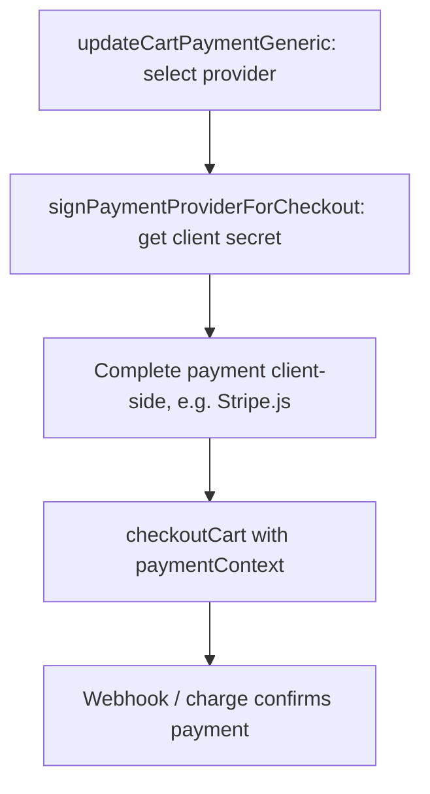

# Payment Integration

Getting a payment provider live takes three steps: register the plugin at boot, create a provider instance via GraphQL, and wire the checkout flow (`signPaymentProviderForCheckout` → `checkoutCart`). Webhook routes are registered automatically by the plugin.

## Built-in Payment Providers

| Provider | Adapter Key | Type | Preset |
|----------|-------------|------|--------|
| [Invoice](../plugins/payment/invoice.md) | `shop.unchained.invoice` | INVOICE | base |
| [Invoice Prepaid](../plugins/payment/invoice-prepaid.md) | `shop.unchained.invoice-prepaid` | INVOICE | all |
| [Stripe](../plugins/payment/stripe.md) | `shop.unchained.payment.stripe` | GENERIC | all |
| [Datatrans](../plugins/payment/datatrans.md) | `shop.unchained.datatrans` | GENERIC | all |
| [Saferpay](../plugins/payment/saferpay.md) | `shop.unchained.payment.saferpay` | GENERIC | all |
| [Payrexx](../plugins/payment/payrexx.md) | `shop.unchained.payment.payrexx` | GENERIC | all |
| [PostFinance Checkout](../plugins/payment/postfinance-checkout.md) | `shop.unchained.payment.postfinance-checkout` | GENERIC | all |
| [Apple In-App Purchase](../plugins/payment/apple-iap.md) | `shop.unchained.apple-iap` | GENERIC | all |
| [Cryptopay](../plugins/payment/cryptopay.md) | `shop.unchained.payment.cryptopay` | GENERIC | crypto, all |

Each plugin page documents its environment variables, webhook path, and provider configuration.

## 1. Register the Plugin

Register plugins before `startPlatform()` — either via a preset or individually:

```typescript
// Preset: registers all built-in plugins (includes Stripe)
import { registerAllPlugins } from '@unchainedshop/plugins/presets/all';

registerAllPlugins();
```

```typescript
// Or cherry-pick a single plugin
import { pluginRegistry } from '@unchainedshop/core';
import { StripePlugin } from '@unchainedshop/plugins/payment/stripe';

pluginRegistry.register(StripePlugin);
```

A registered plugin brings its payment adapter *and* its webhook route — no manual HTTP wiring needed.

For Stripe, set the environment variables before boot — without `STRIPE_SECRET`, `startPlatform()` skips the plugin with a warning and neither its adapter nor its webhook route is registered:

```bash
STRIPE_SECRET=sk_test_xxx           # required
STRIPE_ENDPOINT_SECRET=whsec_xxx    # required for webhooks
# STRIPE_WEBHOOK_PATH defaults to /payment/stripe/webhook
```

## 2. Create a Payment Provider

Registering an adapter only makes it *available* — create a provider instance to activate it (Admin UI: **Settings → Payment Providers**, or GraphQL):

```graphql
mutation CreateStripeProvider {
  createPaymentProvider(
    paymentProvider: { type: GENERIC, adapterKey: "shop.unchained.payment.stripe" }
  ) {
    _id
    type
    interface {
      _id
      label
    }
  }
}
```

`type` is `GENERIC` or `INVOICE` — it must match what the adapter supports (see the table above).

## 3. Checkout Flow


```mermaid
flowchart TD
    A[updateCartPaymentGeneric: select provider] --> B[signPaymentProviderForCheckout: get client secret]
    B --> C[Complete payment client-side, e.g. Stripe.js]
    C --> D[checkoutCart with paymentContext]
    D --> E[Webhook / charge confirms payment]
```

### Select the payment provider

```graphql
mutation SelectPayment($paymentProviderId: ID!) {
  updateCartPaymentGeneric(paymentProviderId: $paymentProviderId) {
    _id
    payment {
      _id
      provider {
        _id
        interface {
          label
        }
      }
    }
  }
}
```

For invoice-type providers use `updateCartPaymentInvoice` instead; `updateCart(paymentProviderId: ...)` also works for a plain provider switch. Query available providers with `paymentProviders(type: GENERIC)` or per-order via `order.supportedPaymentProviders`.

### Sign the payment

`signPaymentProviderForCheckout` returns the gateway's client token as a string — for Stripe, a PaymentIntent `client_secret`:

```graphql
mutation SignPayment($orderPaymentId: ID) {
  signPaymentProviderForCheckout(orderPaymentId: $orderPaymentId)
}
```

Get `orderPaymentId` from `me { cart { payment { _id } } }`. The `OrderPayment` type itself exposes only `_id`, `provider`, `status`, `fee`, `paid`, and `discounts` — the client secret exists solely in the mutation result.

### Complete payment client-side

Use the returned secret with the gateway SDK. For Stripe:

```typescript
import { loadStripe } from '@stripe/stripe-js';

const stripe = await loadStripe('pk_test_xxx');
// clientSecret = result of signPaymentProviderForCheckout
const { error, paymentIntent } = await stripe.confirmPayment({
  elements, // Stripe Elements initialized with { clientSecret }
  redirect: 'if_required',
});
```

See the [Stripe.js docs](https://stripe.com/docs/js) for Elements setup.

### Checkout

```graphql
mutation Checkout($paymentContext: JSON) {
  checkoutCart(paymentContext: $paymentContext) {
    _id
    status
    orderNumber
    payment {
      status
    }
  }
}
```

For Stripe, pass `paymentContext: { paymentIntentId }` — the adapter retrieves the intent, verifies amount, currency and order payment, and marks the order paid if the intent succeeded. If the charge is not yet confirmed, the order stays `PENDING` until the webhook arrives.

## 4. Webhooks

Payment plugins self-register their webhook route when you register them — there is no handler to import. For Stripe the route is `POST /payment/stripe/webhook` (override with `STRIPE_WEBHOOK_PATH`); it verifies signatures with `STRIPE_ENDPOINT_SECRET` and processes `payment_intent.succeeded` and `setup_intent.succeeded`.

Test locally with the Stripe CLI:

```bash
stripe listen --forward-to localhost:4010/payment/stripe/webhook
```

Webhook paths for the other gateways are listed on their [plugin pages](../plugins/payment/index.md).

## Custom Payment Adapter

For gateways without a built-in plugin, use the `registerPaymentProvider` factory from `@unchainedshop/core`:

```typescript
import { OrderPricingSheet, PaymentError, registerPaymentProvider } from '@unchainedshop/core';

registerPaymentProvider({
  adapterId: 'custom-gateway', // key becomes shop.unchained.payment.custom-gateway
  type: 'GENERIC',
  configurationError: process.env.MY_GATEWAY_API_KEY ? null : PaymentError.INCOMPLETE_CONFIGURATION,

  // Create a payment session for the front-end SDK (result of signPaymentProviderForCheckout)
  sign: async (configuration, context) => {
    if (!context.order) return null;
    const pricing = OrderPricingSheet({
      calculation: context.order.calculation,
      currencyCode: context.order.currencyCode,
    });
    const session = await myGateway.createSession({
      amount: pricing.total().amount,
      currency: context.order.currencyCode,
      orderId: context.order._id,
    });
    return session.clientToken;
  },

  // Called during checkoutCart; return a result = paid, false = not yet paid, throw = abort
  charge: async (configuration, context) => {
    const { transactionId } = context.transactionContext || {};
    if (transactionId) {
      const payment = await myGateway.getPayment(transactionId);
      if (payment.status === 'completed') return { transactionId };
    }
    return false; // order stays PENDING
  },

  cancel: async (configuration, context) => {
    await myGateway.refund(context.orderPayment?._id);
    return true;
  },
});
```

See [Plugin Factories](../extend/plugin-factories.md) for the full option reference.

## Payment Fees

Add processing fees with a payment pricing adapter:

```typescript
import { OrderPricingSheet, registerPaymentPricing } from '@unchainedshop/core';

registerPaymentPricing({
  adapterId: 'card-fee',
  isActivatedFor: (context) => context.provider.adapterKey === 'shop.unchained.payment.stripe',
  calculate: async (sheet, context) => {
    const pricing = OrderPricingSheet({
      calculation: context.order?.calculation,
      currencyCode: context.order?.currencyCode,
    });
    const total = pricing.total().amount;
    sheet.addFee({ amount: Math.round(total * 0.029 + 30), isTaxable: false, isNetPrice: true }); // 2.9% + 0.30
  },
});
```

## Related

- [Payment Plugins](../plugins/payment/index.md) - Per-plugin configuration reference
- [Plugin Factories](../extend/plugin-factories.md) - Custom adapter registration
- [Checkout Implementation](./checkout-implementation.md) - Full checkout flow
- [Director/Adapter Pattern](../concepts/director-adapter-pattern.md) - Plugin architecture
