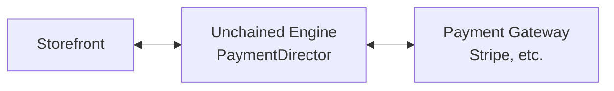
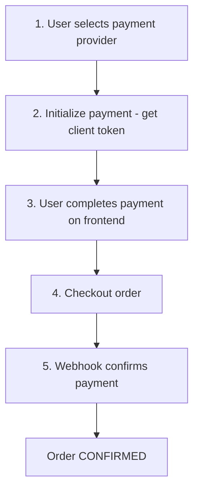

# Payment Integration

This guide covers setting up payment processing in Unchained Engine, from configuring built-in providers to creating custom integrations.

## Overview

Unchained Engine supports multiple payment providers through the plugin system:


```mermaid
flowchart LR
    S[Storefront] <--> U[Unchained Engine<br/>PaymentDirector] <--> P[Payment Gateway<br/>Stripe, etc.]
```

## Built-in Payment Providers

| Provider | Type | Use Case |
|----------|------|----------|
| [Stripe](../plugins/payment/stripe.md) | GENERIC | Credit/debit cards |
| [PayPal](../plugins/payment/paypal-checkout.md) | GENERIC | PayPal checkout |
| [Braintree](../plugins/payment/braintree.md) | GENERIC | Cards, PayPal |
| [Datatrans](../plugins/payment/datatrans.md) | GENERIC | Swiss payment gateway |
| [Saferpay](../plugins/payment/saferpay.md) | GENERIC | Swiss payment gateway |
| [Cryptopay](../plugins/payment/cryptopay.md) | GENERIC | Cryptocurrency |
| [Invoice](../plugins/payment/invoice.md) | INVOICE | Manual invoicing |

## Quick Start: Stripe

### 1. Install and Configure

```bash
npm install stripe
```

```typescript
// boot.ts
import '@unchainedshop/plugins/payment/stripe/index.js';
```

```bash
# .env
STRIPE_SECRET=sk_test_xxx
STRIPE_ENDPOINT_SECRET=whsec_xxx
```

### 2. Create Payment Provider

Create a payment provider in the Admin UI or via GraphQL:

```graphql
mutation CreateStripeProvider {
  createPaymentProvider(paymentProvider: {
    type: GENERIC
    adapterKey: "shop.unchained.payment.stripe"
  }) {
    _id
    type
    interface {
      _id
      label
    }
  }
}
```

### 3. Frontend Integration

1. Select the Stripe payment provider on the cart.
2. Call `signPaymentProviderForCheckout(orderPaymentId: ...)`. The returned string is the PaymentIntent client secret; there is no `payment.clientSecret` GraphQL field.
3. Initialize Stripe Elements with that client secret and collect payment details.
4. Confirm the payment with Stripe. The built-in webhook handler processes successful payments and advances the Unchained order. If your integration calls `checkoutCart` directly, pass the intent ID as `paymentContext: { paymentIntentId }`.
5. Query the order to display its current status. A browser redirect alone does not confirm the order.

See the [Stripe plugin guide](../plugins/payment/stripe.md) for the provider-specific flow and options.

### 4. Webhook Handler

Use the built-in Stripe webhook handler through the framework plugin preset, which handles raw request bodies, signature verification, and the Unchained order transition. For the Fastify kitchensink this is configured with:

```typescript
import initPluginMiddlewares from '@unchainedshop/plugins/presets/all-fastify.js';
import { connect } from '@unchainedshop/api/fastify';

connect(fastify, platform, { initPluginMiddlewares });
```

The default webhook path is `/payment/stripe` (override with `STRIPE_WEBHOOK_PATH`). Set `STRIPE_ENDPOINT_SECRET` to the endpoint signing secret. The all-plugin preset also initializes routes for other plugins; see the Stripe plugin guide for an individual integration.

## Payment Flow

### Standard Flow


```mermaid
flowchart TD
    A[1. User selects payment provider] --> B[2. Initialize payment - get client token]
    B --> C[3. User completes payment on frontend]
    C --> D[4. Checkout order]
    D --> E[5. Webhook confirms payment]
    E --> F[Order CONFIRMED]
```

### GraphQL Mutations

```graphql
# Step 1: Set payment provider
mutation SetPaymentProvider($orderId: ID!, $paymentProviderId: ID!) {
  setOrderPaymentProvider(orderId: $orderId, paymentProviderId: $paymentProviderId) {
    _id
    payment {
      _id
      provider {
        _id
        interface {
          label
        }
      }
    }
  }
}

# Step 2: Sign payment (get client token)
mutation SignPayment($orderPaymentId: ID!) {
  signPaymentProviderForCheckout(orderPaymentId: $orderPaymentId)
}

# Step 4: Checkout
mutation Checkout($orderId: ID, $paymentContext: JSON) {
  checkoutCart(orderId: $orderId, paymentContext: $paymentContext) {
    _id
    status
    orderNumber
    payment {
      status
    }
  }
}
```

## Payment Provider Configuration

### Configure via Admin UI

1. Go to **Settings > Payment Providers**
2. Click **Create Provider**
3. Select adapter (e.g., Stripe)
4. Set configuration values
5. Save and activate

### Configure via GraphQL

```graphql
mutation ConfigureStripe {
  createPaymentProvider(paymentProvider: {
    type: GENERIC
    adapterKey: "shop.unchained.payment.stripe"
  }) {
    _id
  }
}
```

Configure `merchantCountry` via the Admin UI after creation.

### Environment Variables

Most payment adapters use environment variables:

```bash
# Stripe
STRIPE_SECRET=sk_xxx
# Configure the Stripe publishable key in your storefront
STRIPE_ENDPOINT_SECRET=whsec_xxx

# PayPal
PAYPAL_CLIENT_ID=xxx
PAYPAL_SECRET=xxx
PAYPAL_ENVIRONMENT=sandbox  # or live

# Datatrans
DATATRANS_MERCHANT_ID=xxx
DATATRANS_SECRET=xxx
DATATRANS_SIGN_KEY=xxx
```

## Custom Payment Adapter

Create a custom adapter for payment gateways not covered by built-in plugins. This example assumes `myGateway` is your gateway client and its session/payment methods return the illustrated values:

```typescript
import {
  PaymentAdapter, PaymentDirector, PaymentError, OrderPricingSheet,
  type IPaymentAdapter,
} from '@unchainedshop/core';

const MyPaymentAdapter: IPaymentAdapter = {
  ...PaymentAdapter,
  key: 'com.mycompany.payment.custom',
  label: 'My Payment Gateway',
  version: '1.0.0',
  typeSupported: (type) => type === 'GENERIC',
  actions(configuration, context) {
    const baseActions = PaymentAdapter.actions(configuration, context);
    return {
      ...baseActions,
      configurationError: () => process.env.MY_GATEWAY_API_KEY
        ? null : PaymentError.INCOMPLETE_CONFIGURATION,
      isActive: () => Boolean(process.env.MY_GATEWAY_API_KEY),
      isPayLaterAllowed: () => false,
      async sign() {
        const { order } = context;
        if (!order) throw new Error('Order is required');
        const pricing = OrderPricingSheet({
          calculation: order.calculation,
          currencyCode: order.currencyCode,
        });
        const { amount, currencyCode } = pricing.total();
        const session = await myGateway.createSession({
          amount,
          currency: currencyCode,
          orderId: order._id,
        });
        return session.clientToken;
      },
      async charge({ transactionId } = {}) {
        if (!transactionId) return false;
        const payment = await myGateway.getPayment(transactionId);
        // Validate the gateway's order reference, amount, and currency here.
        if (payment.status !== 'completed') return false;
        return { transactionId };
      },
    };
  },
};

PaymentDirector.registerAdapter(MyPaymentAdapter);
```

Implement gateway-specific validation before returning a successful charge. The base `cancel`, `confirm`, `register`, and `validate` methods remain available to override. `charge()` receives the transaction context passed by checkout; adapter context is the second argument to `actions(configuration, context)`.

## Testing Payments

### Test Mode

Most payment providers have test/sandbox modes:

```bash
# Stripe test keys
STRIPE_SECRET=sk_test_xxx
# Configure the Stripe test publishable key in your storefront

# PayPal sandbox
PAYPAL_ENVIRONMENT=sandbox
```

### Test Payment Details

Use the provider's current test-card documentation and sandbox accounts. The [Stripe plugin guide](../plugins/payment/stripe.md) describes the Unchained test configuration.

### Testing Webhooks Locally

Use Stripe CLI or ngrok for local webhook testing:

```bash
# Stripe CLI
stripe listen --forward-to localhost:4010/payment/stripe

# ngrok
ngrok http 4010
# Configure webhook URL in Stripe dashboard
```

## Error Handling

### Common Payment Errors

| Error | Cause | User Message |
|-------|-------|--------------|
| `card_declined` | Card was declined | "Your card was declined" |
| `insufficient_funds` | Not enough funds | "Insufficient funds" |
| `expired_card` | Card expired | "Card has expired" |
| `incorrect_cvc` | Wrong CVC | "Invalid security code" |
| `processing_error` | Gateway error | "Please try again" |

### Error Handling in Frontend

```typescript
try {
  const { error } = await stripe.confirmPayment({ /* ... */ });
  if (error) {
    switch (error.code) {
      case 'card_declined':
        setError('Your card was declined. Please try another card.');
        break;
      case 'expired_card':
        setError('Your card has expired. Please use a different card.');
        break;
      default:
        setError('Payment failed. Please try again.');
    }
  }
} catch (err) {
  setError('An unexpected error occurred.');
}
```

## Payment Fees

Payment pricing adapters compose `PaymentPricingAdapter` and add fees with `resultSheet().addFee()`:

```typescript
import {
  PaymentPricingAdapter, PaymentPricingDirector,
  type IPaymentPricingAdapter,
} from '@unchainedshop/core';

const ExamplePaymentFee: IPaymentPricingAdapter = {
  ...PaymentPricingAdapter,
  key: 'com.example.pricing.payment-fee',
  label: 'Example payment fee',
  version: '1.0.0',
  orderIndex: 10,
  isActivatedFor: ({ provider, currencyCode }) =>
    provider.type === 'GENERIC' && currencyCode === 'CHF',
  actions(params) {
    const baseActions = PaymentPricingAdapter.actions(params);
    return {
      ...baseActions,
      async calculate() {
        baseActions.resultSheet().addFee({
          amount: 30, // Illustrative fixed CHF 0.30 fee
          isTaxable: false,
          isNetPrice: true,
          meta: { adapter: ExamplePaymentFee.key },
        });
        return baseActions.calculate();
      },
    };
  },
};

PaymentPricingDirector.registerAdapter(ExamplePaymentFee);
```

For a percentage fee, derive the intended subtotal from order positions and their calculation sheets. Reading a previous final order total can include the payment fee itself and create repeated recalculation errors.

## Multi-Currency Support

Orders store `currencyCode` and calculation rows. In `actions(configuration, context)`, read `context.order`, construct `OrderPricingSheet({ calculation: order.calculation, currencyCode: order.currencyCode })`, and use `total()` to obtain `{ amount, currencyCode }`. Convert the currency code or amount only as required by your gateway's API.

The built-in Stripe adapter uses this approach and verifies that the completed PaymentIntent matches the order payment, amount, and currency.

## Related

- [Stripe Plugin](../plugins/payment/stripe.md) - Stripe payment adapter
- [Director/Adapter Pattern](../concepts/director-adapter-pattern.md) - Plugin architecture
- [Checkout Implementation](./checkout-implementation.md) - Full checkout flow
