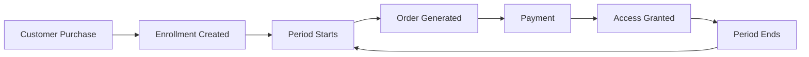

# Enrollment Plugins

Enrollment plugins handle subscription-based products and recurring orders.

## Available Plugins

| Adapter Key | Description | Base Preset |
|-------------|-------------|-------------|
| [`shop.unchained.enrollments.licensed`](./enrollment-licensed.md) | Licensed subscription with period-based access | Yes |

## How Enrollments Work

Enrollments in Unchained manage subscription products:

1. Customer purchases a subscription product (PLAN_PRODUCT)
2. An enrollment is created linking the customer to the product
3. The enrollment adapter determines billing periods
4. Orders are automatically generated for each period
5. Access is granted based on active periods

## Enrollment Flow

## Key Concepts

### Enrollment Status

| Status | Description |
|--------|-------------|
| `INITIAL` | Enrollment created but not yet active |
| `ACTIVE` | Subscription is active |
| `PAUSED` | Temporarily paused (can resume) |
| `TERMINATED` | Permanently ended |

### Periods

Each enrollment tracks periods which represent billing cycles:
- `start` - Period start date
- `end` - Period end date
- `isTrial` - Whether this is a trial period
- `orderId` - Associated order for this period

## Creating Custom Enrollment Plugins

See [Custom Enrollment Plugins](../../extend/enrollment.md) for creating your own enrollment adapters.
