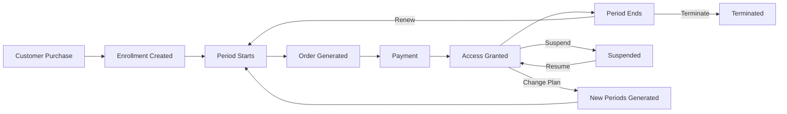
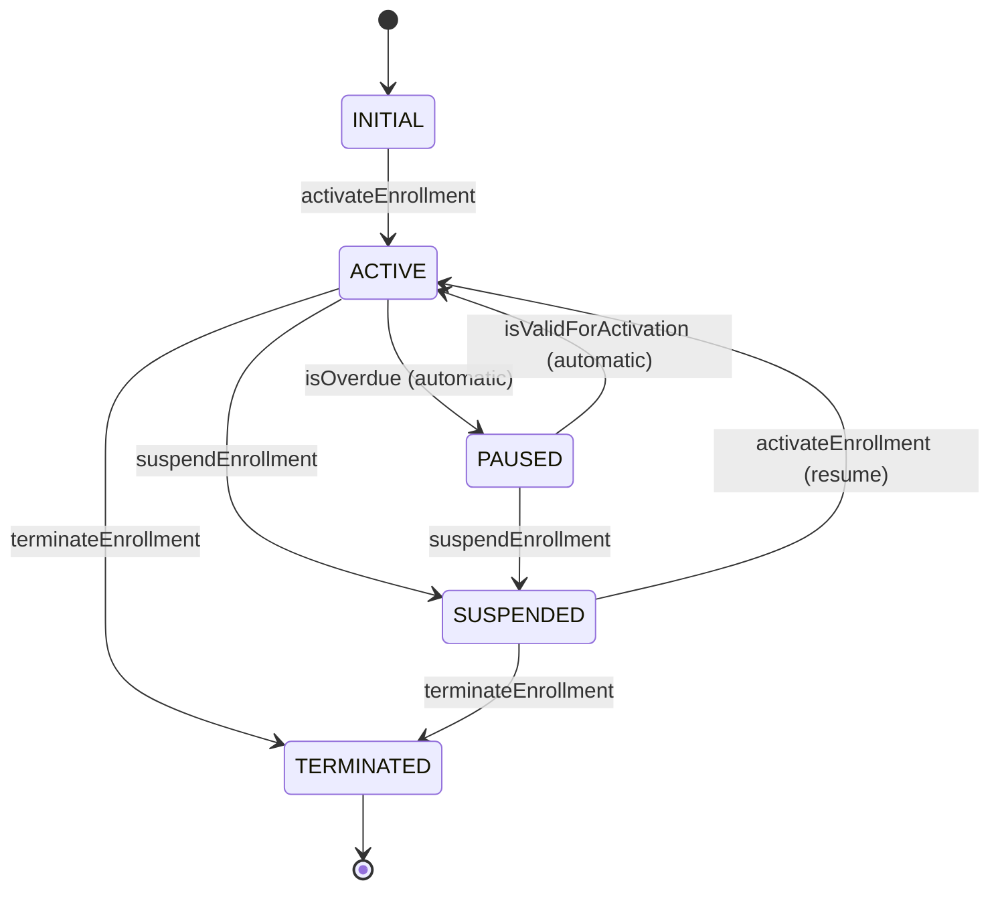

# Enrollment Plugins

Enrollment plugins handle subscription-based products and recurring orders.

## Available Plugins

| Adapter Key | Description | Base Preset |
|-------------|-------------|-------------|
| [`shop.unchained.enrollments.licensed`](./enrollment-licensed.md) | Licensed subscription with period-based access | Yes |

## How Enrollments Work

Enrollments in Unchained manage subscription products:

1. Customer purchases a subscription product (PLAN_PRODUCT)
2. An enrollment is created linking the customer to the product
3. The enrollment adapter determines billing periods
4. Orders are automatically generated for each period
5. Access is granted based on active periods

## Enrollment Flow

```mermaid
flowchart LR
    A[Customer Purchase] --> B[Enrollment Created]
    B --> C[Period Starts]
    C --> D[Order Generated]
    D --> E[Payment]
    E --> F[Access Granted]
    F --> G[Period Ends]
    G -->|Renew| C
    G -->|Terminate| H[Terminated]
    F -->|Suspend| I[Suspended]
    I -->|Resume| F
    F -->|Change Plan| J[New Periods Generated]
    J --> C
```

## Key Concepts

### Enrollment Status

| Status | Description |
|--------|-------------|
| `INITIAL` | Enrollment created but not yet active |
| `ACTIVE` | Subscription is active |
| `PAUSED` | Temporarily paused due to overdue payment (can resume automatically) |
| `SUSPENDED` | Manually suspended by an admin (no new orders generated until resumed) |
| `TERMINATED` | Permanently ended |

### Status Transitions

```mermaid
stateDiagram-v2
    [*] --> INITIAL
    INITIAL --> ACTIVE : activateEnrollment
    ACTIVE --> PAUSED : isOverdue (automatic)
    ACTIVE --> SUSPENDED : suspendEnrollment
    ACTIVE --> TERMINATED : terminateEnrollment
    PAUSED --> ACTIVE : isValidForActivation (automatic)
    PAUSED --> SUSPENDED : suspendEnrollment
    SUSPENDED --> ACTIVE : activateEnrollment (resume)
    SUSPENDED --> TERMINATED : terminateEnrollment
    TERMINATED --> [*]
```

### Scheduled Termination

When `terminateEnrollment` is called, the enrollment adapter's `terminationDate()` method determines when termination takes effect. If the returned date is in the future, the enrollment stays in its current status and a `requestedTerminationDate` is set. The enrollment will be terminated automatically when processed after that date.

Resuming a suspended enrollment via `activateEnrollment` clears any pending `requestedTerminationDate`.

### Cancellation Reason and Feedback

The `terminateEnrollment` mutation accepts optional `reason` and `comment` parameters for churn analysis:

| Reason | Description |
|--------|-------------|
| `USER_REQUESTED` | Customer initiated the cancellation |
| `PAYMENT_FAILED` | Cancelled due to payment failure |
| `EXPIRED` | Subscription reached its expiry date |
| `ADMIN_ACTION` | Cancelled by an administrator |
| `OTHER` | Other reason (use `comment` for details) |

The `cancellationReason` and `cancellationComment` fields are stored on the enrollment and accessible via the GraphQL API.

### Cancel at Period End

Instead of immediate or adapter-computed termination, you can set `cancelAtPeriodEnd: true` on the `updateEnrollment` mutation. This sets `requestedTerminationDate` to the end of the current billing period — the subscription won't renew but access continues until the period ends. Set `cancelAtPeriodEnd: false` to undo this and continue the subscription.

### Suspend with Scheduled Resume

The `suspendEnrollment` mutation accepts an optional `resumeAt` date. When set, the enrollment will automatically resume to `ACTIVE` status when processed after that date. This enables time-limited pauses (e.g., "pause my subscription for 2 months").

Manually resuming via `activateEnrollment` clears the `resumeAt` date.

### Contract Terms / Minimum Commitments

Plan products can define a `minimumCommitmentPeriods` value (e.g., 12 for a 12-month contract). When an enrollment is initialized for such a product, the adapter computes a `minimumCommitmentEnd` date and stores it alongside a `contractStartDate` on the enrollment.

During termination, the licensed adapter enforces the commitment: if the normal termination date would fall before `minimumCommitmentEnd`, the termination is pushed out to the commitment end date. This means early cancellation is allowed but the subscription stays active until the contract term completes.

Both `contractStartDate` and `minimumCommitmentEnd` are exposed in the GraphQL API and visible in the admin UI.

### Trial Ending Notification

The enrollment order generator worker emits an `ENROLLMENT_TRIAL_ENDING` event when a trial period is within 3 days of ending. This enables sending reminder emails or triggering conversion flows before the trial expires.

### Plan Changes

Active enrollments can change their subscription plan via `updateEnrollment` with a new `plan` parameter. The adapter's `transformPlanToNewPlan()` method controls whether the change is allowed and when it takes effect. Future periods without linked orders are removed and new periods are generated based on the new plan.

### Periods

Each enrollment tracks periods which represent billing cycles:
- `start` - Period start date
- `end` - Period end date
- `isTrial` - Whether this is a trial period
- `orderId` - Associated order for this period

## Creating Custom Enrollment Plugins

See [Custom Enrollment Plugins](../../extend/enrollment.md) for creating your own enrollment adapters.
