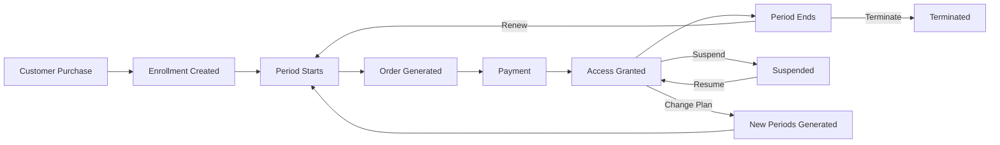
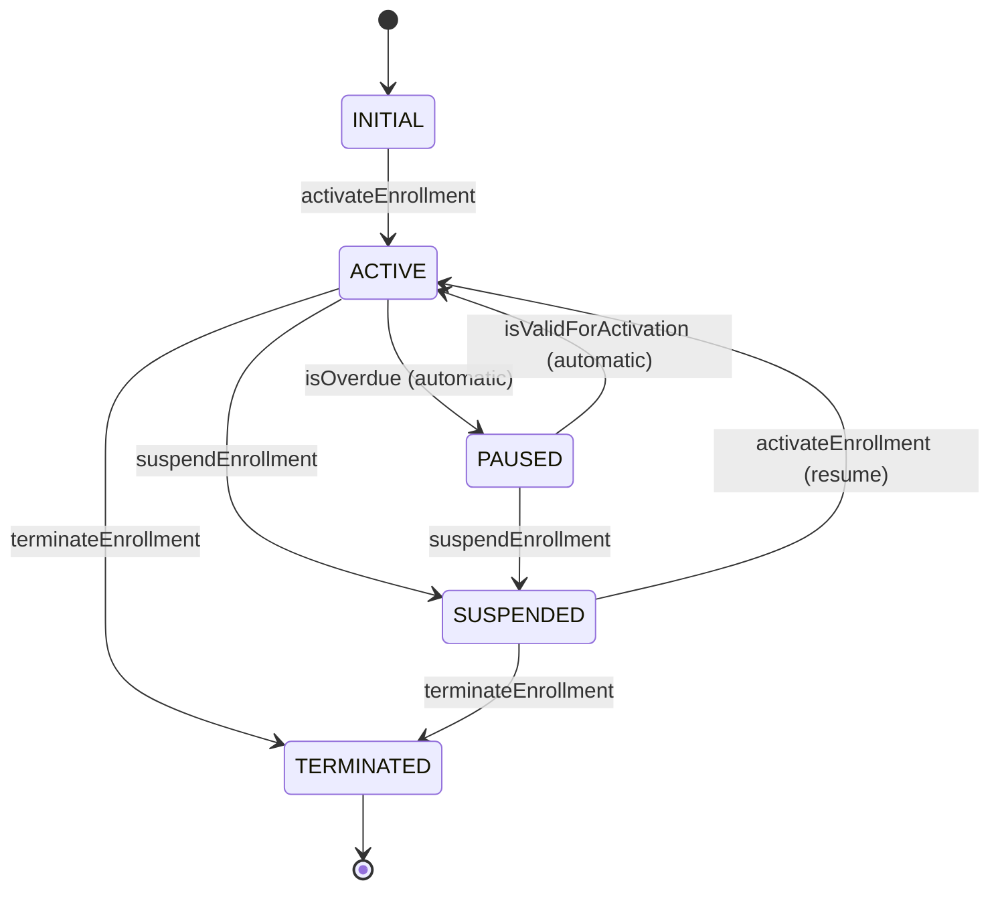

# Enrollment Plugins

Enrollment plugins handle subscription-based products and recurring orders.

## Available Plugins

| Adapter Key | Description | Base Preset |
|-------------|-------------|-------------|
| [`shop.unchained.enrollments.licensed`](./enrollment-licensed.md) | Licensed subscription with period-based access | Yes |

## How Enrollments Work

Enrollments in Unchained manage subscription products:

1. Customer purchases a subscription product (PLAN_PRODUCT)
2. An enrollment is created linking the customer to the product
3. The enrollment adapter determines billing periods
4. Orders are automatically generated for each period
5. Access is granted based on active periods

## Enrollment Flow

```mermaid
flowchart LR
    A[Customer Purchase] --> B[Enrollment Created]
    B --> C[Period Starts]
    C --> D[Order Generated]
    D --> E[Payment]
    E --> F[Access Granted]
    F --> G[Period Ends]
    G -->|Renew| C
    G -->|Terminate| H[Terminated]
    F -->|Suspend| I[Suspended]
    I -->|Resume| F
    F -->|Change Plan| J[New Periods Generated]
    J --> C
```

## Key Concepts

### Enrollment Status

| Status | Description |
|--------|-------------|
| `INITIAL` | Enrollment created but not yet active |
| `ACTIVE` | Subscription is active |
| `PAUSED` | Temporarily paused due to overdue payment (can resume automatically) |
| `SUSPENDED` | Manually suspended by an admin (no new orders generated until resumed) |
| `TERMINATED` | Permanently ended |

### Status Transitions

```mermaid
stateDiagram-v2
    [*] --> INITIAL
    INITIAL --> ACTIVE : activateEnrollment
    ACTIVE --> PAUSED : isOverdue (automatic)
    ACTIVE --> SUSPENDED : suspendEnrollment
    ACTIVE --> TERMINATED : terminateEnrollment
    PAUSED --> ACTIVE : isValidForActivation (automatic)
    PAUSED --> SUSPENDED : suspendEnrollment
    SUSPENDED --> ACTIVE : activateEnrollment (resume)
    SUSPENDED --> TERMINATED : terminateEnrollment
    TERMINATED --> [*]
```

### Scheduled Termination

When `terminateEnrollment` is called, the enrollment adapter's `terminationDate()` method determines when termination takes effect. If the returned date is in the future, the enrollment stays in its current status and a `requestedTerminationDate` is set. The enrollment will be terminated automatically when processed after that date.

Resuming a suspended enrollment via `activateEnrollment` clears any pending `requestedTerminationDate`.

### Plan Changes

Active enrollments can change their subscription plan via `updateEnrollment` with a new `plan` parameter. The adapter's `transformPlanToNewPlan()` method controls whether the change is allowed and when it takes effect. Future periods without linked orders are removed and new periods are generated based on the new plan.

### Periods

Each enrollment tracks periods which represent billing cycles:
- `start` - Period start date
- `end` - Period end date
- `isTrial` - Whether this is a trial period
- `orderId` - Associated order for this period

## Creating Custom Enrollment Plugins

See [Custom Enrollment Plugins](../../extend/enrollment.md) for creating your own enrollment adapters.
