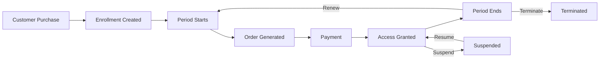
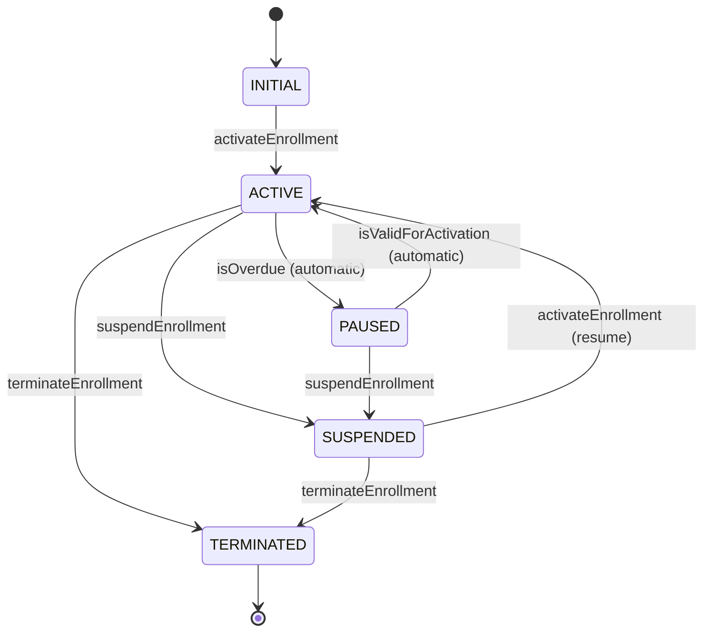

# Enrollment Plugins

Enrollment plugins handle subscription-based products and recurring orders.

| Adapter Key | Description | Preset |
|-------------|-------------|--------|
| [`shop.unchained.enrollments.licensed`](./enrollment-licensed.md) | Licensed subscription with period-based access | `base` |

## How Enrollments Work

1. Customer purchases a subscription product (`PLAN_PRODUCT`)
2. An enrollment is created linking the customer to the product
3. The enrollment adapter determines billing periods
4. Orders are automatically generated for each period
5. Access is granted based on active periods

## Enrollment Flow

```mermaid
flowchart LR
    A[Customer Purchase] --> B[Enrollment Created]
    B --> C[Period Starts]
    C --> D[Order Generated]
    D --> E[Payment]
    E --> F[Access Granted]
    F --> G[Period Ends]
    G -->|Renew| C
    G -->|Terminate| H[Terminated]
    F -->|Suspend| I[Suspended]
    I -->|Resume| F
```

## Key Concepts

### Enrollment Status

| Status | Description |
|--------|-------------|
| `INITIAL` | Enrollment created but not yet active |
| `ACTIVE` | Subscription is active |
| `PAUSED` | Temporarily paused due to overdue payment (can resume automatically) |
| `SUSPENDED` | Manually suspended by an admin (no new orders generated until resumed) |
| `TERMINATED` | Permanently ended |

### Status Transitions

```mermaid
stateDiagram-v2
    [*] --> INITIAL
    INITIAL --> ACTIVE : activateEnrollment
    ACTIVE --> PAUSED : isOverdue (automatic)
    ACTIVE --> SUSPENDED : suspendEnrollment
    ACTIVE --> TERMINATED : terminateEnrollment
    PAUSED --> ACTIVE : isValidForActivation (automatic)
    PAUSED --> SUSPENDED : suspendEnrollment
    SUSPENDED --> ACTIVE : activateEnrollment (resume)
    SUSPENDED --> TERMINATED : terminateEnrollment
    TERMINATED --> [*]
```

### Scheduled Termination

An enrollment ends at its `expires` date; while `expires` is `null`, it renews period after period. When `terminateEnrollment` is called, the enrollment adapter's `terminationDate()` method determines when the termination takes effect. If that date is in the future, it is stored as `expires` and the enrollment keeps its current status until then; it is terminated automatically when processed after that date, also while it is suspended. A repeated `terminateEnrollment` never postpones an end that is already set.

Admins (`manageEnrollments`) set or clear the end date directly with `updateEnrollment(expires)`, without the adapter's termination policy: `null` undoes a scheduled termination, a date that has passed terminates the enrollment right away.

### Cancellation Reason and Feedback

The `terminateEnrollment` mutation accepts optional `reason` and `comment` parameters for churn analysis:

| Reason | Description |
|--------|-------------|
| `USER_REQUESTED` | Customer initiated the cancellation |
| `PAYMENT_FAILED` | Cancelled due to payment failure |
| `EXPIRED` | Subscription reached its expiry date |
| `ADMIN_ACTION` | Cancelled by an administrator |
| `OTHER` | Other reason (use `comment` for details) |

The `cancellationReason` and `cancellationComment` fields are stored on the enrollment and accessible via the GraphQL API.

### Suspend with Scheduled Resume

The `suspendEnrollment` mutation accepts an optional `resumeAt` date (which must lie in the future). When set, the enrollment will automatically resume to `ACTIVE` status when processed after that date. This enables time-limited pauses (e.g., "pause my subscription for 2 months").

Suspending and resuming (`activateEnrollment`) require the `manageEnrollments` permission. Leaving `SUSPENDED`, manually or automatically, clears the `resumeAt` date.

### Contract Terms / Minimum Commitments

Plan products can define a `minimumCommitmentPeriods` value (e.g., 12 for a 12-month contract). When an enrollment is initialized for such a product, it stores the start of its first paid period as `contractStartDate` and `minimumCommitmentPeriods` billing intervals later as `minimumCommitmentEnd`.

`terminateEnrollment` never ends an enrollment before `minimumCommitmentEnd`, whatever the adapter's `terminationDate()` returns. Early cancellation is allowed, but the subscription stays active until the contract term completes; only an admin can set an earlier end with `updateEnrollment(expires)`.

Both `contractStartDate` and `minimumCommitmentEnd` are exposed in the GraphQL API and visible in the admin UI.

### Trial Ending Notification

The enrollment order generator worker emits one `ENROLLMENT_TRIAL_ENDING` event when an active trial period is within `trialEndingNoticeDays` (module option, default 3) of ending. This enables sending reminder emails or triggering conversion flows before the trial expires.

### Plan Changes

Active enrollments can change their subscription plan via `updateEnrollment` with a new `plan` parameter. The adapter's `transformPlanToNewPlan()` method accepts the change (the licensed adapter does) or rejects it (the default). Billed periods stay as they are; the next period is generated from the new plan.

### Periods

Each enrollment tracks periods which represent billing cycles: `start`, `end`, `isTrial`, and the `orderId` of the order generated for the period.

## Creating Custom Enrollment Plugins

See [Custom Enrollment Plugins](../../extend/enrollment.md) for creating your own enrollment adapters.
