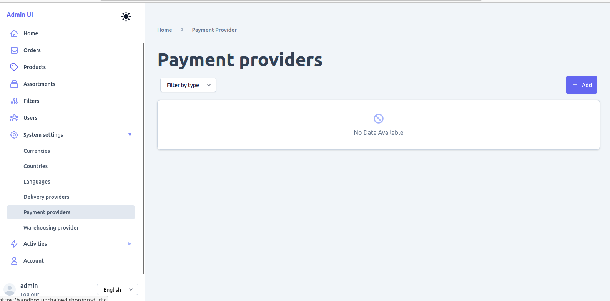
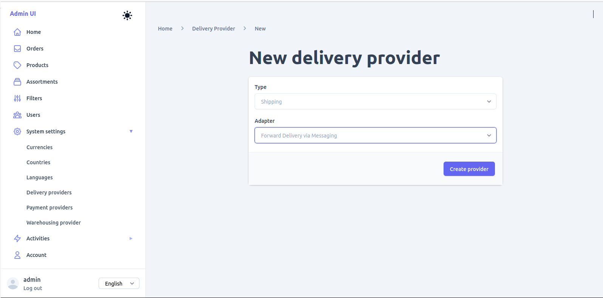

# Configure Admin UI

The Admin UI is a powerful web-based interface for managing your Unchained Engine. This guide will help you access and configure the essential components for your shop.

## Accessing the Admin UI

### Local Development
If you're running Unchained Engine locally:
- URL: http://localhost:4010/admin
- Default credentials (from your `.env` file):
  - Username: `admin@myshop.com`
  - Password: `mysecurepassword`

### Sandbox Environment
For testing with sample data:
- URL: https://engine.unchained.shop/admin
- Credentials:
  - Username: `admin@unchained.local`
  - Password: `password`

> **Browser Compatibility**: Use Chrome or Firefox. Safari may have issues with cross-origin requests in development.

## Initial Setup Steps

### Step 1: Configure Payment Providers

Payment providers handle how customers pay for their orders.

1. **Navigate to Payment Providers**
   - Click **System** in the sidebar
   - Select **Payment providers**

2. **Add Invoice Payment (Recommended for start)**
   - Click **Add payment provider**
   - Fill in:
     - **ID**: `invoice-payment`
     - **Type**: Select **Invoice (manually)**
     - Click **Create**

3. **Configure the Provider**
   - No additional configuration needed for invoice payment
   - It's automatically available for all orders



### Step 2: Configure Delivery Providers

Delivery providers handle how orders are shipped to customers.

1. **Navigate to Delivery Providers**
   - Click **System** in the sidebar
   - Select **Delivery providers**

2. **Add Email Delivery (For digital products)**
   - Click **Add delivery provider**
   - Fill in:
     - **ID**: `email-delivery`
     - **Type**: Select **Send via Email**
     - Click **Create**

3. **Add Shipping Provider (For physical products)**
   - Click **Add delivery provider**
   - Fill in:
     - **ID**: `shipping`
     - **Type**: Select **Forward Delivery via Messaging**
     - Click **Create**
   - Configure:
     - **From Email**: `orders@myshop.com`
     - **To Email**: `fulfillment@myshop.com`



### Step 3: Configure Currencies and Countries

1. **Set Default Currency**
   - Navigate to **System** → **Currencies**
   - Add your primary currency (e.g., USD, EUR, CHF)
   - Mark it as default

2. **Configure Countries**
   - Navigate to **System** → **Countries**
   - Add countries you ship to
   - Set default country

### Step 4: Configure Languages

1. **Navigate to Languages**
   - Go to **System** → **Languages**
   
2. **Add Languages**
   - Add your primary language (e.g., en, de, fr)
   - Mark primary language as default

## Admin UI Overview

### Main Navigation

The Admin UI is organized into these main sections:

1. **Dashboard**
   - Quick stats and recent activity
   - System health indicators

2. **Products**
   - Create and manage products
   - Handle variations and bundles
   - Manage product media

3. **Orders**
   - View and process orders
   - Handle refunds and cancellations
   - Export order data

4. **Users**
   - Manage customer accounts
   - Set roles and permissions
   - View order history

5. **Assortments**
   - Create product categories
   - Build navigation structure
   - Manage filters

6. **System**
   - Payment providers
   - Delivery providers
   - Countries and currencies
   - Languages
   - Filters

## Key Features

### Product Management

**Product Types:**
- **Simple Product**: Standard products with price and stock
- **Configurable Product**: Products with variations (size, color)
- **Bundle Product**: Groups of products sold together
- **Plan Product**: Subscriptions and recurring products
- **Token Product**: NFTs and digital tokens

**Product States:**
- **Draft**: Not visible in storefront
- **Active**: Available for purchase
- **Deleted**: Archived products

### Order Management

**Order Flow:**
1. **Open** → Customer adding items
2. **Pending** → Awaiting payment
3. **Confirmed** → Payment received
4. **Fulfilled** → Delivered to customer

### User Management

**Default Roles:**
- **Admin**: Full system access
- **User**: Regular customer

**User Features:**
- Email verification
- Password reset
- Login tracking
- Order history

## Advanced Configuration

### Email Templates

Customize email templates in `engine/src/email-templates/`:
- `account-verification.html`
- `order-confirmation.html`
- `password-reset.html`

### Custom Fields

Add custom fields to entities:
```javascript
// In engine startup configuration
startPlatform({
  modules: {
    products: {
      customFields: {
        isbn: {
          type: String,
          optional: true
        }
      }
    }
  }
});
```

### Webhooks

Configure webhooks for external integrations:
```javascript
// In engine configuration
webhooks: {
  orderConfirmed: 'https://myapp.com/webhooks/order-confirmed'
}
```

## Tips and Best Practices

### Organization
1. **Use meaningful IDs** for providers (e.g., `stripe-payment`, not `provider-1`)
2. **Create categories first** before adding products
3. **Set up filters** for better product discovery

### Performance
1. **Optimize images** before uploading
2. **Use lazy loading** for large catalogs
3. **Archive old orders** periodically

### Security
1. **Change default passwords** immediately
2. **Use strong passwords** for admin accounts
3. **Limit admin access** to necessary users
4. **Enable 2FA** when available

## Common Tasks

### Bulk Import Products
1. Prepare CSV file with product data
2. Use import tool in Products section
3. Map fields correctly
4. Review and confirm import

### Export Orders
1. Go to Orders section
2. Apply filters if needed
3. Click Export button
4. Choose format (CSV, Excel)

### Managing Stock
1. Navigate to product
2. Go to Supply tab
3. Update stock levels
4. Set low stock alerts

## Troubleshooting

### Cannot Access Admin UI
- Check if engine is running
- Verify URL is correct
- Clear browser cache
- Check browser console for errors

### Provider Not Showing
- Ensure provider is created
- Check if it's enabled
- Verify configuration is complete

### Images Not Uploading
- Check file size limits
- Verify allowed formats
- Ensure upload directory has write permissions

## Next Steps

Now that your Admin UI is configured, you're ready to [Create Your First Product →](./first-product)