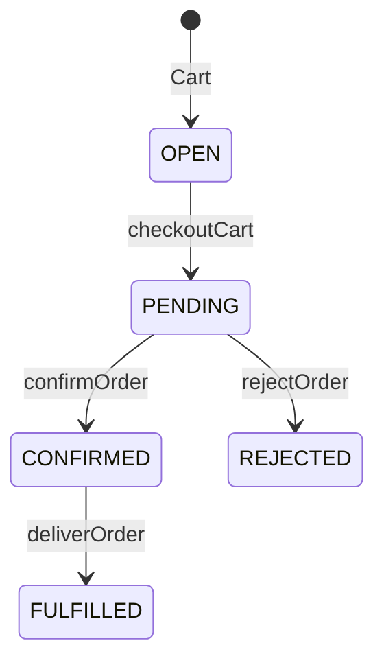

# Create Your First Order

This guide walks you through the complete checkout flow to create your first order.

## Prerequisites

- Unchained Engine running locally (see [Initialize and Run](./run-local))
- At least one product created (see [Your First Product](./first-product))
- Payment and delivery providers configured

## Using the Storefront

The easiest way to create an order is through the storefront.

### 1. Browse Products

1. Open http://localhost:3000
2. Browse the product catalog
3. Find the product you created

### 2. Add to Cart

1. Click on a product to view details
2. Select quantity
3. Click **Add to Cart**

### 3. View Cart

1. Click the cart icon
2. Review your items
3. Adjust quantities if needed

### 4. Checkout

1. Click **Proceed to Checkout**
2. If prompted, log in or continue as guest
3. Enter shipping address
4. Select delivery method
5. Select payment method
6. Review order total
7. Click **Place Order**

### 5. Confirm Order

After placing the order:
- You'll see an order confirmation page
- Check the Admin UI for the new order
- Email confirmation will be sent (check the built-in email preview)

## Using GraphQL

For testing or programmatic orders, use the GraphQL API.

### Step 1: Login as Guest

```graphql
mutation LoginAsGuest {
  loginAsGuest {
    _id
    tokenExpires
    user {
      _id
      isGuest
    }
  }
}
```

Save the `_id` (token) and include it in all subsequent requests:
```http
Authorization: Bearer <your-token>
```

### Step 2: Add Product to Cart

```graphql
mutation AddToCart {
  addCartProduct(productId: "your-product-id", quantity: 1) {
    _id
    quantity
    product {
      texts {
        title
      }
    }
    total {
      amount
      currencyCode
    }
    order {
      _id
      total {
        amount
        currencyCode
      }
    }
  }
}
```

### Step 3: Get Available Providers & Set Delivery/Payment

Get available delivery and payment providers:

```graphql
query GetProviders {
  me {
    cart {
      supportedDeliveryProviders {
        _id
        type
        interface { label }
      }
      supportedPaymentProviders {
        _id
        type
        interface { label }
      }
    }
  }
}
```

Set both providers in one call:

```graphql
mutation SetProviders {
  updateCart(
    deliveryProviderId: "your-delivery-provider-id"
    paymentProviderId: "your-payment-provider-id"
  ) {
    _id
    delivery {
      provider { interface { label } }
    }
    payment {
      provider { interface { label } }
    }
  }
}
```

### Step 4: Set Delivery Address

```graphql
mutation SetAddress {
  updateCartDeliveryShipping(
    deliveryProviderId: "your-delivery-provider-id"
    address: {
      firstName: "John"
      lastName: "Doe"
      addressLine: "123 Main Street"
      postalCode: "8000"
      city: "Zurich"
      countryCode: "CH"
    }
  ) {
    _id
  }
}
```

### Step 5: Review & Checkout

Review your cart and checkout in one step:

```graphql
query ReviewCart {
  me {
    cart {
      _id
      items {
        quantity
        product { texts { title } }
        total { amount currencyCode }
      }
      delivery {
        ... on OrderDeliveryShipping {
          address { firstName lastName city }
        }
        fee { amount currencyCode }
      }
      payment {
        provider { interface { label } }
        fee { amount currencyCode }
      }
      total { amount currencyCode }
    }
  }
}
```

### Step 6: Checkout

```graphql
mutation Checkout {
  checkoutCart {
    _id
    status
    orderNumber
    ordered
    total {
      amount
      currencyCode
    }
  }
}
```

## Understanding Order Status

After checkout, your order will have one of these statuses:

| Status | Meaning | Next Step |
|--------|---------|-----------|
| `PENDING` | Awaiting payment confirmation | Payment webhook or manual confirmation |
| `CONFIRMED` | Payment received, ready for delivery | Process delivery |
| `FULFILLED` | Delivered and complete | None - order finished |

For the default Invoice payment provider, orders typically go directly to `CONFIRMED` since `isPayLaterAllowed` returns `true`.

## Viewing Orders

### In Admin UI

1. Open http://localhost:4010
2. Click **Orders** in the sidebar
3. Find your order by order number
4. Click to view details

### Via GraphQL

As admin:

```graphql
query GetOrders {
  orders(limit: 10) {
    _id
    orderNumber
    status
    ordered
    user {
      primaryEmail {
        address
      }
    }
    total {
      amount
      currencyCode
    }
  }
}
```

Single order:

```graphql
query GetOrder($orderId: ID!) {
  order(orderId: $orderId) {
    _id
    orderNumber
    status
    items {
      quantity
      product {
        texts {
          title
        }
      }
      total {
        amount
        currencyCode
      }
    }
    delivery {
      ... on OrderDeliveryShipping {
        address {
          firstName
          lastName
          addressLine
          city
        }
      }
      status
    }
    payment {
      status
    }
    total {
      amount
      currencyCode
    }
  }
}
```

## Managing Orders

### Confirm Order Manually

If order is in `PENDING` status:

```graphql
mutation ConfirmOrder {
  confirmOrder(orderId: "order-id") {
    _id
    status
  }
}
```

### Reject Order

```graphql
mutation RejectOrder {
  rejectOrder(orderId: "order-id") {
    _id
    status
  }
}
```

### Mark as Delivered

```graphql
mutation MarkDelivered {
  deliverOrder(orderId: "order-id") {
    _id
    status
    delivery {
      status
    }
  }
}
```

## Common Issues

### "No delivery provider" Error

- Ensure you've created at least one delivery provider in Admin UI
- Check that the delivery provider is active
- Verify the delivery provider supports your country

### "No payment provider" Error

- Create at least one payment provider in Admin UI
- Ensure it's active
- For testing, use the Invoice provider with "Pay Later" enabled

### Order Stuck in PENDING

- Check payment provider configuration
- For Invoice provider, orders should auto-confirm
- For card payments, verify webhook is set up correctly

### Cart is Empty

- Ensure you're authenticated (guest or registered)
- Check that `Authorization` header is set correctly
- Verify products are published

## Order Lifecycle Diagram



## Next Steps

Now that you've created your first order, explore:

- [Order Lifecycle](../concepts/order-lifecycle) - Understand order states
- [Payment Integration](../guides/payment-integration) - Set up real payments
- [Checkout Implementation](../guides/checkout-implementation) - Build custom checkout
- [Platform Configuration](../platform-configuration/) - Customize your shop
