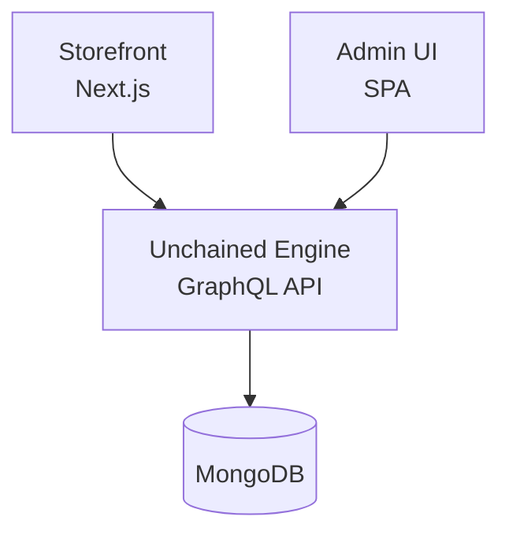

# Quick Start Guide

This guide will help you set up a complete e-commerce solution in about 5 minutes.

## What You'll Build

By the end of this guide, you'll have a fully working web shop with your first product and first test order.

## Guide Structure

This Quick Start guide is organized into the following sections:

1. **[Development Environment Setup](./setup-environment)** - Install required tools and prepare your system
2. **[Initialize Your Project](./run-local)** - Create and configure your full-stack project based on Unchained Engine and Unchained Storefront

## Architecture Overview

Unchained Engine follows a headless architecture with three main components:



- **Unchained Engine**: The core API server providing GraphQL endpoints
- **Storefront**: Your customer-facing web application
- **Admin UI**: Management interface for products, orders, and settings

## Quick Commands Reference

```bash
# Create new Unchained Engine
npm init @unchainedshop

# Start development server
npm run dev
```

## Next Steps

Ready to get started? Continue to [Development Environment Setup →](./setup-environment)

## Getting Help

- 📚 [Full Documentation](/)
- 💬 [GitHub Discussions](https://github.com/unchainedshop/unchained/discussions)
- 🐛 [Report Issues](https://github.com/unchainedshop/unchained/issues)
- 📧 [Contact Support](mailto:support@unchained.shop)