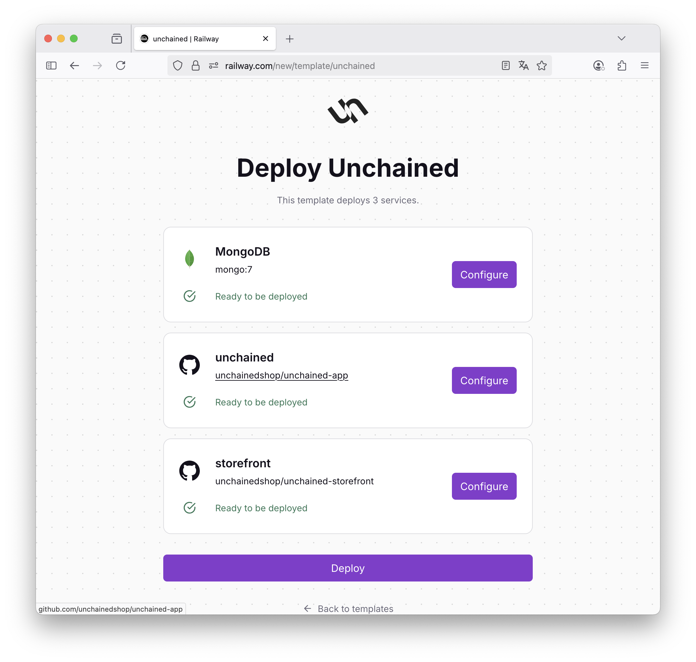
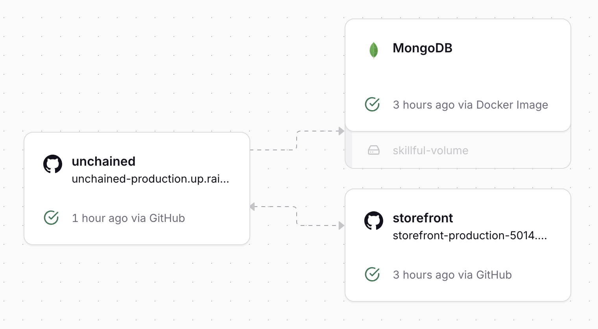
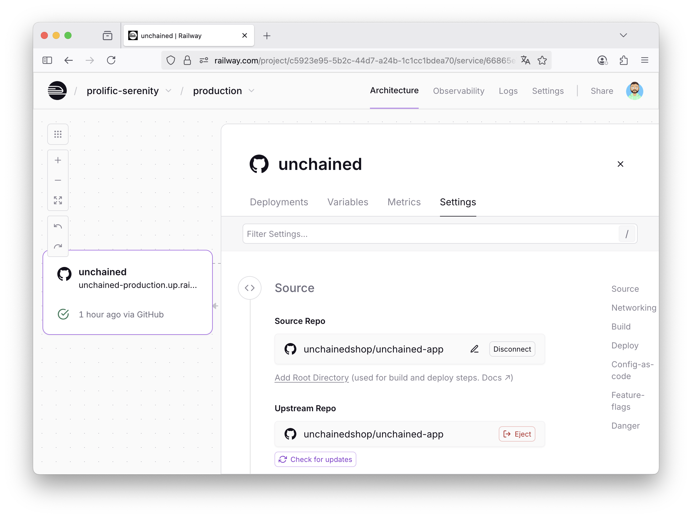

# Start your first Unchained Project on Railway

## Deploy on Railway

Follow this button:

[](https://railway.com/deploy/unchained?referralCode=ZXvOAF)

### E-Mail Setup

When presented with this screen here, make sure you click on **Configure** for "unchained" in order to setup E-Mail:



To configure E-Mail, you need to specify `MAIL_URL` and `EMAIL_FROM`. If you skip setting these variables, your instance will not be able to send any mails at all.

If you don't have any SMTP Server at hand, we recommend:
- https://brevo.com (🇫🇷)
- https://www.mailersend.com (🇱🇹)

Those have a free plan that you can use for transactional e-mails. 

### Verify Engine Installation

After you have deployed the Template Railway will build your project based on our basic Github Repositories:
- [unchainedshop/unchained-app](https://github.com/unchainedshop/unchained-app)
- [unchainedshop/unchained-storefront](https://github.com/unchainedshop/unchained-storefront)

Once Railway communicates success, it looks like this:


To find the Unchained Admin UI URL of your deployment, open the "unchained" card. The deployment URL will propably look something like `unchained*.up.railway.app`. The Storefront URL of your depoyment can be found in "storefront" and looks something like `storefront*.up.railway.app`.

1. **Configure your Backend**

- Open the Railway Deployment URL of the engine in your browser
- Setup your administrator user
- Go the dashboard and complete the onboarding (essentials)

To have a working checkout, you need:
- 1 currency
- 1 country with the default currency set
- 1 language
- 1 payment provider (use Invoice -> Invoice)
- 1 delivery provider (use Shipping -> Manual)
- 1 simple product in status published with at least one price setup in commerce.

2. **Verify Checkout on Storefront**

- Open the Railway Deployment URL of storefton in your browser
- Scroll down, you should see your product
- Add it to the cart and complete the payment process
- At the end of the process, you should get an E-Mail Confirmation of the Order (if you have setup `MAIL_URL` and `EMAIL_URL` correctly)

## Eject

Unchained is a code-first hackable platform. Code is law here and the out-of-the-box capabilities of unchained-app are limited, so you need to be able to do some hacking. In order to do that, you need to "eject" your backend (fork).

Railway helps you with this, just go to settings of the unchained service, it will guide you through:


After cloning your own engine backend, you have to install dependencies:
`npm install`

For local development, Unchained uses a local SQLite database file by default (`unchained.db`). For production, we recommend using [Turso](https://turso.tech):

```bash
# Create a .env file with Turso credentials (optional)
DRIZZLE_DB_URL=libsql://your-db.turso.io
DRIZZLE_DB_TOKEN=your-auth-token
```

If you skip setting database variables, a local `unchained.db` file will be created automatically.

At the end you can run the backend in development mode with:
```
npm run dev
```

Of course, same is true for the Storefront. Just eject it and start working on it.

## Next Steps

Your Unchained project is now initialized and running locally and you should see your first confirmed order in the Admin UI. You can now turn to our next section "Platform Configuration" to find out how to configure and/or extend your project to your needs.


## Troublehsooting

### Adjusting Environment Variables on deployed Stack

Please check [this guide of Railway](https://docs.railway.com/guides/variables) to see how environment variables can be adjusted on an existing Railway project.

You can find [a list of basic environment variables for Unchained here](../platform-configuration/environment-variables.md)


